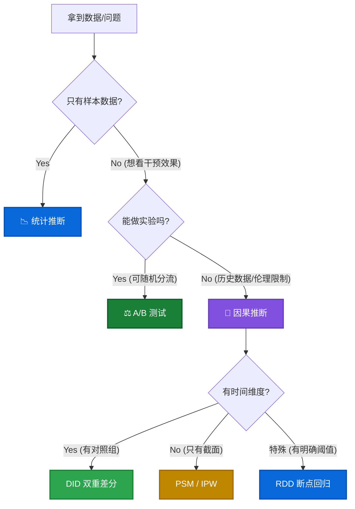

# 🗺️ 推断分析总纲 (Inference Framework)

> **核心问题**: "我们看到的数字变化，到底是真实的规律，还是随机的巧合？"

本指南将帮助你根据 **业务场景** 和 **数据条件**，选择最正确的分析路径。

## 0. 决策树 (Decision Tree)

---

## 1. 统计推断 (Statistical Inference)
> **场景**: 只有一部分数据（样本），想知道总体的情况。
> *例*: "抽查了100个用户，满意度80%，能代表全量用户吗？"

*   **核心工具**:
    *   **置信区间 (Confidence Interval)**: "总体均值有95%的概率在 [78%, 82%] 之间"。
    *   **假设检验 (Hypothesis Testing)**:
        *   **T检验**: 比较两组均值差异。
        *   **卡方检验**: 比较分类变量占比差异。

---

## 2. A/B 测试 (Experimentation)
> **场景**: **黄金标准**。我们可以主动控制谁看版本A，谁看版本B。
> *例*: "App改版，随机切50%流量看新版，50%看旧版。"

*   **核心优势**: 彻底消除**混杂因素 (Confounders)**。
*   **关键步骤**:
    1.  **样本量计算**: 避免 Sample Size 不足导致假阴性。
    2.  **SRM 检测**: 样本比率偏差 (Sample Ratio Mismatch)，检查分流是否均匀。
    3.  **显著性检验**: P值 < 0.05 且 提升幅度 > MDE (最小检测效应)。

---

## 3. 因果推断 (Causal Inference)
> **场景**: **无法实验**。比如政策已经全量上线，或者那是去年的历史数据。
> *例*: "去年发放了消费券，对GMV提升了多少？" (不能让时光倒流做对照)

*   **核心挑战**: **选择偏差 (Selection Bias)**。领券的人本来就是购买力强的人。
*   **武器库**:
    1.  **DID (双重差分)**: 利用时间趋势，剔除自然增长。
        *   *要求*: 平行趋势假设。
    2.  **PSM (倾向性得分匹配) / IPW (逆概率加权)**:
        *   **PSM**: 找替身，丢弃无法匹配的样本 (ATT)。
        *   **IPW**: 全量加权，保留所有样本 (ATE)。
    3.  **RDD (断点回归)**: 利用规则的“一刀切”（如考分>60及格）。
        *   *优势*: 局部随机实验，可信度极高。

---

## 4. 归因分析 (Attribution)
> **场景**: **多触点贡献分配**。用户点了广告A，又看了视频B，最后在直播间C下单。
> *例*: "这次大促，小红书、抖音、分众传媒各有多大功劳？"

*   **方法**:
    *   **规则模型**: 首次点击 (First-click)、末次点击 (Last-click)、线性平均。
    *   **算法模型**:
        *   **马尔可夫链 (Markov Chain)**: 计算移除某个渠道后，转化率的损失 (Removal Effect)。
        *   **Shapley Value**: 博弈论方法，计算边际贡献。

---

### 📚 学习路径建议
1.  先夯实 **[05_statistics.md](05_statistics.md)**，搞懂 P值和置信区间。
2.  如果有条件做实验，优先钻研 **A/B 测试** (工程 + 统计)。
3.  如果只能对着历史数据分析效果，深入学习 **[15_causal_inference.md](15_causal_inference.md)**。
