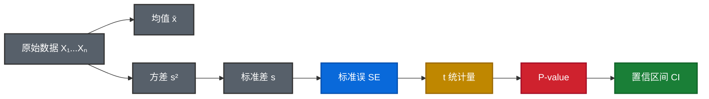

# 📐 统计学基础 & 假设检验框架 🧬

## 0. 统计学核心概念 (Foundation) 🧱

> 面试中经常被问到 "P-value 怎么算的？"、"标准误和标准差有什么区别？"。
> 这些概念是一条 **推导链**，理解了这条链，所有统计检验都通了。

### 0.1 推导链全景图



### 0.2 七大核心统计量

| #    | 统计量       | 符号 | 公式                    | 大白话                          | Python                               |
| :--- | :----------- | :--- | :---------------------- | :------------------------------ | :----------------------------------- |
| 1    | **均值**     | x̄    | Σxᵢ / n                 | 所有数据的"重心"                | `np.mean(x)`                         |
| 2    | **方差**     | s²   | Σ(xᵢ - x̄)² / (n-1)      | 每个点离重心多远 (平方)         | `np.var(x, ddof=1)`                  |
| 3    | **标准差**   | s    | √s²                     | 方差开根号，回到原单位          | `np.std(x, ddof=1)`                  |
| 4    | **标准误**   | SE   | s / √n                  | **均值的不确定性** (非数据本身) | `scipy.stats.sem(x)`                 |
| 5    | **t 统计量** | t    | (x̄ - μ₀) / SE           | 效应 ÷ 噪声 = 信噪比            | `scipy.stats.ttest_1samp`            |
| 6    | **P-value**  | p    | P(\|t\| ≥ 观测值 \| H₀) | "纯运气产生这么大差异的概率"    | 检验函数自动返回                     |
| 7    | **置信区间** | CI   | x̄ ± t* × SE             | 真实值大概率在这个范围内        | `sms.DescrStatsW(x).tconfint_mean()` |

!!! important "标准差 s vs 标准误 SE 的区别 (面试高频!)"

    - **标准差 s**: 描述 **数据本身** 的分散程度 → "这些订单量波动有多大？"
    - **标准误 SE = s / √n**: 描述 **均值估计** 的不确定性 → "我算出的均值有多靠谱？"
    - 样本越大 → SE 越小 → 均值越精确 → P-value 越小

### 0.3 推导链详解 (每一步怎么推到下一步)

**Step 1→2→3: 数据 → 方差 → 标准差**

```
数据: [10, 12, 15, 11, 13]
均值 x̄ = (10+12+15+11+13) / 5 = 12.2
方差 s² = [(10-12.2)² + (12-12.2)² + ... + (13-12.2)²] / (5-1) = 3.7
标准差 s = √3.7 = 1.92
```

> 为什么除以 **(n-1)** 而不是 n？这叫 Bessel's correction (贝塞尔校正)，样本方差用 n-1 是为了得到总体方差的无偏估计。面试中说 "自由度校正" 即可。

**Step 3→4: 标准差 → 标准误**

```
SE = s / √n = 1.92 / √5 = 0.86
```

> **关键直觉**: 样本量 n 增大，SE 减小 → 均值估计更精确。这就是为什么大样本更容易"显著"。

**Step 4→5: 标准误 → t 统计量**

```
假设 H₀: μ = 10 (零假设: 真实均值是 10)
t = (x̄ - μ₀) / SE = (12.2 - 10) / 0.86 = 2.56
```

> **t 的本质就是信噪比 (SNR)**: 分子是"效应有多大"，分母是"噪声有多大"。t 越大 → 越可能是真实效应。

**Step 5→6: t 统计量 → P-value**

```
P-value = P(|t| ≥ 2.56 | H₀为真)
        = 2 × P(t ≥ 2.56)   # 双尾
        ≈ 0.063              # 查 t 分布表 (df=4)
```

> **P-value 的计算**: 在 t 分布 (自由度 = n-1) 上，找 |t| ≥ 观测值的面积。这个面积就是 P-value。

**Step 6→7: P-value ↔ 置信区间**

```
95% CI = x̄ ± t₀.₀₂₅ × SE
       = 12.2 ± 2.776 × 0.86   # t₀.₀₂₅(df=4) = 2.776
       = [9.81, 14.59]
```

> **CI 和 P-value 的关系**: 如果 95% CI 不包含 H₀ 的值 (如 μ₀=10)，则 P < 0.05。上例中 10 在 CI 内 → P > 0.05 → 不显著。

### 0.4 回归分析中的统计量

在回归 `Y = β₀ + β₁X + ε` 中，每个系数 β₁ 也有自己的推导链：

| 统计量     | 回归中的含义                    | 公式                  |
| :--------- | :------------------------------ | :-------------------- |
| **β₁**     | X 每增加 1 单位，Y 平均变化多少 | OLS 最小二乘估计      |
| **SE(β₁)** | β₁ 估计的不确定性               | ≈ σ_ε / (√n × s_X)    |
| **t(β₁)**  | β₁ 的信噪比                     | β₁ / SE(β₁)           |
| **P(β₁)**  | β₁ 为 0 的概率 (纯噪声)         | 查 t 分布             |
| **R²**     | 模型解释了 Y 多少变异           | 1 - SS_res / SS_total |

!!! tip "SE(β₁) 的核心公式"

    `SE ≈ 残差标准差 / (√n × X的标准差)`

    这就解释了你在 DID 中看到的现象：

    - **噪声 (σ_ε) 大** → SE 大 → t 小 → P 大 → 不显著
    - **样本量 (n) 小** → SE 大 → t 小 → P 大 → 不显著
    - 斜率差 = 3.77，但 SE ≈ 7.8 → t ≈ 0.48 → P = 0.63

### 0.5 快速判断表

| 你想回答的问题   | 看什么          | 判断标准                       |
| :--------------- | :-------------- | :----------------------------- |
| 数据波动大不大？ | **标准差 s**    | 越大越波动                     |
| 均值估得准不准？ | **标准误 SE**   | 越小越精确                     |
| 效应是真是假？   | **P-value**     | < 0.05 → 可能是真的            |
| 效应有多大？     | **置信区间 CI** | 看区间宽度和方向               |
| 模型好不好？     | **R²**          | 越接近 1 越好 (但不是唯一标准) |

### 0.6 假设检验思维框架 🧠 (防搞反速查)

!!! danger "你总搞反的根本原因"
    **H0 永远是 "没事发生"**。P 值小 = 证据强 = 能拒绝 H0 = 有事。P 值大 = 证据弱 = 不能拒绝 H0 = 没事。

#### 法庭与混淆矩阵类比 (终极映射，永远不忘)

在所有假设检验中：
*   **H0 (Null Hypothesis，原假设)**  = "没事发生 / 被告无罪 / 策略无效"  ← 永远是默认基准线
*   **H1 (Alternative Hypothesis，备择假设)** = "有事发生 / 被告有罪 / 策略有效"  ← 你想证明的发现

P-value 本质是推翻 H0 的证据强度。基于此，我们永远面临两类核心错误：

| 维度             | 第一类错误 (Type I Error, $\alpha$)             | 第二类错误 (Type II Error, $\beta$)            |
| :--------------- | :---------------------------------------------- | :--------------------------------------------- |
| **通俗叫法**     | **假阳性 (False Positive, FP)**                 | **假阴性 (False Negative, FN)**                |
| **统计学别名**   | **Alpha ($\alpha$) / 显著性水平**               | **Beta ($\beta$) / (1-Power 统计效力)**        |
| **法庭类比**     | **冤枉好人**（无罪判有罪）                      | **放过坏人**（有罪判无罪）                     |
| **A/B 实验翻译** | **无中生有（错上垃圾策略）**<br>没效却测出有效  | **视而不见（错过真爱策略）**<br>有效却没测出来 |
| **ML 混淆矩阵**  | **误报 (FP)**：预测=1，实际=0                   | **漏报 (FN)**：预测=0，实际=1                  |
| **控制与解药**   | **把守门槛**：如 mSPRT 基于似然比反算的动态门槛 | **降低底噪**：如 CUPED 降方差 / 增加样本       |
| **业界容忍度**   | **极其苛刻，锁死 5% (0.05)**                    | **相对宽容，一般设在 20% (保证 80% Power)**    |

> **面试防搞反口诀**：
> *   **Alpha (第一类) = 假阳** = 没病说你有病 = P-Hacking 疯狂试探的直接后果。
> *   **Beta (第二类) = 假阴** = 有病查不出来 = 方差太大被噪音掩盖，需要大力吃 **CUPED** 药丸抢救！

#### 万能判断口诀

!!! success "口诀"
    **P 小 → 拒绝 H0 → 有事！ | P 大 → 不拒绝 H0 → 没事！**

- **P < 0.05** → 拒绝 H0 → **有显著差异 / 有效果** → 通常是你想看到的
- **P ≥ 0.05** → 无法拒绝 H0 → **无显著差异 / 没效果** → 但不等于 "证明没差异"

#### 常见场景速查表 ⭐ (面试 / 实战必背)

| 场景                  | H0 (原假设 = 没事)   | 你想要的结果   | P < 0.05 意味着      | P > 0.05 意味着 |
| :-------------------- | :------------------- | :------------- | :------------------- | :-------------- |
| **A/B Test**          | 新版 = 旧版 (没提升) | P < 0.05       | 新版**赢了** ✅       | 没检测到差异    |
| **DID 回归** (交互项) | 干预效应 = 0         | P < 0.05       | 干预**有效果** ✅     | 没检测到效果    |
| **平行趋势检验**      | 两组斜率**无差异**   | **P > 0.05** ⚠️ | 平行趋势**不成立** ❌ | 平行趋势成立 ✅  |
| **Placebo Test**      | 安慰剂效应 = 0       | **P > 0.05** ⚠️ | 模型**有问题** ❌     | 模型稳健 ✅      |
| **Balance Check**     | 匹配后两组**无差异** | **P > 0.05** ⚠️ | 匹配**失败** ❌       | 匹配成功 ✅      |
| **卡方检验**          | 两组比例**相同**     | P < 0.05       | 比例**有差异** ✅     | 没检测到差异    |
| **Granger 因果**      | X 不能预测 Y         | P < 0.05       | X **能预测** Y ✅     | 无预测关系      |

!!! warning "⚠️ 标记的场景：你想要 P 大！"
    在**平行趋势、Placebo、Balance Check** 中，你的期望和正常的检验是**反的**——你**希望** P > 0.05（即"没事"），因为你想证明的是"两组没有差异"、"假干预没有效果"。

    **速记**: 带 ⚠️ 的场景 = "你希望没事" = P 越大越好

#### Adj. R² 为负？别慌！

| R² 值          | 含义                         | 什么时候出现                |
| :------------- | :--------------------------- | :-------------------------- |
| **0.8+**       | 模型解释了 80%+ 变异，非常好 | 回归分析                    |
| **0.3~0.6**    | 社科/商业领域很正常          | DID、因果推断               |
| **~0**         | 模型几乎没解释力             | 平行趋势检验 (✅ 正常)       |
| **< 0 (负数)** | 加的变量是噪声，还不如算平均 | 平行趋势检验 (✅ 这是好事！) |

> **平行趋势检验中 R² 为负 = 好消息**：说明 `is_treated` 和 `week:is_treated` 在干预前对 GMV 毫无解释力 → 两组确实没有系统性差异。

---

## Statsmodels/Scipy (统计学)
*严谨的因果与推断。*

| 库/函数 (Function)       | 作用 (Action) | 场景 (Scenario)                           |
| :----------------------- | :------------ | :---------------------------------------- |
| `sm.OLS`                 | **线性回归**  | 看 P-value 找显著因子 (比 Sklearn 更详细) |
| `stats.ttest_ind`        | **T检验**     | A/B 测试 (对比两组均值)                   |
| `stats.chi2_contingency` | **卡方检验**  | 对比两组转化率/占比 (Categorical)         |

### 💎 OLS Summary 核心阅读指南 (The "体检报告")

Statsmodels 输出的 OLS Summary 信息量巨大，但作为 Senior DA，你只需扫视以下核心区域即可快速判断问题：

1. **R-squared (拟合优度)**
    * **位置**：顶层概览区右上角。
    * **含义**：你的变量能解释目标 Y 总体方差的百分比。（例如 0.729 代表模型解释了 72.9% 的波动）。
    * **判断**：如果只有 0.05 说明找错了原因；但是在推断问题中（如 DID），只要你的核心指标显著，R² 低（如 0.3）往往是可以接受的，因为人类行为很难 100% 预测。

2. **coef (回归系数 - "效应大小")**
    * **位置**：中间报表的左侧第一列。
    * **含义**：X 变动 1 个单位（或者变成某种类别时），Y 平均怎么变。
    * **注意**：如果有 `C(分类变量)[T.某个类别]` 的变量，它的基准是那个没有出现的默认类别；如果是交互项 `A:B`，它的物理意义必须结合主效应系数一起解读！

3. **P>\|t\| (显著性 P-value - "是不是噪音骗人")**
    * **位置**：中间报表的第四列。
    * **含义**：这个变量带来的效应，有多大概率是纯随机噪音？
    * **判断**：永远和 **0.05** 比。`< 0.05` 代表真有影响（可信）；`>= 0.05` 代表无论 coeff 多高多低，大概率都是噪音（不可信）。

4. **[0.025   0.975] (95% 置信区间 CI - "落差大小与方向")**
    * **位置**：中间报表的最右侧两列。
    * **含义**：真实系数有 95% 的把握落在这个区间。
    * **极速判断技巧**：看符号**是否跨越了 0**（比如从负数到正数 `[-10, 50]` 区间）。如果跨 0，说明方向摇摆不定，等同于该行的 P > 0.05；只有不跨 0，结论才立得住。

### 💻 OLS 回归代码模板与 Patsy 语法揭秘

我们推荐使用 `statsmodels.formula.api` (简称 `smf`)，因为它允许你像写 R 语言一样用字符串公式 (`Patsy Formula`) 构建模型，极大地简化了特征工程。

```python
import pandas as pd
import numpy as np
import statsmodels.formula.api as smf

# 核心三段式：写公式 -> fit() 拟合 -> summary() 阅卷
formula = 'Real_Income ~ treatment * post + C(City) + age + np.log(tenure)'
model = smf.ols(formula, data=df).fit()
print(model.summary())
```

!!! tip "深度解密：公式里的 `C(x)` 是什么怪物？"
    `C(City)` 里的 `C` 代表 **Categorical (分类变量)**。
    
    * **为什么需要它？** 机器学习模型只懂数字。如果你的 `City` 列是文本 (`"Beijing"`, `"Shanghai"`) 或者**被编码成了伪数字** (`1`, `2`, `3`，但 2 并不比 1 大一倍)，你直接扔进去模型会彻底算错。
    * **C() 做了什么？** 它在后台瞬间帮你做了 **One-Hot Encoding (独热编码)**，把一个变量自动拆成了多个虚拟变量（Dummy Variables）。
    * **防止哑变量陷阱**：它非常聪明，如果 `City` 有 3 个取值，它只会生成 2 个新列。被扔掉的那个类别叫做 **“基准组 (Baseline/Reference)”**。你在参数表 `coef` 里看到的 `C(City)[T.Shanghai]` 的系数，其物理含义就是：“在别的条件完全相同下，来到上海**对比于去基准组城市**，你的收入 (Y) 会有什么差异”。
    * **高级技巧**：即使不写 `C()`，如果那一列数据类型（dtype）是 `object/string/category`，Patsy 也会自动当类别处理；但如果类别用数字 `0/1/2` 表示，你**必须手动加 `C()`** 强制识别，否则它会当普通数值去计算斜率！

---

## 实验设计与 A/B 检验

> 📦 **已迁移**：样本量计算 (MDE)、检验选择速查表、Delta Method、Bootstrap、避坑指南、面试 Q&A 等 A/B 实验相关内容已整合到独立页面。
>
> 🔗 请参考 → [⚖️ A/B 实验基础 (设计/SRM/检验)](05b_ab_testing.md) | [🔧 A/B 高阶 (CUPED/Delta)](05a_ab_advanced.md)

