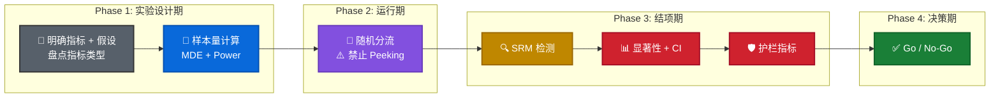

# ⚖️ A/B 实验基础 (设计/SRM/检验)

> **核心逻辑**：A/B 实验是因果推断的**黄金标准**。通过随机分流消除混淆因素，让我们能直接归因。
> 本页覆盖实验设计全流程，高阶工具（CUPED/Delta Method）请参考 → [A/B 高阶 (CUPED/Delta)](05a_ab_advanced.md)

---

## 0. A/B 实验 SOP 全链路 (工业级)



### Phase 1: 实验设计期 (Before)

| Step  | 关键动作                                 | 产出                     |
| :---: | :--------------------------------------- | :----------------------- |
|   1   | **明确核心指标 + 护栏指标**              | H₀/H₁ 假设               |
|   2   | **盘点指标类型 → 选定检验方法** (见下表) | 检验方案文档             |
|   3   | **样本量计算 (MDE/Power)**               | 每组所需 N，预估实验天数 |

!!! warning "🔥 Phase 1 的关键动作：根据指标类型，提前定好检验方法"
    | 指标类型                        | 举例                     | 显著性检验       | 置信区间 (CI)                                  |
    | :------------------------------ | :----------------------- | :--------------- | :--------------------------------------------- |
    | **均值型** (连续值)             | ARPU、停留时长           | T-Test           | `tconfint_diff`                                |
    | **转化率型** (0/1)              | CVR、留存率              | T-Test / Z-Test¹ | `tconfint_diff` / `confint_proportions_2indep` |
    | **比率型** (分子分母非用户维度) | 整体 CTR = 总点击/总曝光 | ❌ T-Test 失效    | **Delta Method / Bootstrap**                   |

    ¹ 大样本下 T-Test 和 Z-Test 结果几乎一致（中心极限定理），实务中常直接用 T-Test。

### Phase 2: 实验运行期 (During)

!!! danger "禁止偷看 (No Peeking!)"
    实验进行中，**绝对不要提前查看 P 值并决定是否提前结束**。

    **原理**: 每"偷看"一次 ≈ 做了一次额外的假设检验。看 7 天，假阳性率从 5% 飙升至 ~30%（$1 - 0.95^7$）。

    **如果业务方确实需要提前看**: 使用 **贯序检验 (Sequential Testing / mSPRT)**，动态调高每次偷看的显著性门槛，把整体假阳性率严格控制在 α 以内。

### Phase 3: 实验结项期 (After)

| Step  | 关键动作                      | 判断标准             | 失败处理                         |
| :---: | :---------------------------- | :------------------- | :------------------------------- |
|   4   | **SRM 检测**                  | χ² P > 0.05          | 排查 Bot/Bug/Hash 碰撞，结果作废 |
|   5   | **核心指标: 显著性检验 + CI** | P < 0.05 + CI 不含 0 | 延长实验或接受无效               |
|   6   | **护栏指标检查**              | 无显著负向影响       | 排查副作用                       |

### Phase 4: 业务决策期 (Decision)

| Step  | 关键动作            | 判断标准                                     |
| :---: | :------------------ | :------------------------------------------- |
|   7   | **Go / No-Go 决策** | 统计显著 + CI 效果量 > 业务回本线 + 护栏安全 |

---

## 1. SRM 检测 (Sample Ratio Mismatch) 🔍

**工具**: `scipy.stats.chisquare`

*   **场景**: 实验结束后，**第一步永远是检查分流系统是否正常**。如果设计 50:50 分流，实际却是 52:48，说明分流系统有 Bug，后续分析全部无效。
*   **判断标准**: P > 0.05 → 分流正常；P ≤ 0.05 → 存在 SRM，需排查原因 (Bot/Bug/Hash 碰撞)。

??? example "🐍 SRM 检测模板 (工业级 3 大场景)"

    === "1. 基础大盘检测"
        **场景**: 实验刚结束，快速看一眼大盘总流量有没崩。
        ```python
        from scipy import stats

        # 1. 统计各组实际人数
        n_control = df[df['group'] == 'control'].shape[0]
        n_treatment = df[df['group'] == 'treatment'].shape[0]
        n_total = n_control + n_treatment

        # 2. 卡方拟合优度检验 (期望 50:50)
        observed = [n_control, n_treatment]
        expected = [n_total / 2, n_total / 2]
        stat, p_value = stats.chisquare(observed, expected)

        print(f"对照组: {n_control}, 实验组: {n_treatment}")
        print(f"卡方统计量: {stat:.4f}, P-value: {p_value:.4f}")
        # P > 0.05 → ✅ 分流正常 | P ≤ 0.05 → ⚠️ 存在 SRM
        ```

    === "2. 多维极速排查 (Pivot Table)"
        **场景**: 大盘 SRM 异常 (Simpson's Paradox)，怀疑是特定系统/版本/机型漏水。<br>
        **优点**: 极速（底层 C 语言聚合），适合数据干净、维度不太复杂的场景。
        ```python
        from scipy import stats
        import pandas as pd

        dimensions = ['os', 'app_version'] # 假设排查这两个维度

        for dim in dimensions:
            # 核心：一次性把该维度下所有(组别 x 特征)的人数算出来
            pivot = pd.pivot_table(df, values='users', index=dim, columns='group', aggfunc='sum')
            
            for val_name in pivot.index:
                # 抠出具体的整数
                exp_users = pivot.loc[val_name, 'treatment']
                ctrl_users = pivot.loc[val_name, 'control']
                total_users = exp_users + ctrl_users
                
                # 小样本防噪
                if total_users < 100: continue
                    
                observed = [exp_users, ctrl_users]
                expected = [total_users / 2, total_users / 2]
                
                stat, p_value = stats.chisquare(observed, expected)
                
                if p_value < 0.001:  # 多维排查阈值通常更严
                    diff = exp_users - ctrl_users
                    print(f"🚨 维度异常 [{dim} : {val_name}] - SRM 报警 (p={p_value:.6f})")
                    print(f"   exp:ctrl = {exp_users}:{ctrl_users} | 绝对差异={diff}人")
        ```

    === "3. 高维鲁棒自动化排查 (Crosstab)"
        **场景**: 日常自动化的 QA 脚本，要跑几十个维度，数据质量极度稀疏（例如某版本只有安卓用户）。<br>
        **优点**: 极其稳定（自带补齐防报错功能），不用单独算 `users` 的 Sum，自动统计行数。
        ```python
        from scipy import stats
        import pandas as pd

        dimensions = ['os', 'app_version', 'device_model', 'age_group'] 

        for dim in dimensions:
            # 核心神技：一句话算出二维频数矩阵，自动处理稀释数据
            contingency_table = pd.crosstab(index=df[dim], columns=df['group'])
            
            for val_name, row in contingency_table.iterrows():
                # 使用 .get() 防雷（万一只有实验组没有对照组不会报错）
                exp_users = row.get('treatment', 0)
                ctrl_users = row.get('control', 0)
                total_users = exp_users + ctrl_users
                
                if total_users < 100: continue
                    
                observed = [exp_users, ctrl_users]
                expected = [total_users / 2, total_users / 2]
                
                stat, p_value = stats.chisquare(observed, expected)
                
                if p_value < 0.001:
                    exp_pct = int(round(exp_users * 100 / total_users, 0))
                    ctrl_pct = int(round(ctrl_users * 100 / total_users, 0))
                    
                    print(f"🚨 维度异常 [{dim} : {val_name}] - SRM 报警 (p={p_value:.6f})")
                    print(f"   exp:ctrl = {exp_pct}:{ctrl_pct} | 绝对差异={exp_users - ctrl_users}人")
        ```

---

## 2. 样本量计算 (MDE) 🔮

**工具**: `statsmodels.stats.api`

*   **场景**: 开始实验前，算算需要多少样本才能"显著"。
*   **核心逻辑**: 如果提升很微弱 (1% → 1.1%)，就需要海量样本；如果提升很巨大 (1% → 50%)，几个样本就够了。

!!! info "灵魂发问：MDE 到底是什么？为什么满足了 MDE 的样本量最后还是不显著？"

    很多人误以为 "MDE 是拿样本推出来的结果"，**错！MDE 是业务决定的输入条件！**

    *   **MDE 的本质**：它代表了**“业务能够容忍的、必须被检测出来的最小收益底线”**。
    *   **翻译**：业务方说——“我的改版成本很高，如果转化率不能提升最少 1%（这就是 MDE），那这事儿就不值得做。” 于是你根据这个 1% 的 MDE，倒推出你需要 **10万** 个样本。
    *   **为什么达到了 10万 样本也可能不显著？**
        因为上面算出的 10万 样本是基于**历史基线方差**估算出来的！如果在真实的实验中，用户的**实际方差（噪音）远大于你预估的方差**，那么这 10万 样本就如同泥牛入海，根本无法从巨大的噪音中把那 1% 的信号（MDE）剥离出来，所以最后 P 就不显著。
        > *公式透视：所需的样本量 $N \propto \frac{\sigma^2}{MDE^2}$。方差 $\sigma^2$ 是个难以预测的捣蛋鬼。如果真实 $\sigma^2$ 翻倍，你原本准备的 $N$ 就不够检测出这个 MDE 了。*

??? example "🐍 MDE 样本量计算模板"

    ```python
    import statsmodels.stats.api as sms
    from statsmodels.stats.power import NormalIndPower

    # 1. 定义基线(p1) 和 目标(p2)
    p1, p2 = 0.10, 0.11 # 比如希望提升 1pp

    # 2. 计算效应量 (Effect Size - Cohen's h)
    effect_size = sms.proportion_effectsize(p1, p2)

    # 3. 求解样本量 (Solve N)
    n_required = NormalIndPower().solve_power(
        effect_size=effect_size, 
        power=0.8,     # 功效 (通常 0.8)
        alpha=0.05,    # 显著性水平 (通常 0.05)
        ratio=1        # 对照组:实验组 = 1:1
    )
    print(f"每组需要样本: {int(n_required)}")
    ```

    !!! note "代码变量扫盲：p1, p2 和 effect_size 的关系"
        *   `p1`：对照组（当前线上）的真实基线数值（例：10%）。
        *   `p2`：你期望达到的目标数值（例：11%）。**MDE 就隐藏在 p2-p1 之中**（MDE = 1%）。
        *   `effect_size`：既然 MDE 是 1%，为什么不能直接代入公式，要用 `effect_size`？因为统计学只认**相对难度**。同样绝对提升 1%（50%→51% vs 1%→2%），前者的天然方差大得多，需要的样本量天差地别。`proportion_effectsize` 内部做了反正弦变换（计算出 Cohen's h），把带噪音的原始提升率，洗成了一个纯粹反映“检测难度”的标准化强弱指标，最后丢给核算公式。

---

## 3. 统计检验选择速查表 (The "Right" Test) 📊

*不求甚解，只求用对。*

| 场景 (Scenario)           | 检验名称 (Test)    | 推荐武器 (Function)                                           | 入参要求 (Input Params)                                               | 核心理由 (Why?)                                                                       |
| :------------------------ | :----------------- | :------------------------------------------------------------ | :-------------------------------------------------------------------- | :------------------------------------------------------------------------------------ |
| **CTR / 转化率 (大样本)** | Z 检验 (或 T 检验) | `proportions_ztest(count, nobs)`<br>*(需从 statsmodels 导入)* | **聚合后的数据**<br>`count=[转化数A, B]`<br>`nobs=[总人数A, B]`       | 工业界标准。大样本 (N>1000) 下 Z 检验和 T 检验等价，通常直接用 Z 检验算比例。         |
| **CTR / 转化率 (小样本)** | Fisher 精确检验    | `stats.fisher_exact(table)`                                   | **2x2 频数表**<br>`[[转化A, 未转化A], [转化B, 未转化B]]`              | 小样本 (如 N<30 或转化数极少) 时，Z 检验的连续性假设失效，必须用 Fisher 取精确 P 值。 |
| **ARPU / 时长**           | 曼惠特尼 U检验     | `stats.mannwhitneyu(a, b)`                                    | **两个原始数组** (连续值)<br>`[1.2, 3.5...]` vs `[2.1, ...]`          | 钱的数据通常长尾(有土豪)，T检验容易受极端值影响。                                     |
| **漏斗 / 频数**           | 卡方独立性检验     | `stats.chi2_contingency(tbl)`                                 | **二维频数表** (绝对值，非比率!)<br>`[[10, 90], [15, 85]]` (2x2或MxN) | 比如看 Test 组在 Cart 流失的人数比例是否异常。                                        |
| **SRM 检查**              | 卡方拟合优度       | `stats.chisquare(obs, exp)`                                   | **两个计数数组**<br>Obs:`[102, 98]`, Exp:`[100, 100]`                 | 验证样本量是否符合 50%/50% 分配 (Sample Ratio Mismatch)。                             |
| **多组 (A/B/C)**          | 单因素方差分析     | `stats.f_oneway(a, b, c)`                                     | **三个及以上原始数组**<br>`data_A, data_B, data_C`                    | 千万别做 3 次 T-Test (会累积 I 类错误)！                                              |

!!! tip "为什么 T-Test 不给我置信区间 (CI)?"

    *   `scipy.stats` 很懒，只给 P-value。
    *   **要算 CI (Confidence Interval)**，得用 `statsmodels`。

??? example "🐍 置信区间 (CI) 计算模板"

    ```python
    import statsmodels.stats.api as sms

    # 1. 拆分两组数据 (注意: 传的是原始 0/1 数组，不是均值！)
    control = df[df['group'] == 'control']['is_purchased']
    treatment = df[df['group'] == 'treatment']['is_purchased']

    # 2. 用 CompareMeans 计算差异的置信区间
    # usevar='unequal': 等同于 Welch's T-test (更稳健，推荐)
    cm = sms.CompareMeans(
        sms.DescrStatsW(treatment),  # 注意: treatment 放前面 → 差值 = treatment - control
        sms.DescrStatsW(control)
    )
    ci_lower, ci_upper = cm.tconfint_diff(usevar='unequal', alpha=0.05)
    diff = treatment.mean() - control.mean()

    print(f"CVR 差异: {diff:.4f}")
    print(f"95% CI: [{ci_lower:.4f}, {ci_upper:.4f}]")
    # CI 不包含 0 → 显著 | CI 包含 0 → 不显著
    ```

    **面试要点**: 面试官问"P < 0.05 就够了吗？"，标准答案是"不够，还要看 CI 的宽度和效果量"。CI 宽 = 估计不精确 = 可能需要更多样本。

---

## 4. 避坑指南 (Survival Kit) 🧪

*这些错误让我在面试中因为"不够严谨"而挂掉，切记！*

### 4.1 分母! 分母! (The Denominator Trap)
*   **场景**: 算人均点击/转化时，别把"没点击/没转化"的人漏了。
*   ❌ `df_actions['clicks'].mean()` (只算了活跃用户，极大虚高)
*   ✅ **黄金连招**:
    ```python
    # 1. 算出活跃用户的指标
    df_clicks = df_actions.groupby('uid').size().reset_index(name='cnt')
    # 2. Left Join 回全量用户表 (保留沉默用户)
    df_final = df_all_users.merge(df_clicks, on='uid', how='left')
    # 3. 补 0 (关键!)
    df_final['cnt'] = df_final['cnt'].fillna(0)
    ```

### 4.2 统计函数返回值 (The "Unpacking" Minefield) 💣
*   **场景**: `scipy.stats` 的函数有的返回2个值(t-test)，有的返回4个(chi2)，记不住容易报错。
*   ❌ `stat, p = stats.chi2_contingency(obs)` (报错：too many values to unpack)
*   ✅ **万能写法 (Index Access)**:
    ```python
    # 不管它返回几个值，第2个永远是 P-value
    res = stats.chi2_contingency(obs)
    p_value = res[1]
    ```

---

## 5. 高阶工具速查

### 5.1 Delta Method (比率指标的方差) 🚀

*面试加分项：当你要算 CTR (Clicks/Views) 的置信区间时，传统的 T-Test 其实是近似值。Delta Method 才是精准解。*

🔗 **详细版请参考** → [A/B 高阶 (CUPED/Delta)](05a_ab_advanced.md)

??? example "Delta Method 代码模板"

    ```python
    def delta_method(x, y):
        """
        计算 Ratio Metric (x/y) 的 Variance, SE, 和 CI
        x: 分子 (e.g., Clicks, [1, 0, 1...])
        y: 分母 (e.g., Views, [1, 1, 1...])
        """
        n = len(x)
        mean_x, mean_y = np.mean(x), np.mean(y)
        var_x, var_y = np.var(x, ddof=1), np.var(y, ddof=1)
        cov_xy = np.cov(x, y)[0][1] # 协方差
        
        # 1. Point Estimate (点估计)
        r = mean_x / mean_y
        
        # 2. Variance (Delta Method for Ratio of Means)
        var_ratio = (var_x / n) + (r**2) * (var_y / n) - (2 * r * cov_xy / n)
        var_ratio = var_ratio / (mean_y**2)

        # 3. Standard Error & 95% CI
        se = np.sqrt(var_ratio)
        ci = (r - 1.96 * se, r + 1.96 * se)
        
        # 💡 P-Value 怎么算? (A/B Test)
        # Z = (r_test - r_ctrl) / sqrt(se_test² + se_ctrl²)
        # p_value = (1 - norm.cdf(abs(Z))) * 2
        
        return r, se, ci
    ```

### 5.2 Bootstrap 置信区间 (自助法)

当数据严重偏态 (如 Revenue) 且样本量不够大时，普通的 T-test 置信区间可能不准。
Bootstrap 的核心思想是 **"模拟平行宇宙"**：

1.  **重采样**: 从现有样本中有放回地抽样 n 次。
2.  **算均值**: 算出这 n 次抽样的均值。
3.  **重复**: 重复 10000 次，得到 10000 个均值。
4.  **看分布**: 这 10000 个均值的分布就是总体均值的抽样分布，直接取 2.5% 和 97.5% 分位点作为置信区间。

??? example "Bootstrap 置信区间代码模板"

    ```python
    def bootstrap_ci(control, test, n=10000):
        diffs = []
        for _ in range(n):
            # 有放回抽样 Replace=True
            s_c = np.random.choice(control, size=len(control), replace=True)
            s_t = np.random.choice(test, size=len(test), replace=True)
            diffs.append(s_t.mean() - s_c.mean())
        return np.percentile(diffs, [2.5, 97.5])
    ```

---

## 6. 面试高频 Q&A

??? question "Q1: P 值 = 0.03 意味着什么？常见误解是什么？"

    **正确理解**: P 值 = 0.03 ≠ "有 3% 的概率 H₀ 是对的"。

    P 值的正确定义：**在 H₀ 为真的前提下**，观察到当前或更极端结果的概率。

    | ❌ 常见误解                  | ✅ 正确说法                                        |
    | :-------------------------- | :------------------------------------------------ |
    | "有 97% 的概率实验有效"     | "如果没有效果，出现这种极端结果的概率为 3%"       |
    | "P < 0.05 就是 significant" | 还需要看 **效果量 (Effect Size)** 和 **业务意义** |
    | "P = 0.06 就不显著"         | 0.05 是人为阈值，0.06 不代表没有效果              |

??? question "Q2: 既然置信区间不包含 0 就代表显著，为什么不直接看 P 值？"

    这是面试**极高频**的考点。P 值只能回答一个极度无聊的问题："它是不是 0？"，而 置信区间 (CI) 能回答业务最关心的三个问题：

    1. **0 意味着什么？(Why 0?)**
        如果 95% CI 包含了 0 (如 `[-0.5%, 1.2%]`)，意味着这 95% 的可能性里，包含了"没效果"甚至"起反效果"的可能，不能理直气壮地说它显著变好了。
    2. **"显著" = 值得上线吗？(统计显著 vs 业务显著)**
        在大样本下，极微小的提升 (如 0.0001%) 也会导致 P < 0.05。但看 CI `[0.0001%, 0.0005%]` 会发现收益太小，如果新策略有开发或服务器成本，业务上决不能上线 (ROI 为负)。
    3. **我们对结果有多大把握？(估计的精度)**
        假设业务要求提升 2% 回本。
        * 实验 A 的 CI `[2.1%, 2.3%]`：极窄且不仅大于 0 还大于 2%，闭眼上线 (Go)。
        * 实验 B 的 CI `[0.1%, 15%]`：虽然 P < 0.05，但区间太宽，下限只有 0.1% (稳亏不赚)。说明当前**样本量不足以给出精确估计**，盲目上线风险极大，应延长实验。

??? question "Q3: 做了 20 次 A/B 测试，有 1 个 P < 0.05，这说明什么？"

    **这是多重检验 (Multiple Testing) 问题**。做 20 次检验，即使所有 H₀ 都为真，也期望有 20 × 0.05 = 1 次误报 (假阳性)。

    **解法**:

    - **Bonferroni 修正**: α' = 0.05 / 20 = 0.0025 (最保守)
    - **BH (Benjamini-Hochberg)**: 控制 FDR (False Discovery Rate)，更宽松
    - **面试加分**: 实际工作中，如果只做 1-2 个核心指标的检验，通常不需要修正；但如果一次看 20+ 指标，必须修正。

??? question "Q4: α 和 P-value 有什么区别？假阳性到底是哪个？"

    **这是面试官最喜欢深挖的概念题**。很多候选人会把 α、p-value、1-p 搞混。

    | 概念               | 定义                                           | 什么时候定            | 会变吗？             |
    | :----------------- | :--------------------------------------------- | :-------------------- | :------------------- |
    | **α (显著性水平)** | 你**事前设定**的假阳性容忍度（= "犯错预算"）   | 实验**开始前**        | ❌ 固定的，是你的规则 |
    | **p-value**        | 在 H₀ 为真时，观察到**当前或更极端**结果的概率 | 实验**结束后** 算出来 | ✅ 每次实验结果不同   |
    | **假阳性率 (FPR)** | 多次实验中，H₀ 为真时你错误拒绝的比例          | 由你的决策规则决定    | ⚠️ 看 Q5              |

    **类比**：

    - **α = 你设定的红绿灯规则**：p < 0.05 就亮绿灯 (宣布显著)
    - **p-value = 这次实验考试的卷面分**：每次考完试算一个数
    - **决策过程**：卷面分 (p) < 及格线 (α) → 亮绿灯

    !!! warning "致命误区"
        ❌ "p = 0.03，所以有 97% 的概率实验有效" → **完全错误！**

        ❌ "假阳性率 = 1 - p" → **也是错的！**

        ✅ 假阳性率 = α = 你自己定的那个门槛 (单次检验场景下)

    !!! tip "面试话术"
        "α 是我事前定的决策门槛，p-value 是数据给我的证据。假阳性率在单次检验时等于 α，但如果我反复偷看 (peeking) 或做多个检验，整体假阳性率会膨胀超过 α，这时需要用 Alpha Spending 或 Bonferroni 来控制。"

??? question "Q5: Data Peeking 为什么会让假阳性率飙升？怎么算？"

    **核心逻辑**：每偷看一次 ≈ 多做一次假设检验 ≈ 多买一张彩票 → 中奖（误判）概率变高。

    **公式推导**（面试用简化版）:

    每次偷看，**不犯假阳性**的概率 = `1 - α = 0.95`

    偷看 *k* 次，**每次都不犯错**的概率（假设独立）= `0.95ᵏ`

    **至少犯错一次** = 整体假阳性率 = `1 - 0.95ᵏ`

    | 偷看次数 (k) | 公式 `1 - 0.95ᵏ` | 整体假阳性率 | vs 预期 5% |
    | :----------: | :--------------- | :----------: | :--------: |
    |      1       | 1 - 0.950        |   **5.0%**   |   达标 ✅   |
    |      2       | 1 - 0.903        |  **9.75%**   |  ×1.95 ⚠️   |
    |      5       | 1 - 0.774        |  **22.6%**   |  ×4.52 🔴   |
    |      7       | 1 - 0.698        |  **30.2%**   |  ×6.03 🔴   |
    |      10      | 1 - 0.599        |  **40.1%**   |  ×8.02 🔴   |

    !!! note "为什么实际膨胀率比 `1 - 0.95ᵏ` 略低？"
        上表假设每次偷看之间**完全独立**。实际上 Data Peeking 是**累积数据**——Day 3 的数据包含了 Day 1 和 Day 2，所以各次检验**高度相关**。相关性会让实际膨胀率比理论上界略低（例如偷看 5 次的实际膨胀率约 14% 而非 22%），但仍然**远超 5%**。

        面试时用 `1 - 0.95ᵏ` 回答已经足够，面试官听到这个就知道你理解了。

    **解法** → 使用 **Sequential Testing (Alpha Spending)**，见 → [A/B 高阶 (Sequential Testing)](05a_ab_advanced.md)

??? question "Q6: 什么是 AA 实验？为什么不直接做 AB？"

    **AA 实验 = 两组都不做任何策略变更的实验**。目的是**校验实验平台本身是否可信**。

    ```
    AA 实验流程：

    对照组A ─── (无干预) ──┐
                           ├── 对比 → 应该不显著 ✅
    对照组B ─── (无干预) ──┘

    如果 AA 都跑出了显著 → ❌ 系统有 Bug！
    (分流偏差 / 数据管道错误 / 指标口径问题)
    ```

    **工业级用法**：

    | 方式          | 操作                                          | 优缺点                            |
    | :------------ | :-------------------------------------------- | :-------------------------------- |
    | **预实验 AA** | 先跑 1 周 AA → 确认不显著 → 保持分流切换为 AB | ✅ 最严谨，流量不浪费              |
    | **并行 AA**   | 三组（对照1:对照2:实验），同时跑 AA 和 AB     | ⚠️ 严谨但浪费 1/3 流量，Power 下降 |
    | **SRM 替代**  | 只跑 AB，用 SRM 卡方检验代替 AA               | ✅ 最常用，零额外流量成本          |

    !!! tip "面试话术"
        "AA 实验就像体检前先校准体温计——确认仪器没坏再量病人。在实际工作中，我通常用 SRM 诊断来替代独立的 AA 实验，这样不需要占用额外流量。但如果是新搭建的实验平台，第一次上线时一定会跑一轮完整的 AA 实验来校验系统。"

