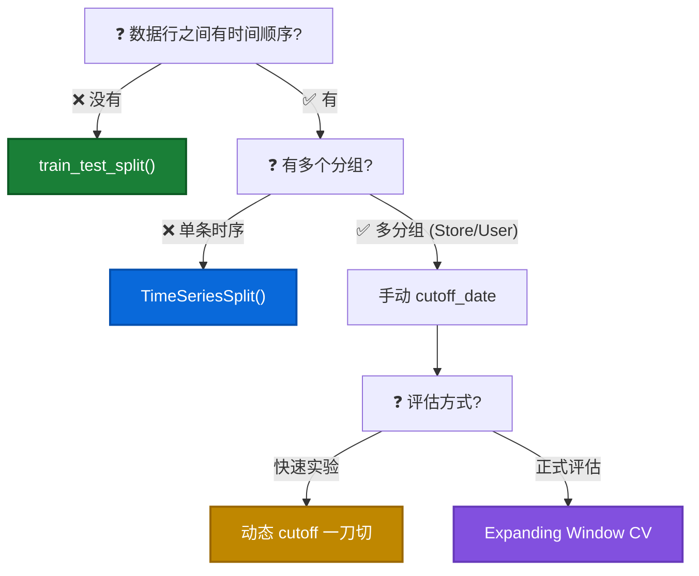

# ✂️ 数据集拆分 (Train-Test Split)
*建模之前最关键的一步：把数据正确地分成训练集和测试集。*

## 拆分策略选型指南

| 数据类型                        | 拆分方式             | 为什么                         |
| :------------------------------ | :------------------- | :----------------------------- |
| **普通表格** (Churn/房价)       | `train_test_split()` | 行与行之间独立，随机切分没问题 |
| **单条时序** (1 个门店的日销量) | `TimeSeriesSplit()`  | 只有一条时间线，按行号=按时间  |
| **多条时序** (N 门店 × T 周)    | **手动 cutoff_date** | 行号 ≠ 时间顺序，调包会切错    |

### 拆分策略决策树



!!! important "核心判断原则"

    问自己两个问题：

    1. **数据行之间有没有时间顺序？** → 有 → 不能随机 Shuffle
    2. **有没有多个分组 (Store/User/Region)？** → 有 → 不能用 `TimeSeriesSplit`

---

## 1. 普通表格数据 (Cross-sectional)

> **场景**: Churn 预测、房价预测、信用评分 → 每一行是一个**独立样本**。

```python
from sklearn.model_selection import train_test_split

# 随机拆分，80% 训练，20% 测试
X_train, X_test, y_train, y_test = train_test_split(
    X, y, test_size=0.2, random_state=42
)
```

!!! tip "stratify 分层抽样"

    如果目标列不均衡 (如 Churn 只有 26%)，加 `stratify=y` 保证训练集和测试集的比例一致：

    ```python
    X_train, X_test, y_train, y_test = train_test_split(
        X, y, test_size=0.2, random_state=42, stratify=y
    )
    ```

---

## 2. 单条时序数据 (Single Time Series)

> **场景**: 1 个门店 / 1 只股票 / 1 个城市的日销量 → 只有**一条时间线**。

### 方法 1: TimeSeriesSplit 交叉验证

```python
from sklearn.model_selection import TimeSeriesSplit

# 前提: 数据必须按时间排序!
df = df.sort_values('date')

tscv = TimeSeriesSplit(n_splits=5)
for fold, (train_idx, test_idx) in enumerate(tscv.split(X)):
    X_train, X_test = X.iloc[train_idx], X.iloc[test_idx]
    y_train, y_test = y.iloc[train_idx], y.iloc[test_idx]
    # ... 训练 & 评估
```

### 方法 2: 固定比例拆分 (快速实验)

```python
# 前 80% 训练，后 20% 测试
split_point = int(len(df) * 0.8)
train_df = df.iloc[:split_point]
test_df  = df.iloc[split_point:]
```

!!! warning "TimeSeriesSplit 的工作原理"

    它**不是随机抽样**！而是滑动窗口，永远保证训练集在测试集之前：

    ```
    Fold 1: [Train ████       ] [Test ██         ]
    Fold 2: [Train ██████     ] [Test ██         ]
    Fold 3: [Train ████████   ] [Test ██         ]
    Fold 4: [Train ██████████ ] [Test ██         ]
    ```

    它只看**行号顺序**，不看日期列 → 所以**必须提前按时间排序**。

---

## 3. 多条时序数据 (Multi-Group Time Series) ⚠️

> **场景**: 45 个门店 × 143 周 (Walmart)、多品类销量、多用户行为 → **多个分组 × 时间**。

### 为什么 `TimeSeriesSplit` 会失效？

如果数据按 `['store', 'date']` 排序：

```
行 0:   store=1, 2010-02-05
行 1:   store=1, 2010-02-12
...
行 142: store=1, 2012-10-26
行 143: store=2, 2010-02-05   ← 时间倒退了!
```

`TimeSeriesSplit` 按行号切分 → Fold 1 训练集可能全是 Store 1，测试集全是 Store 2 → **完全不是按时间切！**

### 方法 1: 动态 cutoff 拆分 (快速实验)

```python
# ✅ 动态计算切分点: 取后 20% 的时间跨度做测试集 (无魔法数字)
TEST_RATIO = 0.2
unique_dates = sorted(df['date'].unique())
n_dates = len(unique_dates)
cutoff_idx = int(n_dates * (1 - TEST_RATIO))
cutoff_date = unique_dates[cutoff_idx]

# 按日期切分 (所有 Store 统一切)
train_mask = df['date'] <= cutoff_date
test_mask  = df['date'] > cutoff_date

X_train, X_test = X[train_mask], X[test_mask]
y_train, y_test = y[train_mask], y[test_mask]

print(f"切分点: {cutoff_date.date()}")
print(f"训练集: {train_mask.sum()} 行 | 测试集: {test_mask.sum()} 行")
```

### 方法 2: Expanding Window 交叉验证 (正式评估)

> **Why?** 单次切分运气成分大。多折交叉验证更稳定，也更有面试说服力。

```python
# 多分组时序数据的交叉验证 (手写版 TimeSeriesSplit)
unique_dates = sorted(df['date'].unique())
n_dates = len(unique_dates)
N_SPLITS = 5
TEST_SIZE = n_dates // (N_SPLITS + 1)  # 每折测试窗口大小

for fold in range(N_SPLITS):
    # 训练集不断扩大，测试窗口向后滑动
    test_start_idx = n_dates - TEST_SIZE * (N_SPLITS - fold)
    test_end_idx   = test_start_idx + TEST_SIZE

    cutoff_date = unique_dates[test_start_idx]
    end_date    = unique_dates[min(test_end_idx - 1, n_dates - 1)]

    train_mask = df['date'] < cutoff_date
    test_mask  = (df['date'] >= cutoff_date) & (df['date'] <= end_date)

    # 所有 Store 都按相同时间切分
    X_train, X_test = X[train_mask], X[test_mask]
    y_train, y_test = y[train_mask], y[test_mask]

    model.fit(X_train, y_train)
    y_pred = model.predict(X_test)
    mae = mean_absolute_error(y_test, y_pred)
    print(f"Fold {fold+1}: Train {train_mask.sum()} | Test {test_mask.sum()} | MAE {mae:.2f}")
```

```
原理示意 (Expanding Window):
Fold 1: [Train ████         ] [Test ██         ]
Fold 2: [Train ██████       ] [Test ██         ]
Fold 3: [Train ████████     ] [Test ██         ]
Fold 4: [Train ██████████   ] [Test ██         ]
Fold 5: [Train ████████████ ] [Test ██         ]
```

| 方法                         | 适用场景            | 稳定性 |
| :--------------------------- | :------------------ | :----- |
| 动态 cutoff (方法 1)         | 快速实验 / 作业     | ⭐⭐     |
| Expanding Window CV (方法 2) | 正式评估 / 面试展示 | ⭐⭐⭐⭐⭐  |

!!! tip "验证切分质量"

    切分后应该检查：

    ```python
    # 1. 每个 Store 在训练集和测试集中都有数据
    print("训练集 Store 数:", X_train['store'].nunique())
    print("测试集 Store 数:", X_test['store'].nunique())

    # 2. 时间边界干净 (训练集最大日期 < 测试集最小日期)
    print(f"训练集最后日期: {df[train_mask]['date'].max()}")
    print(f"测试集首个日期: {df[test_mask]['date'].min()}")
    ```

---

## 4. 进阶：训练集 vs 验证集 vs 测试集 (The Holy Trinity) ⚖️

*Train 做课本，Valid 做模考，Test 做高考。*

### 为什么需要三份？
*   **训练集 (Train)**: 模型用来**学习参数** (Weights)。
*   **验证集 (Validation)**: 模型用来**调整超参数** (Early Stopping, Grid Search)。
*   **测试集 (Test)**: 模型完全没见过，用来**最终评估** (Final Exam)。

### 实现代码 (3-Way Split)

**方法 1: 两次调用 `train_test_split` (适用于普通表格)**

```python
# 1. 先切出 20% 做 Test (高考卷，锁死!)
X_train_val, X_test, y_train_val, y_test = train_test_split(
    X, y, test_size=0.2, random_state=42
)

# 2. 再从剩下的 80% 里切出 25% 做 Validation (模考卷)
# (注: 0.8 * 0.25 = 0.2，最终各占 20%)
X_train, X_val, y_train, y_val = train_test_split(
    X_train_val, y_train_val, test_size=0.25, random_state=42
)

# 最终比例: Train(60%) - Valid(20%) - Test(20%)
```

**方法 2: 时序数据的 3 段式切分**

```python
# 按时间排序后
n = len(df)
train_end = int(n * 0.6)
val_end   = int(n * 0.8)

# 手动切三段
train_mask = np.arange(n) < train_end
val_mask   = (np.arange(n) >= train_end) & (np.arange(n) < val_end)
test_mask  = np.arange(n) >= val_end

X_train, X_val, X_test = X[train_mask], X[val_mask], X[test_mask]
```

### 哪些模型需要 Validation Set?

| 模型类型                            | 参数名                           | 作用                                                        |
| :---------------------------------- | :------------------------------- | :---------------------------------------------------------- |
| **XGBoost / LightGBM / CatBoost**   | `eval_set=[(X_val, y_val)]`      | **Early Stopping** (发现 Valid 误差不再下降就停止训练)      |
| **Deep Learning (Keras/PyTorch)**   | `validation_data=(X_val, y_val)` | 监控每个 Epoch 的过拟合情况                                 |
| **Sklearn GridSearchCV**            | (内部自动切分)                   | 不需要手动传 Valid Set，它会自动把 Train Set 切成 K 份做 CV |
| **LinearRegression / RandomForest** | (无)                             | 通常直接 `fit(X_train)`，不需要显式 Valid Set               |

---

## 5. 灵魂拷问：为什么工业界常用 8:2 而不是 6:2:2？🤔

*你经常看到大佬只切两份 (Train/Test)，难道他们不做验证吗？*

**原因有三点**：

1.  **隐式验证 (Cross-Validation)**:
    他们虽然只切了 Train/Test，但在 Train 内部做了 **5-Fold CV**。
    *   `GridSearchCV` 自动把 80% 的 Train 变成了 (64% Train + 16% Valid) × 5 次。
    *   所以验证集是**动态存在**的，不是固定的。

2.  **数据太贵 (Data Scarcity)**:
    如果只有 1000 条数据，切 200 条给 Valid 太浪费了！
    不如用 CV 让每一条数据都有机会既当课本又当模考。

3.  **偷懒做法 (Early Stopping with Test)**:
    很多 Baseline 代码里，直接把 Test Set 丢给 `eval_set` 做 Early Stopping。
    *   **风险**: Test Set 泄露了 (模型根据 Test 的反馈决定何时停)。
    *   **现实**: 如果数据量够大 (e.g. 几十万行)，Test Set 分布很稳，这点泄露通常**可接受** (Benign Leakage)。

!!! summary "最终建议"

    *   **数据 < 1万行**: 8:2 切分 + **Cross Validation** (这就是为什么你没看到显式的 Valid Set)。
    *   **数据 > 10万行**: 6:2:2 切分 (跑 CV 太慢了，不如直接切一份 Valid 出来)。

---

## 6. 进阶：如何应对"时代变了" (Concept Drift)？📉

*你的直觉是对的！在 前司某电商平台/TikTok 这种快节奏业务中，2年前的数据确实可能"过时"了。*

**如果只用 standard split，模型会被旧数据"拖后腿"。** 解决方案有两个层级：

### 1. 拆分层级：滑动窗口 (Sliding Window) 🪟

不同于 Expanding Window (越学越多)，Sliding Window **只看最近 N 个月**。
*   **适用**: 时尚电商 (前司某电商平台)、短视频推荐 (TikTok) — 潮流变化极快。
*   **做法**: 训练集长度固定，随时间向前滑动，丢弃太旧的数据。

```python
# 示意图: 只用最近 3 个月训练
Fold 1: [Train   ███       ] [Test █         ]
Fold 2: [Train     ███     ] [Test █         ]
Fold 3: [Train       ███   ] [Test █         ]
```

### 2. 模型层级：样本加权 (Time Decay Weighting) ⚖️

*我不舍得丢掉旧数据（毕竟也是数据），但我希望模型**更听最近的话**。*

```python
import numpy as np

# 1. 计算每个样本距离现在的天数 (days_diff)
# 2. 生成衰减权重 (Decay Weights)
decay_rate = 0.01
weights = np.exp(-decay_rate * days_diff)

# 3. 喂给模型
model.fit(X_train, y_train, sample_weight=weights)
```

这样模型在拟合时，**最近样本的 Loss 权重更大**，旧样本权重只有 0.1 甚至更低（仅作参考）。

!!! tip "面试话术：Big Data Split"

    "在 前司某电商平台 这种数据量级下，我们通常采用 **6:2:2** 的严格时序切分。同时为了应对 **Concept Drift**，我们会使用 **Sliding Window** 策略，或者在 Loss Function 中加入 **Time Decay**，确保模型对即时趋势保持敏感。"


| 错误                           | 后果                           | 正确做法          |
| :----------------------------- | :----------------------------- | :---------------- |
| 时序数据用 `train_test_split`  | 未来数据泄露到训练集           | 按时间切分        |
| 多分组数据用 `TimeSeriesSplit` | 按 Store 切而非按时间切        | 用 `cutoff_date`  |
| 切分前没排序                   | `TimeSeriesSplit` 按错误顺序切 | 先 `sort_values`  |
| Rolling/Lag 特征用了未来数据   | 训练时偷看了答案               | 必须先 `shift(1)` |
