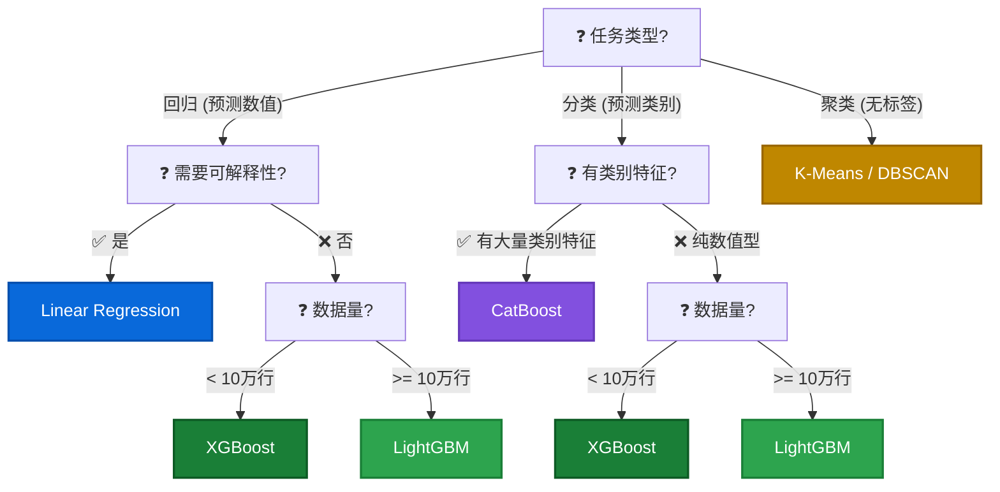

# 🤖 建模 (LightGBM / CatBoost)

## 机器学习标准流程 (ML SOP) 🧬

> **核心内容已迁移**: 完整的 9 步标准作战地图 请移步 **[🧭 机器学习标准流程 (ML SOP)](00_ml_sop.md)**。

这里主要聚焦于 **Step 6: Modeling (建模)** 及其之后的步骤。

## 建模三部曲 (Modeling 1-2-3) 🎬

| 步骤 (Step)   | 代码 (Code)                    | 含义 (Meaning)             |
| :------------ | :----------------------------- | :------------------------- |
| **1. 实例化** | `model = LinearRegression()`   | 建一个空脑子               |
| **2. 训练**   | `model.fit(X_train, y_train)`  | 送去上学 (Backpropagation) |
| **3. 预测**   | `pred = model.predict(X_test)` | 参加高考                   |

## 模型对比速查 (Model Comparison) ⚔️

| 模型 (Model)            | **任务类型 (Task)**                            | 适用场景 (Scenario)   | 核心库/函数            |
| :---------------------- | :--------------------------------------------- | :-------------------- | :--------------------- |
| **Linear Regression**   | **回归 (Regression)**<br>预测**具体数值**      | 预测房价/销量/LTV     | `sklearn.linear_model` |
| **Logistic Regression** | **分类 (Classification)**<br>预测**几率/类别** | 预测是否点击/流失     | `sklearn.linear_model` |
| **Random Forest**       | **Reg & Class**<br>都能做！                    | 万金油 (表格数据)     | `sklearn.ensemble`     |
| **XGBoost**             | **Reg & Class**<br>都能做！                    | 追求高精度的比赛/业务 | `xgboost`              |
| **K-Means**             | **聚类 (Clustering)**<br>没有标准答案          | 用户分层/发现模式     | `sklearn.cluster`      |

### 模型选型决策树 (Model Selection Decision Tree)



## SOTA 模型: XGBoost 🚀
*Gradient Boosting 的王者。Kaggle 竞赛 + 工业界通用。*

??? example "1. 回归 (Regression): 预测数值 (销量/房价/LTV)"

    ```python
    import xgboost as xgb
    from sklearn.metrics import mean_absolute_error

    # 实例化 (注意: 是 XGBRegressor，不是 XGBClassifier)
    xgb_model = xgb.XGBRegressor(
        n_estimators=500,       # 树的数量 (先给够，靠 early_stopping 控制)
        max_depth=6,            # 树深度 (防过拟合，一般 4-8)
        learning_rate=0.05,     # 学习率 (越小越稳，但训练越慢)
        subsample=0.8,          # 每棵树用 80% 的数据 (防过拟合)
        colsample_bytree=0.8,   # 每棵树用 80% 的特征 (防过拟合)
        random_state=42,
        n_jobs=-1               # 用所有 CPU 核心
    )

    # 训练 (带 eval_set 可监控训练过程)
    xgb_model.fit(
        X_train, y_train,
        eval_set=[(X_test, y_test)],  # 监控测试集表现
        verbose=50                     # 每 50 轮打印一次
    )

    # 预测 & 评估
    y_pred = xgb_model.predict(X_test)
    mae = mean_absolute_error(y_test, y_pred)
    print(f'XGBoost MAE: {mae:.2f}')
    ```

??? example "2. 分类 (Classification): 预测 0/1 (流失/欺诈)"

    ```python
    xgb_clf = xgb.XGBClassifier(
        n_estimators=300,
        max_depth=6,
        learning_rate=0.1,
        use_label_encoder=False,
        eval_metric='logloss',  # 分类用 logloss
        random_state=42
    )
    xgb_clf.fit(X_train, y_train)
    ```

!!! tip "XGBoost 两套 API"

    | API               | 用法                                         | 特点                                       |
    | :---------------- | :------------------------------------------- | :----------------------------------------- |
    | **sklearn API** ✅ | `xgb.XGBRegressor()` / `xgb.XGBClassifier()` | 兼容 sklearn，支持 `fit/predict`，**推荐** |
    | **原生 API**      | `xgb.train(params, DMatrix(...))`            | 更底层，需要手动构造 `DMatrix`             |

!!! warning "XGBoost 只接受数值型特征"

    - **日期列** (`datetime64`): 必须先拆解为 `year/month/dayofweek` 等数值特征，再丢掉原始日期列
    - **分类特征** (`object`): 必须先 One-Hot 编码或 Label 编码 (LightGBM/CatBoost 可自动处理，但 XGBoost **不行**)

## SOTA 模型: LightGBM ⚡
*比 XGBoost 快，精度还不输。面试与比赛的首选。*

??? example "1. 分类 (Classification): 预测 0/1 (流失/欺诈)"

    ```python
    import lightgbm as lgb
    model = lgb.LGBMClassifier(
        n_estimators=200,    # 树的棵数
        learning_rate=0.1,   # 步长 (通常 0.01~0.1)
        max_depth=-1,        # -1 不限制深度 (Leaf-wise)
        num_leaves=31,       # 🔥 核心参数！控制复杂度
        random_state=42,
        verbose=-1           # 静音模式
    )
    model.fit(X_train, y_train)
    ```

??? example "2. 回归 (Regression): 预测数值 (销量/股价)"

    ```python
    model = lgb.LGBMRegressor(
        n_estimators=200,
        learning_rate=0.05,
        num_leaves=31
    )
    model.fit(X_train, y_train)
    ```

**💡 Senior 面试必问: `num_leaves` vs `max_depth`**

*   **XGBoost (Level-wise)**: 限制 `max_depth` (层层修剪)。
*   **LightGBM (Leaf-wise)**: 限制 `num_leaves` (只长最有用的叶子)。
*   **换算关系**: 如果 `num_leaves > 2^max_depth`，模型会过拟合！

## SOTA 模型: CatBoost 🐱
*处理类别特征的神器 (目标大厂/美团常用)。*

??? example "CatBoost 代码模板"

    ```python
    from catboost import CatBoostClassifier

    # 1. 找到类别列的索引
    cat_idx = [df.columns.get_loc(c) for c in ['city', 'job']]

    # 2. 傻瓜式调用
    model = CatBoostClassifier(
        iterations=200,
        learning_rate=0.1,
        cat_features=cat_idx, # 🔥 核心: 告诉它哪些列是类别
        verbose=0
    )
    model.fit(X_train.values, y_train)
    ```

> **🤯 参数大乱斗 (Parameter Chaos)**
> 
> | 含义 | Sklearn/XGB | LightGBM | CatBoost |
> | :--- | :--- | :--- | :--- |
> | **树的数量** | `n_estimators` | `n_estimators` / `num_iterations` | `iterations` |
> | **学习率** | `learning_rate` | `learning_rate` | `learning_rate` |
> | **静音** | `verbose=0` | `verbose=-1` | `verbose=0` |
> | **类别特征** | ❌ (必须OneHot) | `categorical_feature` | `cat_features` |

## Early Stopping (防炼过头) ⏱️
*树够了就停，不要浪费迭代。*

??? example "Early Stopping 代码模板"

    ```python
    # 方法: 在构造函数中设置 (XGBoost ≥ 1.6 推荐写法)
    xgb_model = xgb.XGBRegressor(
        n_estimators=500,          # 给够上限
        early_stopping_rounds=50,  # 连续 50 轮没改善就停
        random_state=42
    )

    xgb_model.fit(
        X_train, y_train,
        eval_set=[(X_test, y_test)],  # 必须提供验证集
        verbose=10
    )
    # best_iteration 属性可查看实际用了多少棵树
    print(f'最佳迭代轮数: {xgb_model.best_iteration}')
    ```

!!! tip "怎么判断需要 Early Stopping？"

    看训练日志：如果 RMSE 在 50 轮后就不再下降甚至略微上升，说明模型早就学到极限了，后面在白跑（甚至过拟合）。

## Feature Importance 驱动调优 🎯
*先看特征，再调参数。特征决定上限，参数决定下限。*

??? example "Feature Importance 代码模板"

    ```python
    # 1. 画 Feature Importance (快速诊断)
    import xgboost as xgb
    fig, ax = plt.subplots(figsize=(10, 8))
    xgb.plot_importance(xgb_model, ax=ax, height=0.5, max_num_features=20)
    plt.tight_layout()
    plt.show()

    # 2. 拿到数值排序 (高级用法)
    importances = xgb_model.feature_importances_
    feat_imp = pd.Series(importances, index=feature_cols).sort_values(ascending=False)
    print(feat_imp)
    ```

!!! important "Feature Importance 三条审查规则"

    1. **排名第一的特征是否合理？** 如果一个"不该这么重要"的特征排第一 → 大概率是 **Data Leakage**
    2. **Importance ≈ 0 的特征**：可以安全删除，减少噪音
    3. **高度相关的特征** (如 `is_weekend` vs `dayofweek`)：模型会自动选一个，所以 importance 低 ≠ 无用

## 模型调优诊断表 (Tuning Playbook) 🔧
*看到症状 → 锁定病因 → 对症下药。*

| 症状 (Symptom)                         | 病因 (Root Cause)                  | 处方 (Solution)                          | 代码关键词                               |
| :------------------------------------- | :--------------------------------- | :--------------------------------------- | :--------------------------------------- |
| RMSE/MAE 从第 N 轮开始**不再下降**     | 模型已学到极限，后续在过拟合       | **Early Stopping**                       | `early_stopping_rounds=50`               |
| MAE 很低但**不合理的好**               | **Data Leakage** (偷看了未来信息)  | 检查 Feature Importance，删泄露特征      | `xgb.plot_importance()`                  |
| 模型**不敢冲高**，极值严重低估         | 树模型预测叶子均值，极值被"平均"掉 | **样本加权** (给极值 x3 权重)            | `sample_weight=weights`                  |
| 模型整体**预测偏移** (系统性偏高/偏低) | 数据分布变化 (趋势/季节)           | 检查 Train/Test 分布是否一致             | 对比 `y_train.mean()` vs `y_test.mean()` |
| MAE / mean **> 100%**                  | 数据本身**波动极大** (CV > 1)      | 接受现实 / 换更粗粒度 (日→周) / 分层评估 | `y_test.std() / y_test.mean()`           |
| 特征 importance 分布**极度不均**       | 关键特征信息量太大，其他特征被遮蔽 | 正常现象，但可尝试删掉 top1 看变化       | —                                        |

!!! warning "调参的正确顺序"

    ```
    ❌ 错误：一上来就 Optuna 暴搜参数
    ✅ 正确：Feature Importance → 误差分析 → 删/加特征 → 最后才 Optuna

    原因: 调参 = 微调 (5-15%) | 特征优化 = 大调 (30-50%)
    ```

### 样本加权代码 (Sample Weighting)

??? example "Sample Weighting 代码模板"

    ```python
    import numpy as np

    # 给高值样本更高的权重 (告诉模型：极值天更重要)
    weights = np.ones(len(y_train))
    high_threshold = y_train.quantile(0.9)       # Top 10%
    weights[y_train >= high_threshold] = 3.0      # 权重 x3

    xgb_model.fit(
        X_train, y_train,
        sample_weight=weights,
        eval_set=[(X_test, y_test)],
        verbose=10
    )
    ```

!!! note "Log Transform vs Sample Weighting 适用场景"

    | 方法                           | 适用场景                          | 不适用场景                              |
    | :----------------------------- | :-------------------------------- | :-------------------------------------- |
    | **Log Transform** (`np.log1p`) | 关心**相对误差** (MAPE)，数据右偏 | 想让模型"冲高"预测极值 (log 会压缩高值) |
    | **Sample Weighting**           | 让模型**更关注极值/高价值样本**   | 极值是**随机噪声** (不可预测的事件)     |

    **核心区别**：Log 压缩目标让模型"不在乎极值"；加权放大惩罚让模型"更在乎极值"。方向完全相反。

---

## 🎯 面试高频 Q&A

??? question "Q1: XGBoost 和 LightGBM 有什么区别？什么时候用哪个？"

    | 维度         | XGBoost               | LightGBM                         |
    | :----------- | :-------------------- | :------------------------------- |
    | **生长策略** | Level-wise (层层生长) | Leaf-wise (找增益最大的叶子生长) |
    | **核心参数** | `max_depth`           | `num_leaves`                     |
    | **速度**     | 较慢                  | **快 3-5 倍** (GOSS + EFB)       |
    | **类别特征** | ❌ 必须手动编码        | ✅ 原生支持 `categorical_feature` |
    | **适用场景** | 数据量 < 10万         | 数据量 >= 10万                   |

    **面试加分**: LightGBM 用 GOSS (Gradient-based One-Side Sampling) 只保留梯度大的样本 + EFB (Exclusive Feature Bundling) 合并互斥特征，所以又快又准。

??? question "Q2: 模型过拟合了怎么办？"

    **诊断**: 训练集 MAE 很低，测试集 MAE 很高 → 过拟合。

    **四板斧** (按优先级排序)：

    1. **加数据**: 最有效但最难
    2. **减特征**: 删掉 importance ≈ 0 和高度相关的特征
    3. **正则化**: 降 `max_depth`/`num_leaves`，升 `min_child_weight`，降 `learning_rate`
    4. **Early Stopping**: `early_stopping_rounds=50`

    **注意**: 不要一上来就调参！先检查是否有 Data Leakage。

??? question "Q3: Feature Importance 高的特征一定有用吗？"

    **不一定**。需要警惕 3 种情况：

    1. **Data Leakage**: 如预测"是否购买"时"购买金额"排第一 → 因果倒置
    2. **高基数类别**: 如 `user_id` 的 Importance 虚高 → 因为唯一值多，树总能找到好的切分点
    3. **相关特征互抢**: `is_weekend` 和 `dayofweek` 只会有一个排前面 → 不代表另一个没用

    **正确做法**: Importance 要结合 **SHAP 值** 和 **业务逻辑** 一起看。
