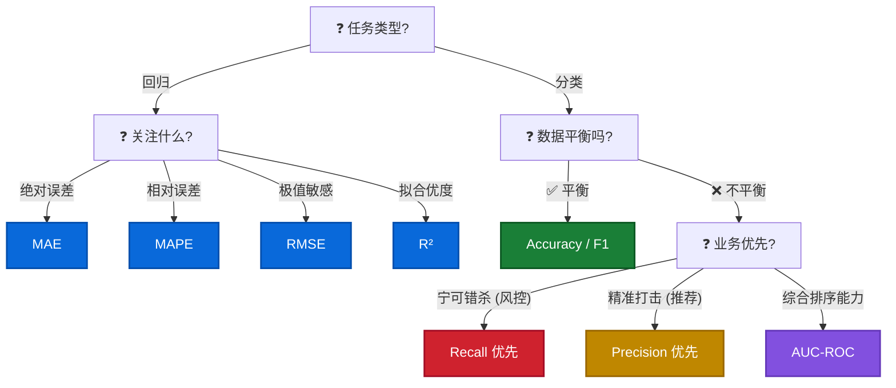

# 📏 评估指标 & 调优

| 指标 (Metric) | 全称 (Full Name)   | Sklearn 函数 (Function)             | 核心含义 (Intuition)                            | 越高越好吗？   |
| :------------ | :----------------- | :---------------------------------- | :---------------------------------------------- | :------------- |
| **MSE**       | 均方误差           | `mean_squared_error`                | **loss function**。甚至会帮你求导。             | **❌ 越低越好** |
| **RMSE**      | 均方根误差         | `mean_squared_error(squared=False)` | **标准误差**。单位和 Target 一样 ($)。          | **❌ 越低越好** |
| **MAE**       | 平均绝对误差       | `mean_absolute_error`               | **人话指标**。平均差了多少钱？                  | **❌ 越低越好** |
| **MAPE**      | 平均绝对百分比误差 | `mean_absolute_percentage_error`    | **老板看**。平均差了百分之几？(注意分母不能为0) | **❌ 越低越好** |
| **R²**        | R-Squared          | `r2_score`                          | **拟合优度**。比瞎猜平均值强多少？(1.0是完美)   | ✅ 越高越好     |

### 指标选择决策树 (Metric Selection Decision Tree)



> **💡 Pro Tip: MAE vs MAPE vs MAE/Mean**
> *   **MAE**: 绝对值 (比如差 100 块)。问题：如果不看均值，你不知道 100 块是大是小。
> *   **MAPE**: 每一行的百分比误差求平均。问题：如果这就行 `y_true` 很小 (e.g. 1)，误差会被无限放大。
> *   **MAE / Mean**: 全局的相对误差。**最稳健的业务指标！** 相当于 "总误差 / 总销量"。

> **💡 Pro Tip: 让报告说人话 (target_names)**
> ```python
> print(classification_report(y_test, y_pred, target_names=['正常用户', '流失用户']))
> ```

## 深度辨析：Loss Function vs Metric 🧠

| 维度     | Loss Function (损失函数)      | Metric (评估指标)       |
| :------- | :---------------------------- | :---------------------- |
| **受众** | **给模型看** (Training)       | **给人看** (Evaluation) |
| **作用** | **指导优化** (求导/梯度下降)  | **汇报结果** (业务价值) |
| **特性** | 必须**光滑** (Differentiable) | 可以**阶跃** (离散)     |

## 必考辨析: SD vs SE vs MSE ⚠️
*名字很像，但完全不是一家人！*

| 指标    | 全称 (Full Name)                     | 核心含义 (Intuition)                         | 公式 (Formula)             | 归属 (Family)                               |
| :------ | :----------------------------------- | :------------------------------------------- | :------------------------- | :------------------------------------------ |
| **SD**  | **Standard Deviation**<br>(标准差)   | **描述数据**<br>这届学生的分数差距大不大？   | `σ = √(Σ(x-μ)² / N)`       | **Descriptive Stats**<br>(描述性统计)       |
| **SE**  | **Standard Error**<br>(标准误)       | **描述均值**<br>重考一次，平均分会抖动多少？ | `SE = SD / √n`             | **Inference Stats**<br>(推断性统计/A/B测试) |
| **MSE** | **Mean Squared Error**<br>(均方误差) | **描述预测**<br>模型预测的值离真实值差多少？ | `MSE = Σ(y - y_pred)² / n` | **Machine Learning**<br>(回归模型 Loss)     |

!!! tip "关系 (The Connection)"

    *   **SE** 越小 → **P-value** 越小 (更容易显著)。
    *   **MSE** 越小 → **模型越准** (预测误差小)。
    *   它们没有直接换算关系，**Don't Mix Them Up!** 🚫

## 混淆矩阵与阈值调优 (Confusion Matrix & Threshold Tuning) ⚖️

**1. 混淆矩阵 (Confusion Matrix)**

|                    | 预测: 好人 (0)                                   | 预测: 坏人 (1)                             |
| :----------------- | :----------------------------------------------- | :----------------------------------------- |
| **真实: 好人 (0)** | **TN** (True Negative)<br>岁月静好               | **FP** (False Positive)<br>冤枉好人 (误报) |
| **真实: 坏人 (1)** | **FN** (False Negative) 💣<br>**漏网之鱼 (漏报)** | **TP** (True Positive)<br>抓个正着         |

**2. 核心指标速查**

*   **Accuracy (准确率)**: `(TP+TN) / All`。*陷阱*: 样本不平衡时毫无意义。
*   **Precision (查准率)**: `TP / (TP + FP)`。*人话*: "你抓的人里，有多少是真的坏人？"
*   **Recall (查全率/召回率)**: `TP / (TP + FN)`。*人话*: "所有坏人里，你到底抓住了几个？"
*   **F1-Score**: `2 * P * R / (P + R)`。P 和 R 的调和平均数。

```python
from sklearn.metrics import confusion_matrix

# 1. 默认门槛 (Threshold = 0.5)
y_pred = model.predict(X_test)
cm = confusion_matrix(y_test, y_pred)

# 2. 画出混淆矩阵
sns.heatmap(cm, annot=True, fmt='d', cmap='Blues')
plt.xlabel('Predicted')
plt.ylabel('Actual')

# 3. 🔥 高阶技巧: 调低门槛，抓更多坏人 (Boost Recall)
y_prob = model.predict_proba(X_test)[:, 1] # 先拿到概率！
y_pred_recall = (y_prob > 0.3).astype(int) # 只要嫌疑超过 30% 就抓！
```
!!! important "业务心法"

    *   **宁可错杀 (查全率优先)**: 比如抓逃犯、查癌症。**调低门槛** (0.3)。
    *   **宁缺毋滥 (查准率优先)**: 比如推荐视频、垃圾邮件拦截。**调高门槛** (0.7)。

## 自动调参: Optuna 🔫
*别再用 GridSearchCV 傻跑了！用贝叶斯优化，越跑越聪明。*

??? example "Optuna 调参代码模板"

    ```python
    import optuna

    def objective(trial):
        # 1. 定义参数空间 (让它自己猜)
        param = {
            'n_estimators': trial.suggest_int('n_estimators', 100, 500),
            'learning_rate': trial.suggest_float('learning_rate', 0.01, 0.1),
            'num_leaves': trial.suggest_int('num_leaves', 20, 50),
            'verbose': -1
        }
        
        # 2. 跑模型 (用 CV 验证更稳)
        model = lgb.LGBMClassifier(**param)
        score = cross_val_score(model, X_train, y_train, cv=3, scoring='roc_auc').mean()
        return score

    # 3. 开始炼丹 (Running...)
    study = optuna.create_study(direction='maximize')
    study.optimize(objective, n_trials=50)

    print(study.best_params_)
    ```

## 不平衡处理 (Imbalanced Data Handling) ⚖️
*当坏人太少 (1%) 时，模型会偷懒全猜好人。*

**1. 两种手段 (Techniques)**

*   **Random Oversampling**: `Ctrl+C`, `Ctrl+V`。简单粗暴地复制坏人样本。缺点: 容易过拟合。
*   **SMOTE (合成过采样) 🧪**: 找两个坏人 A 和 B，在它们连线上生一个"混血儿" C。创造了**新的**坏人。

??? example "SMOTE 代码模板"

    ```python
    from imblearn.over_sampling import SMOTE
    from collections import Counter

    print(f'Original dataset shape: {Counter(y_train)}')

    # 1. 初始化 SMOTE
    smote = SMOTE(random_state=42)

    # 2. Resample (注意：只能对训练集做！)
    X_resampled, y_resampled = smote.fit_resample(X_train, y_train)

    print(f'Resampled dataset shape: {Counter(y_resampled)}')
    # 3. 接下来用 X_resampled, y_resampled 训练模型
    ```

**2. 灵魂拷问: 为什么 Precision 会暴跌?**

*   用了 SMOTE 后，Recall 上去了，但 Precision 跌成狗。
*   **真相**: 这是 Feature 不是 Bug。风控逻辑: 宁可错杀 1000，不可放过 1。

## 回归模型快速诊断 (MAE Benchmark) 🩺
*MAE 数字本身没有意义，必须跟均值比。*

| MAE / mean | 诊断     | 说明                                 |
| :--------- | :------- | :----------------------------------- |
| **< 20%**  | ✅ 不错   | 模型预测接近真实值                   |
| **20-30%** | ⚠️ 可接受 | 有改进空间但可用                     |
| **30-50%** | 😟 有问题 | 需要优化特征或模型                   |
| **> 100%** | ❌ 严重   | 平均误差超过均值本身，模型基本不可用 |

??? example "MAE 快速诊断代码"

    ```python
    # 快速诊断：MAE / mean 比率
    mae = mean_absolute_error(y_test, y_pred)
    ratio = mae / y_test.mean()
    print(f'MAE: {mae:.0f} | Mean: {y_test.mean():.0f} | MAE/Mean: {ratio:.1%}')

    # 💡 如果 std > mean (CV > 1)，说明数据本身波动极大
    # 此时 MAE 高不一定是模型的问题，而是数据粒度太细
    cv = y_test.std() / y_test.mean()
    print(f'变异系数 CV: {cv:.2f}')  # CV > 1 → 考虑换更粗粒度 (日→周)
    ```

## 分层评估 (Stratified Evaluation) 📊
*总体 MAE 被极值拉高？拆开看才知道真相。*

??? example "分层评估代码模板"

    ```python
    # 分层评估：正常天 vs 极值天
    threshold = y_test.quantile(0.9)  # Top 10% 为极值

    mask_normal = y_test < threshold
    mask_extreme = y_test >= threshold

    mae_normal = mean_absolute_error(y_test[mask_normal], y_pred[mask_normal])
    mae_extreme = mean_absolute_error(y_test[mask_extreme], y_pred[mask_extreme])

    print(f'Normal Days  MAE: {mae_normal:.0f}  (占 {mask_normal.mean():.0%})')
    print(f'Extreme Days MAE: {mae_extreme:.0f}  (占 {mask_extreme.mean():.0%})')
    ```

!!! tip "什么时候用分层评估？"

    - 数据有**明显的极值/尖刺** (如日级销售额)
    - 总体 MAE 很高，但你怀疑是**少数极端样本拉高了均值**
    - 想向业务方证明：模型在**正常场景下是可用的**，极值天是"不可预测的随机事件"

---

## 🎯 面试高频 Q&A

??? question "Q1: AUC = 0.85 是什么意思？为什么不用 Accuracy？"

    **AUC 的直觉**: 随机抽一个正样本和一个负样本，模型给正样本打分更高的概率为 85%。

    | 指标         | 适用场景         | 陷阱                                |
    | :----------- | :--------------- | :---------------------------------- |
    | **Accuracy** | 数据平衡 (50/50) | 不平衡时毫无意义 (全猜好人也有 99%) |
    | **AUC**      | 数据不平衡       | 不受阈值影响，反映**排序能力**      |

    **面试回答要点**: "Accuracy 在不平衡数据上会虚高。AUC 衡量的是模型的排序能力，跟阈值无关，所以在风控/欺诈/流失预测等场景更可靠。"

??? question "Q2: Precision 和 Recall 怎么取舍？"

    **核心公式**：阈值 ↑ → Precision ↑ → Recall ↓ (此消彼长)

    | 业务场景              | 优先指标  | 理由                                         |
    | :-------------------- | :-------- | :------------------------------------------- |
    | **风控/欺诈检测**     | Recall    | 宁可错杀 1000，不可放过 1 (漏掉坏人代价极高) |
    | **垃圾邮件/广告推荐** | Precision | 误报太多则用户体验极差                       |
    | **通用场景**          | F1-Score  | 两者的调和平均，端水大师                     |

    **Senior DA 的价值**: 用 **业务成本** 来量化最优阈值。比如：漏报 1 个欺诈损失 $10000，误报 1 个正常用户只损失 $10 → Recall 的权重是 Precision 的 1000 倍。

??? question "Q3: 样本不平衡怎么处理？SMOTE 一定好吗？"

    **三种手段** (按推荐优先级)：

    1. **调阈值**: 不改数据，只调 `predict_proba` 的阈值 (如 0.5 → 0.3)
    2. **Class Weight**: `class_weight='balanced'` (让模型自动调权重)
    3. **SMOTE**: 合成少数类样本 (有风险)

    **SMOTE 的坑**: 可能导致 Precision 暴跌！因为合成的"假坏人"可能不够像真坏人，导致模型把更多好人误判为坏人。

    **面试加分**: "我通常先试方法 1 和 2，只有当 Recall 还是不够时才考虑 SMOTE，并且一定要监控 Precision 的变化。"
