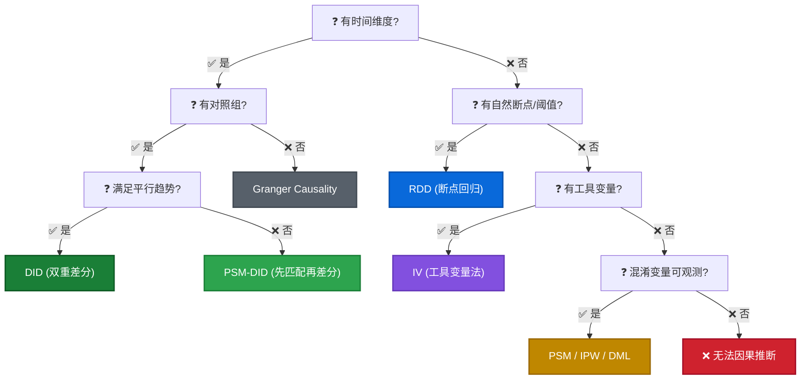

# 🔬 因果推断 (Causal Inference)

> **核心逻辑**: 当无法进行 A/B 测试 (Randomized Controlled Trial) 时，如何从观测数据 (Observational Data) 中识别因果关系？
> **关键挑战**: 消除 **选择偏差 (Selection Bias)** 和 **混杂因素 (Confounders)**。

## 0. 因果推断 SOP (Standard Operating Procedure)

> **核心原则**: 不要上来就跑模型！先问业务问题，再画图，最后才是代码。

| Step  | 关键动作                                      | 详细位置                                                              |
| :---: | :-------------------------------------------- | :-------------------------------------------------------------------- |
|   1   | 业务问题定义 + 因果假设                       | 本页                                                                  |
|   2   | EDA + 分布自检 + DAG 绘制                     | 本页                                                                  |
|   3   | 方法选型 (决策树 + 横向对比)                  | 本页                                                                  |
|   4   | 假设检验 (理论)                               | 本页 (代码 → 子页面)                                                  |
|   5   | 执行（手动挡 → 子页面 / 自动挡 DoWhy → 本页） | [DID](15a_did.md) · [PSM](15b_psm_ipw.md) · [RDD/IV](15c_advanced.md) |
|   6   | 稳健性检验                                    | [稳健性检验 (SC/Placebo)](15d_synthetic_control_placebo.md)           |

### Step 1: 业务问题定义 (Business Question)
*   **判断**: 这是 A/B Test 无法解决的问题吗？(e.g., 全量上线、历史数据、道德限制)
*   **定义**:
    *   **Treatment (T)**: 干预变量 (e.g., 是否发券)
    *   **Outcome (Y)**: 结果变量 (e.g., 购买金额)
    *   **Confounders (X)**: 混淆变量 (e.g., 用户等级、历史活跃度) —— **最重要的一步！**

### Step 2: 数据探索与 DAG (EDA)
*   **相关性扫描**: 使用 `sns.heatmap` 检查 T 和 Y 的相关性 (注意：Correlation ≠ Causation)。

    ```python
    # 0. 相关性热力图
    # annot=True: 在格子中显示数值
    # cmap='coolwarm': 颜色映射 (红正蓝负)，方便肉眼识别
    # fmt='.2f': 保留两位小数
    corr = df[['treatment', 'outcome', 'confounder1', 'confounder2']].corr()
    sns.heatmap(corr, annot=True, cmap='coolwarm', fmt='.2f')
    ```

*   **分布自检 & 模型选择 (Distribution Check)** ⚠️ *新增关键步骤*
    *   **方法**: 使用 `sns.histplot(df['Y'], kde=True)` 查看因变量分布。
    *   **决策树**:
        1.  **正态分布 (钟形)** → **OLS (线性回归)**
            *   *适用*: 大多数销售额、GMV、温度等连续变量。
        2.  **长尾分布 (右偏)** → **Log-Linear (取对数)**
            *   *处理*: `np.log1p(Y)`，系数解释为百分比变化。
        3.  **计数数据 (非负整数)** → **Poisson / Negative Binomial**
            *   *适用*: 点击次、投诉量、订单数。
        4.  **二值数据 (0/1)** → **Logit / Probit**
            *   *适用*: 是否购买、是否流失、是否点击。

    ```python
    # 分布检查代码 (Distribution Check)
    import seaborn as sns
    import matplotlib.pyplot as plt
    import numpy as np

    # 1. 绘制直方图 + KDE 曲线
    plt.figure(figsize=(10, 6))
    sns.histplot(df['outcome'], kde=True)
    plt.title('Outcome Distribution Check')
    plt.show()

    # 2. 偏度检查 (Skewness)
    skewness = df['outcome'].skew()
    print(f"Skewness: {skewness:.2f}")
    if skewness > 1:
        print("Tip: 右偏严重，建议尝试 np.log1p(Y) 变换")
    ```

*   **绘制 DAG (有向无环图)**:
    *   **识别 Confounders**: 同时影响 T 和 Y 的变量 (必须控制)。
    *   **识别 Colliders**: 被 T 和 Y 同时影响的变量 (绝不能控制，否则产生对撞偏差)。

    ```python
    # 进阶绘制 (体现混淆变量的 "Common Cause" 特性)
    from graphviz import Digraph
    dot = Digraph()

    # 1. 定义 T 和 Y (用颜色区分)
    dot.node('T', 'Treatment', shape='box', style='filled', color='lightblue')
    dot.node('Y', 'Outcome', shape='box', style='filled', color='lightgreen')

    # 2. 批量添加混淆变量
    confounders = ['Income', 'Age', 'Location']
    for c in confounders:
        dot.node(c, c)
        
        # 核心逻辑：混淆变量必须同时指向 T 和 Y
        dot.edge(c, 'T') # e.g. 只有这些特征的人才容易被分到干预组
        dot.edge(c, 'Y') # e.g. 这些特征本身就会导致结果好
    
    # 3. 待测因果链路
    dot.edge('T', 'Y', label='Causal Effect?')
    dot
    ```

    > **为什么要这么画？(Why so complex?)**
    > *   **显式表达共因**: 代码循环清楚地展示了 Confounder 的定义——同时影响 T 和 Y 的共因 (Common Cause)。不画这两条线，就不是混淆变量。
    > *   **避免语法坑**: `dot.edges(['AB'])` 这种简写只适合单字符节点名；长变量名如果不拆开写 `dot.edge(u, v)`，Graphviz 会报错。

### Step 3: 方法论选型 (Method Selection Decision Tree)



### 方法横向对比总表 (面试必背)

| 方法        | 数据类型         | 核心假设       | 不可观测混淆? | 估计量   | 适用场景                 | 检验方法                |
| :---------- | :--------------- | :------------- | :-----------: | :------- | :----------------------- | :---------------------- |
| **DID**     | 面板 (Panel)     | 平行趋势       |       ❌       | ATE      | 政策评估、促销活动       | 平行趋势图 + Placebo    |
| **PSM**     | 截面 (Cross-sec) | 可忽略性 (CIA) |       ❌       | ATT      | 会员分析、用药效果       | Balance Check (SMD<0.1) |
| **IPW**     | 截面             | 可忽略性 (CIA) |       ❌       | ATE      | 同 PSM, 样本少时更优     | 权重截断 + Placebo      |
| **RDD**     | 截面 + 阈值      | 连续性         |       ✅       | LATE     | 奖学金、及格线、年龄阈值 | McCrary 操纵检验        |
| **IV**      | 截面             | 排他约束       |       ✅       | LATE     | 自然实验、彩票抽奖       | Sargan/Hansen 过度识别  |
| **DML**     | 截面             | 无遗漏变量     |       ❌       | CATE/ATE | 高维 + 非线性            | Cross-fitting           |
| **Granger** | 时序             | 平稳性         |       ❌       | 预测因果 | GDP vs 股市              | 反向检验                |

!!! tip "面试速记"
    “有时间用 DID，没时间用 PSM，有断点用 RDD，有工具用 IV，高维用 DML”

??? note "方法选型详细说明 (点击展开)"
    1.  **数据是截面的 (无时间维度)** → **PSM / IPW / DML**
        *   *原理*: 既然没有过去和未来，就在当下找个“替身”对比或加权。
        *   *检验*: **平衡性检验 (Balance Check)** + **Placebo Outcome**。
    2.  **数据是面板的 (有时间 + 有对照)** → **DID (双重差分)**
        *   *原理*: 利用对照组作为“平行宇宙”的参照系。
        *   *检验*: **平行趋势检验 (Parallel Trend)** + **Placebo Time**。
    3.  **只有时间 (无对照) / 有明确阈值** → **RDD (断点回归)**
        *   *原理*: 比较阈值前后的跳跃。
        *   *检验*: **McCrary Test (操纵检验)** + **Placebo Cutoff**。
    4.  **只有时间序列 (T先Y后)** → **Granger Causality** (仅验证预测能力)
    5.  **有工具变量 (Z只影响T)** → **IV (工具变量法)** (场景: 自然实验)

### Step 4: 假设检验 (Assumption Check) ⚠️ *核心*
*   **DID**: **平行趋势检验 (Parallel Trend)** —— 干预前两组趋势必须平行 (可视化代码见第 2.3 节)。
*   **PSM (倾向性得分匹配) 的三大护法**:
    1.  **条件独立性假设 (CIA, Conditional Independence Assumption)**:
        *   *解释*: 在控制了所有可观测的混淆变量 $X$ 之后，个体的干预分配 $T$ 与其潜在结果 $(Y_0, Y_1)$ 是相互独立的。
        *   *业务直觉*: “只要我们把历史特征 ($X$) 极其相似的两个用户拉对子，他们最后有没有被干预 ($T$)，就如同抛硬币一样是随机的。”
        *   *硬伤警告*: PSM 的命门在于**无法控制“未观测到的混淆变量”**。如果我们漏掉了关键特征（如用户对某品牌的隐藏偏好），CIA 就不成立。此时结果会存在偏差，应当转向面板数据方法（如 DID）或利用工具变量（IV）。
    2.  **共同支撑域 (Common Support)**: 这是匹配的前提，干预组和对照组的倾向性得分分布必须有足够的重合区间。
    3.  **平衡性检验 (Balance Check)**: 匹配后，用来检验两群人是否真正实现了“同质化”。核心量化指标是 **SMD**。

    !!! note "SMD (Standardized Mean Difference/标准化均值差异) 原理与公式"
        *为什么匹配后不用传统的 T 检验？* 在大数据场景下（样本数 >1万），由于标准误极小，T 检验对哪怕极微小的绝对差异都会报“统计显著（分布不同）”，导致匹配永远无法通过。
        SMD 提供了一个**无量纲的绝对差异幅度量度**，它只看差异相对分布宽度的绝对大小。

        $$
        SMD = \frac{\bar{X}_{treated} - \bar{X}_{control}}{\sqrt{\frac{S_{treated}^2 + S_{control}^2}{2}}}
        $$
        
        *   **分子**：匹配后，处理组和对照组在该特征（如历史消费频次）上的均值差。
        *   **分母**：处理组方差 $S_{treated}^2$ 和对照组方差 $S_{control}^2$ 平均值的散方根（Pooled Standard Deviation）。
        *   **业界判断标准**：绝对值 `|SMD| < 0.1` 判定为完美平衡；`< 0.25` 可接受。如果存在特征的 `|SMD| > 0.25`，宣判匹配失败，必须回去调卡尺 (Caliper) 或增减特征！

    !!! tip "面试必考：什么是调卡尺 (Caliper Matching)？"
        在 PSM 匹配时，如果只用最近邻匹配 (Nearest Neighbor)，系统会强行把干预组和对照组里得分“相对最接近”的人配对，哪怕他们的绝对得分差异很大（例如 0.8 和 0.4 强行配对）。这会导致匹配后特征极度不平衡，进而导致 **SMD 爆炸**。
        
        **卡尺 (Caliper)** 就是设定的**绝对容忍度阈值**。只有得分差异 `< caliper` 的样本才允许配对，否则该样本被**抛弃 (Drop)**。
        
        *   **代价/权衡 (Trade-off)**: 卡尺越小 (例如从 0.05 调到 0.01)，留下的对子越相似，**SMD 越低（结果越纯净）**；但找不到对象的干预组会被大量丢弃，**样本量越少（统计效力下降）**。
        *   **业界标准 (高级专家 答法)**: “通常不会拍脑袋定，标准做法是将卡尺设定为倾向性得分 Logit 变换值标准差的 **0.2 倍** (Rosenbaum & Rubin, 1985)。”
        
        👉 **SMD 计算代码与分布对比图** → 详见 [PSM & IPW 实战 SOP](15b_psm_ipw.md)

    👉 **SMD 计算代码与分布对比图** → 详见 [PSM & IPW 实战 SOP](15b_psm_ipw.md)

*   **RDD**: **驱动变量连续性 (McCrary Test)** → 代码详见 [进阶 (RDD/IV)](15c_advanced.md)

### Step 5: 执行与估算 (Execution)

*   **手动挡 (各方法子页面)**：
    - DID → [📊 DID 双重差分](15a_did.md) (含 Event Study 完整代码)
    - PSM / IPW → [🎯 PSM & IPW 匹配/加权](15b_psm_ipw.md) (含 Caliper Matching + SMD 检验)
    - RDD / IV → [🧪 进阶 (RDD/IV)](15c_advanced.md)

*   **自动挡 (DoWhy 框架)**:
    *   *定位*: DoWhy 不是方法，是 **统一执行引擎**。
    *   *优点*: 自动生成因果图，统一接口调用 DID/PSM/IV，自带稳健性检验。

    ```python
    import dowhy
    from dowhy import CausalModel

    # 1. 定义与绘图 (Define)
    # common_causes: 必须包含所有 Confounders (混淆变量)
    # instruments: (可选) 如果有工具变量 IV，在此指定
    model = CausalModel(
        data=df,
        treatment='is_treated',
        outcome='spend',
        common_causes=['age', 'gender', 'city']
    )
    model.view_model() 

    # 2. 识别 Estimand (Identify)
    # proceed_when_unidentifiable=True: 即使无法完美识别 (e.g. 存在未观测混淆)，也强制继续 (通常用于探索)
    identified_estimand = model.identify_effect(proceed_when_unidentifiable=True)

    # 3. 估算 (Estimate) - 指定方法
    # method_name: 
    #   - "backdoor.propensity_score_matching" (PSM)
    #   - "backdoor.linear_regression" (简单回归)
    #   - "backdoor.propensity_score_weighting" (IPW)
    # method_params: 传递给具体底层方法的参数 (e.g. sklearn 模型参数)
    estimate = model.estimate_effect(
        identified_estimand,
        method_name="backdoor.propensity_score_matching",
        method_params={
            "d_t": 1, # Treatment 的值
            "d_c": 0, # Control 的值
            "weighting_scheme": "ips_weight" # 仅用于 weighting 方法
        }
    )
    print(f"Causal Estimate is: {estimate.value}")
    ```

### Step 6: 稳健性检验 (Refutation)

> 👉 完整的稳健性检验 SOP（安慰剂检验、合成控制、DoWhy refute 等）请参考 → [🛡️ 稳健性检验 (SC/Placebo)](15d_synthetic_control_placebo.md)

*   **Placebo Test (安慰剂检验)**: 假时间 / 假处理 / 假结果 → Effect 应为 0
*   **Data Subset**: 随机删掉 10% 数据，结论是否稳健？

---

## 1. 核心概念 (Core Concepts)

### 1.1 相关性 ≠ 因果性
*   **例子**: "穿得少的人感冒多" vs "天气冷导致穿得少且感冒"。
*   **混淆变量 (Confounder)**: `X` (穿衣) 和 `Y` (感冒) 共同受 `Z` (气温) 影响。如果我们不控制 `Z`，就会得出错误结论。

### 1.2 辛普森悖论 (Simpson's Paradox)
*   **定义**: 在总体看是一个趋势，拆分后却是相反的趋势。
*   **案例**: 某药物总体治愈率低，但拆分男女看治愈率都高。原因：重症患者（治愈率低）都被分配到了该药物组。
*   **启示**: 必须进行 **分层分析 (Stratification)**。

### 1.3 反事实框架 (Counterfactual)

*   **思想**: "如果这个人当时没吃药，但他现在是什么样？"
*   **难点**: 平行宇宙不存在，我们只能观测到一种结果。
*   **解法**: 寻找 "替身" (Matching) 或 "对照组" (Control Group)。

---

