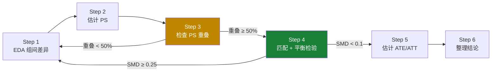

# 🎯 PSM & IPW (匹配与加权)

## PSM 实战 SOP（6 步法）

> **适用场景**: 截面数据 (无时间维度)，混淆变量可观测，需要估计 Treatment 的因果效应。



| Step                   | 关键动作                  | 通过标准       | 不通过怎么办               |
| :--------------------- | :------------------------ | :------------- | :------------------------- |
| **1. EDA**             | 检查协变量组间差异 + 偏态 | 了解数据特征   | 长尾 → `np.log1p()` 变换   |
| **2. 估计 PS**         | `LogisticRegression` 拟合 | 模型收敛       | 检查共线性/缺失值          |
| **3. PS 分布重叠**     | 画两组 PS 分布图          | 重叠 > 70%     | < 50% → 回 Step 1 调整     |
| **4. 匹配 + 平衡检验** | 1-to-1 最近邻 + SMD       | 所有 SMD < 0.1 | ≥ 0.25 → 增加协变量/换方法 |
| **5. 估计效应**        | ATT (匹配) + OLS (验证)   | 两者结果一致   | 差异大 → 考虑 IPW          |
| **6. 整理结论**        | 对比 3 个 ATE 值          | 稳健性通过     | 加 caveat                  |

!!! important "重点不是「数据是否正态」，而是「协变量在两组之间差异有多大」"
    差异越大 → PS 越极端 → 匹配越难 → 估计越不稳定。

??? example "🐍 PSM 实战 SOP 完整代码 (点击展开)"

    ```python
    import numpy as np
    import pandas as pd
    import seaborn as sns
    import matplotlib.pyplot as plt
    from sklearn.linear_model import LogisticRegression
    from sklearn.neighbors import NearestNeighbors
    import statsmodels.formula.api as smf

    # ========== Step 1: EDA ==========
    # 偏态检查（决定是否需要 log 变换）
    skewness = df['Income'].skew()
    print(f"Skewness: {skewness:.2f}")
    if abs(skewness) > 1:
        print("⚠️ 偏态严重，建议 np.log1p() 变换")

    # 组间对比
    sns.boxplot(data=df, x='Treatment', y='Income')
    plt.title('组间 Income 对比')
    plt.show()

    # ========== Step 2: 估计 PS ==========
    covariates = ['Income', 'Age', 'Region']  # 所有混淆变量
    lr = LogisticRegression()
    lr.fit(df[covariates], df['Treatment'])
    df['ps_score'] = lr.predict_proba(df[covariates])[:, 1]

    # ========== Step 3: 检查 PS 重叠 ==========
    plt.figure(figsize=(10, 5))
    sns.kdeplot(df[df['Treatment']==1]['ps_score'],
                label='Treated', fill=True, alpha=0.5)
    sns.kdeplot(df[df['Treatment']==0]['ps_score'],
                label='Control', fill=True, alpha=0.5)
    plt.title('PS Distribution (Check Overlap)')
    plt.legend()
    plt.show()

    # 计算 Common Support 重叠比例
    min_ps = max(df[df['Treatment']==0]['ps_score'].min(),
                 df[df['Treatment']==1]['ps_score'].min())
    max_ps = min(df[df['Treatment']==0]['ps_score'].max(),
                 df[df['Treatment']==1]['ps_score'].max())
    overlap_pct = df[(df['ps_score'] >= min_ps) &
                     (df['ps_score'] <= max_ps)].shape[0] / len(df)
    print(f"Common Support 重叠: {overlap_pct:.1%}")

    # ========== Step 4.1: KNN 默认最近邻匹配 (1-to-1) ==========
    df_trimmed = df[(df['ps_score'] >= min_ps) &
                    (df['ps_score'] <= max_ps)]
    treated = df_trimmed[df_trimmed['Treatment'] == 1]
    control = df_trimmed[df_trimmed['Treatment'] == 0]

    nn_default = NearestNeighbors(n_neighbors=1)
    nn_default.fit(control[['ps_score']])
    distances_def, indices_def = nn_default.kneighbors(treated[['ps_score']])
    matched_control_def = control.iloc[indices_def.flatten()]

    # ⭐ 4.1 平衡性检验
    print("\n=== 4.1 默认匹配平衡性检验 (SMD) ===")
    for col in covariates:
        diff = treated[col].mean() - matched_control_def[col].mean()
        pool_std = np.sqrt((treated[col].var() +
                            matched_control_def[col].var()) / 2)
        smd = abs(diff / pool_std) if pool_std > 0 else 0
        status = "✅" if smd < 0.1 else "❌ (若 SMD>0.25 需调卡尺)"
        print(f"  {col}: SMD = {smd:.4f} {status}")

    # ========== Step 4.2: 调卡尺匹配 (Caliper Matching) ==========
    # 场景: 当 4.1 中发现核心协变量 SMD > 0.25，说明默认容忍度太高，需要收紧匹配范围
    print("\n=== 4.2 调卡尺匹配 (Caliper Matching) ===")
    
    # a) 计算 Logit 变换值标准差的 0.2 倍作为动态卡尺
    eps = 1e-6
    ps_clipped = np.clip(df_trimmed['ps_score'].values, eps, 1 - eps)
    logit_ps = np.log(ps_clipped / (1 - ps_clipped))
    caliper_size = 0.2 * np.std(logit_ps)
    print(f"动态卡尺大小: {caliper_size:.4f}")

    # b) 使用 Radius 限制最大距离 (不限制 n_neighbors)
    nn_caliper = NearestNeighbors(radius=caliper_size)
    nn_caliper.fit(control[['ps_score']])
    
    # 返回: 每个干预样本对应的邻居数组 (若无邻居则为空数组 [])
    distances_cal, indices_cal = nn_caliper.radius_neighbors(treated[['ps_score']])
    
    # 过滤掉数组为空的样本 (抛弃匹配失败的 treated)
    valid_treated_idx = [i for i, x in enumerate(indices_cal) if len(x) > 0]
    
    if len(valid_treated_idx) == 0:
        print("❌ 卡尺过严，所有样本匹配失败！")
    else:
        # 只取有对象的人，且取他们各自的第一个最近邻
        treated_caliper = treated.iloc[valid_treated_idx]
        matched_control_indices = [indices_cal[i][0] for i in valid_treated_idx]
        matched_control_caliper = control.iloc[matched_control_indices]
        
        print(f"卡尺过滤率: 丢弃了 {len(treated) - len(valid_treated_idx)} 个干预样本")
        
        # ⭐ 4.2 新平衡性检验
        print("=== 4.2 卡尺后平衡性检验 (SMD) ===")
        for col in covariates:
            diff = treated_caliper[col].mean() - matched_control_caliper[col].mean()
            pool_std = np.sqrt((treated_caliper[col].var() +
                                matched_control_caliper[col].var()) / 2)
            smd = abs(diff / pool_std) if pool_std > 0 else 0
            status = "✅" if smd < 0.1 else "⚠️"
            print(f"  {col}: SMD = {smd:.4f} {status}")

    # ========== Step 5: 估计 ATE/ATT ==========
    att = treated['Outcome'].mean() - matched_control['Outcome'].mean()
    print(f"\nATT (匹配): {att:.2f}")

    # OLS 稳健性检验
    formula = 'Outcome ~ Treatment + ' + ' + '.join(covariates)
    model = smf.ols(formula, data=df_trimmed).fit()
    print(f"ATT (OLS):  {model.params['Treatment']:.2f}")

    # ========== Step 6: 结论对比 ==========
    print(f"\n估计值对比: 匹配={att:.2f}, OLS={model.params['Treatment']:.2f}")
    ```

!!! tip "报告模板 (面试/汇报用)"

    - **方法**: PSM + 1-to-1 最近邻匹配
    - **样本量**: Treatment N=xxx, Control N=xxx（匹配后）
    - **平衡性**: 匹配后所有协变量 SMD < 0.1 ✅
    - **估计效应**: ATT = xxx（OLS 回归验证一致）
    - **稳健性**: Placebo 检验通过 / OLS 结果一致

---

## 3. PSM 概念详解 (Propensity Score Matching)

> 完整代码见上方 **SOP 完整代码模板**，此处专注概念理解与避坑。

### 3.1 原理

用于 **消除选择偏差**。

*   **场景**: 评估 "会员资格" 对 "消费" 的影响，但会员本来就是有钱人。
*   **三步走**: ① 算 PS → ② 匹配 → ③ 算差值

### 3.2 Common Support — 最常踩的坑

!!! warning "症状：某个 Control 用户被匹配了几千次"
    如果 Treated 组的 PS 集中在 0.8+，而 Control 组的 PS 集中在 0.2-，匹配算法会疯狂重复使用少数几个 Control 用户。

    **自检**: `matched_control['user_id'].value_counts().head()`

    **修正**: Trimming 裁剪（见 SOP Step 3-4）。裁剪后得到的是 **局部因果效应 (LATE)**，仅适用于 "有可能被说服" 的用户群。

### 3.3 平衡性检验 — 匹配是否成功的判定

匹配的目的是让两组在协变量上「长得一样」。**SMD (标准化均值差)** 用来量化匹配效果。

> **大白话**: 匹配前，会员平均收入 ¥8000 vs 非会员 ¥3000（差距巨大 ❌）；匹配后，会员 ¥6000 vs 匹配到的非会员 ¥5800（基本持平 ✅）。

| SMD 阈值       | 判定       | 行动                |
| :------------- | :--------- | :------------------ |
| **< 0.1**      | ✅ 平衡良好 | 继续估计效应        |
| **0.1 ~ 0.25** | ⚠️ 可接受   | 结论加 caveat       |
| **≥ 0.25**     | ❌ 匹配失败 | 增加协变量 / 换方法 |

### 3.4 敏感性检验 — 删变量看系数变不变

!!! tip "预测 vs 因果的经典混淆"
    在因果推断中，即使某个 Confounder 的 P 值不显著，也**不要随便删除**它——除非你能确认它不是 Confounder。
    正确做法是：**比较删和不删时 Treatment 系数的变化幅度**。

```python
# 全模型 vs 精简模型
model_full = smf.ols('Y ~ T + X1 + X2 + X3', data=df).fit()
model_slim = smf.ols('Y ~ T + X1', data=df).fit()  # 删掉不显著的 X2, X3

# 关键：看 T 的系数变化，而非 R²
bias_pct = (model_slim.params['T'] - model_full.params['T']) / model_full.params['T'] * 100
print(f"偏差百分比: {bias_pct:.2f}%")  # < 5% 则可安全删除
```

---

## 4. IPW (逆概率加权 - Inverse Propensity Weighting)

### 4.1 原理

*   **思想**: 不丢弃任何数据 (PSM 会丢弃匹配不上的样本)，而是通过 **"加权" (Weighting)** 重建一个虚拟的平行世界。
*   **直觉**:

    *   如果一个用户**本来不太可能买会员** (Propensity Score 低)，但他**居然买了**，那他就是“稀客”，从他身上能学到更多信息 → **权重调高**。
    *   反之，倾向分很高的人买了会员，属于“常规操作”，权重正常或调低。

### 4.2 核心公式
$$
Weight = \frac{Treatment}{PS} + \frac{1-Treatment}{1-PS}
$$

*   **Treated Group**: 权重 = $1 / PS$
*   **Control Group**: 权重 = $1 / (1-PS)$

### 4.3 优缺点

*   **优点**: 利用了**所有样本**，统计效率通常比 PSM 高。
*   **缺点**: 对 **极值敏感**。如果某人的 PS 非常接近 0 或 1，权重会变得极大 (e.g. 1/0.001 = 1000)，导致结果方差剧增 (Variance Explosion)。

    *   *解法*: **Truncation (截断权重)**，比如把权重限制在 [0.1, 10] 之间。

### 4.3b PSM vs IPW 选择决策

!!! note "什么时候用 PSM，什么时候用 IPW？"

    两者解决**同一个问题**（消除选择偏差），但思路不同：

    - **PSM**: 给每个 Treated 找一个「替身」→ **丢弃**没被匹配到的样本
    - **IPW**: 给每个样本加一个**权重** → **保留全部样本**，调整每个人的"话语权"

    | 场景                       | 推荐方法     | 原因                               |
    | :------------------------- | :----------- | :--------------------------------- |
    | 样本量大，PS 重叠好        | **PSM**      | 匹配直观，容易解释                 |
    | 样本量小，不舍得丢数据     | **IPW**      | 保留全量样本，统计效力更高         |
    | PS 分布极端（≈0 或 ≈1 多） | **都不太好** | IPW 权重会爆炸，PSM 匹配质量差     |
    | 需要估计 ATE（不只是 ATT） | **IPW**      | PSM 天然估计 ATT，IPW 可直接估 ATE |
    | 高维协变量                 | **考虑 DML** | PSM/IPW 在高维下都不稳定           |

### 4.4 代码模板 (Python)

??? example "IPW 完整代码 (点击展开)"

    ```python
    # 接 PSM 的第一步 (算出 ps_score 后)

    # 1. 计算权重
    df['weight'] = np.where(
        df['is_treated'] == 1, 
        1 / df['ps_score'], 
        1 / (1 - df['ps_score'])
    )

    # 2. 截断权重 (可选，防止方差爆炸)
    df['weight'] = df['weight'].clip(upper=10)

    # 3. 计算加权平均差异 (Weighted Difference)
    weighted_ate = np.average(df[df['is_treated']==1]['outcome'], weights=df[df['is_treated']==1]['weight']) - \
                   np.average(df[df['is_treated']==0]['outcome'], weights=df[df['is_treated']==0]['weight'])

    print(f"IPW Estimated Effect: {weighted_ate}")

    # 或者用 Statsmodels 的 WLS (加权最小二乘法) 获得 P 值
    import statsmodels.formula.api as smf
    model = smf.wls("outcome ~ is_treated", data=df, weights=df['weight']).fit()
    print(model.summary())
    ```

---

## 5. ATE vs ATT 概念与 IPW 权重原理解析

### 5.1 ATE vs ATT 的核心区别

| 概念    | 全称                                                               | 含义                                                                   | 业务意义                                                                                                                                          |
| :------ | :----------------------------------------------------------------- | :--------------------------------------------------------------------- | :------------------------------------------------------------------------------------------------------------------------------------------------ |
| **ATE** | Average Treatment Effect<br/>(平均处理效应)                        | 假设**所有人**都接受策略，相比于**所有人**都不接受策略的平均差异。     | 评估一个**普适性政策/活动**如果推广到全盘的效果（例如：如果给全量用户都发红包，能带来多少绝对收入增量）。                                         |
| **ATT** | Average Treatment Effect on the Treated<br/>(参与者的平均处理效应) | **仅针对实际接受了策略的人**，假设他们没有接受策略会怎样，两者的差异。 | 评估一个**自愿参与/有特定门槛的活动**对**已经参与的人**到底产生了多大效果（例如：评估高净值群体开通VIP后的增量，而不是假设所有普通用户都开VIP）。 |

!!! tip "还有一个不常用的 ATC"
    **ATC (Average Treatment Effect on the Control)**: 评估如果让**目前没参与的人（对照组）**参与，会产生什么效果。常用于探讨“向未转化人群下放高配权益”的潜力。
    
    已知 ATE 和 ATT 及其对应占比，可以直接通过加权平均公式反推出 ATC：
    
    $$ 
    ATE = P(T=1) \times ATT + P(T=0) \times ATC 
    $$
    
    **反推代码示例**:
    ```python
    # 计算实验组的占比
    treat_ratio = len(df[df['techsupport'] == 'Yes']) / len(df)
    
    # 反推 ATC
    atc = (ipw_ate - treat_ratio * ipw_att) / (1 - treat_ratio)
    print(f"反算出的 ATC 为: {atc:.1%}")
    ```

### 5.2 IPW 权重的设计原理

IPW 的核心思想是**用样本的权重来还原真实的总体分布（或目标群体的分布）**，把现实中不平衡的分布，强行扭转成平衡的伪分布（Pseudo-population）。

#### (1) 计算 ATE 的权重原理 (目标：还原“全体大盘”的分布)
*   **处理组 (T=1) 的权重**: `1/p`。
    *   **直觉**: 如果一个人特征决定他本来不太可能被打标 (`p=0.1`)，但他居然在处理组里，说明他代表了全体中那一批庞大的“和他相似但没被打标”的人。他的出现非常稀有，我们要把他的**权重放大** (`1/0.1=10`)，让他去代表那 `90%` 缺席的同类。
*   **对照组 (T=0) 的权重**: `1/(1-p)`。
    *   **直觉**: 如果一个人特征决定他极大概率被打标 (`p=0.9`，`1-p=0.1`)，但他居然“漏网”成了对照组。同理，他是个宝贵的对照样本，权重必须放大 (`1/0.1=10`)。

#### (2) 计算 ATT 的权重原理 (目标：把对照组重塑成“处理组自身”的模样)
*   **处理组 (T=1) 的权重**: `1`。
    *   **直觉**: 既然要算 ATT（针对处理组的效应），那么处理组就是标准、就是真理。保持他们原样不动，权重设为 1。
*   **对照组 (T=0) 的权重**: `p/(1-p)`。
    *   **直觉**: 我们要把对照组的特征扭成处理组的样子。在这个过程里，如果某个对照组的人**长得很像处理组的人** (`p` 很大，`1-p` 很小)，他可以作为一个很好的“反事实替身”，必须给他**很高的权重**。如果他长得压根不像处理组 (`p ≈ 0`)，他在配对世界里毫无价值，权重趋近于 0。

### 5.3 什么时候用哪个？

*   **算 ATE (全体基准)**：关注**宏观层面的大盘拉动**。对标：向全民开放的降价促销。此时主要靠拉高少数异类的权重去拟合整体。
*   **算 ATT (实验组基准)**：关注**垂直群体当前产生的实际 ROI**。对标：高价值客户专属邀请。此时以这群核心受众为主基准，只去修改对照组的权重迎合他们。PSM（匹配）默认求出的也是 ATT，因为它只拿着处理组去人海里找双胞胎。
