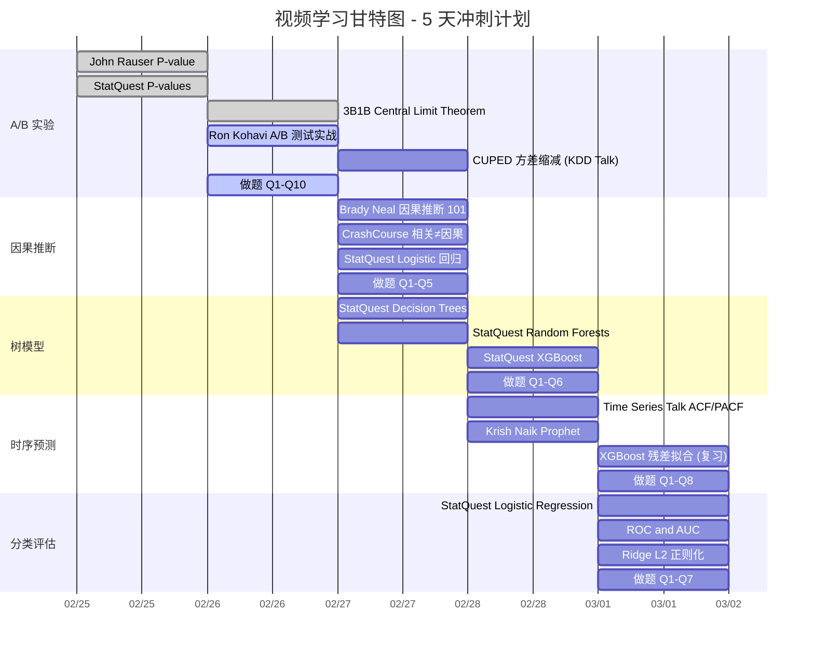
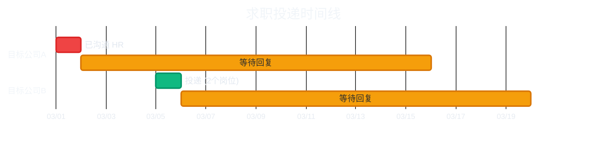

# 🎤 面试准备 (Interview Prep)

> **目标岗位**：<!-- 在此填写你的目标岗位 --> [目标岗位名称] ([目标职级])
> **核心策略**：将 [上一家公司名称] [原业务线]经验**自然迁移**到[新业务线]，展示方法论的可复用性

---

## 0. 面试备战优先级矩阵

!!! warning "先看这里，确定今天该学什么"

| 优先级 | 模块                                 | 核心内容                             |  准备状态  |
| :----: | :----------------------------------- | :----------------------------------- | :--------: |
|  ⭐⭐⭐   | [STAR Stories](#1-核心-star-stories) | 3 个核心项目故事 + 1 个隐藏武器      |  🔲 待完善  |
|  ⭐⭐⭐   | [项目深挖题](#21-项目经历深挖必问)   | 智能客服 / 人力调度 / A/B 平台 10 题 |  🔲 待练习  |
|  ⭐⭐⭐   | [案例分析](#22-案例分析业务场景模拟) | 指标体系设计、痛点分析框架           |  🔲 待练习  |
|   ⭐⭐   | **理论专项突破** (⬇️ 见下方进度)      | 5 大模块视频学习 + 面试巩固题        | 🔲 看视频中 |
|   ⭐⭐   | [行为面试 (BQ)](#25-行为面试)        | 跨团队推动、冲突处理                 |  🔲 待练习  |
|   ⭐    | [面试战术](#3-面试战术武器库)        | 反问策略、QC 防御、万能句式          |  ✅ 已沉淀  |

---

## 📺 理论学习进度 (Video-Driven Learning)

> **核心理念**：不死记题库，而是通过视频构建底层心智模型 → 从原理衍生概念理解 → 用面试题巩固检验。
> 每看完一个视频，把对应的 ⬜ 改成 ✅。

| 模块                 | 视频  | 已看  | 面试题 | 链接                                      |
| :------------------- | :---: | :---: | :----: | :---------------------------------------- |
| 🧪 A/B 实验与假设检验 |   5   | ✅✅✅✅✅ | 10 题  | [→ 进入专项](17a_interview_ab.md)         |
| 🔬 因果推断           |   3   |  ⬜⬜⬜  |  5 题  | [→ 进入专项](17b_interview_causal.md)     |
| 🌲 树模型与集成学习   |   3   |  ⬜⬜⬜  |  6 题  | [→ 进入专项](17c_interview_tree.md)       |
| 📈 时序预测           |   3   |  ⬜⬜⬜  |  8 题  | [→ 进入专项](17d_interview_timeseries.md) |
| 🎯 分类与模型评估     |   3   |  ⬜⬜⬜  |  7 题  | [→ 进入专项](17e_interview_classify.md)   |

### 📅 观看规划（建议 5 天完成全部视频）

!!! tip "节奏建议"
    - **每天 3~4 个视频**，约 60~80 分钟。不要贪多，看完立刻做对应模块的面试题巩固。

    - **纯理论视频犯困？** 正常！先 1.5x 快速过一遍抓大意，不需要每个公式都懂。面试不考推导，只考直觉。

    - **穿插原则**：每天混搭"直觉型视频"（StatQuest/3B1B）和"实战型视频"（Emma Ding/面试题），避免连续看纯理论。

---

## 1. 核心 STAR Stories {: #1-核心-star-stories }

> 面试中 80% 的问题都可以用下面的故事覆盖。每个故事必须烂熟于心，先看标题自测，再点开对照。

### 📅 项目时间线总览（面试时保持一致）

> **递进逻辑**：打地基（埋点）→ 发现问题（VoC）→ 预测优化（人力）→ 量化评估（实验平台）

| 项目                 | 时间段            |  周期   | 面试策略                               |
| :------------------- | :---------------- | :-----: | :------------------------------------- |
| 🏗️ 埋点治理与数仓建设 | 2022 Q4 - 2023 Q2 | ~6个月  | 提一句即可，面试官追问才展开           |
| 🔍 VoC 体验诊断       | 2023 Q2 - 2024 Q2 | ~12个月 | ⭐ **主讲项目之一**，9pp 归因拆分是亮点 |
| 📊 人力预测           | 2024 Q1 - 2024 Q3 | ~6个月  | 提一句即可，与 VoC 有部分并行          |
| 🧪 A/B 实验平台       | 2024 Q4 - 2025 Q2 | ~6个月  | ⭐ **主讲项目之一**，技术深度最硬       |

!!! warning "数字锁定（所有回答必须统一）"
    - 实验平台：周期缩短 60%（25→10天）、规避 5 次负向上线、智能话术降低 3.2pp
    - VoC 诊断：转人工率 37%→28%（-9pp），诊断体系独立贡献 6.9pp（77%）
    - 人力预测：MAPE ≤ 8%、人力利用率提升 12%

??? example "Story 1: A/B 实验平台体系建设 - 分析周期 7->3 天 :star::star::star:"
    |     STAR     | 内容                                                                                                                                                                                                                                                                                                             |
    | :----------: | :--------------------------------------------------------------------------------------------------------------------------------------------------------------------------------------------------------------------------------------------------------------------------------------------------------------- |
    | **S** (背景) | 客服策略迭代缺乏量化评估，核心指标"转人工率"存在会话 (Session) 和用户 (User) 两个分析粒度。会话级是 Binary 指标 (0/1)，用户级因进线次数不同退化为 Ratio Metric（转人工会话数/总会话数）。实验分析周期长达 7 天+，严重拖慢策略迭代节奏                                                                            |
    | **T** (任务) | 0-1 主导搭建分层重叠实验框架，构建 DTD（Day-To-Day 每日切片）和 LTD（Life-To-Date 累计至今）双轨监控体系，将分析周期从 7 天压缩到 3 天                                                                                                                                                                           |
    | **A** (行动) | (1) Hash 取模实现用户层/会话层/策略层正交分流 + 互斥域隔离 (2) 对用户级 Ratio Metric 采用 **Delta Method** 校正方差 (3) 引入 **CUPED** 利用实验前历史进线频次和转人工频次作为协变量，分别对分子分母做方差缩减（~30%+）(4) 为 LTD 曲线引入 **mSPRT 贯序检验**，基于 $1/\alpha$ 似然比阈值实现安全的中途决策与早停 |
    | **R** (结果) | 分析周期从 **7 天缩短到 3 天**，策略上线周期压缩 60%。"智能安抚话术"实验在 3 天内检测出转人工率降低 **3.2pp** 的显著结论。通过严谨检验框架规避了 5 次负向策略上线                                                                                                                                                |

    **可能的追问 & 应对**：

    - *"DTD 和 LTD 分别怎么用？"* - DTD 是每日独立切片数据，用于监控护栏指标有无单日崩盘，可用硬编码 a=0.05；LTD 是累积数据（Day 3 包含 Day 1~3），每次偷看相当于对同批用户反复检验，必须用 Sequential Testing 动态调整门槛
    - *"为什么不直接 Bonferroni 修正？"* - Bonferroni 假设每次检验独立，但 LTD 数据是层层累加的（高度相关），Bonferroni 会过度保守导致 Power 严重下降。Alpha Spending 专门处理这种累积相关性结构
    - *"转人工率是 Ratio Metric，怎么做 CUPED？"* - 不直接对比值做 CUPED。拆分成子（转人工会话数）和分母（总会话数），分别用历史数据做 CUPED 方差缩减，然后用 Delta Method 融合计算最终显著性
    - *"流量冲突怎么处理？"* - [查看回答策略](#p7-4)
    - *"SRM 常见原因？"* - Bot 流量、触发条件 Bug、分桶逻辑错误

    **🔍 “放弃/取舍”类深挖防御**：

    - *"分层实验中你放弃了哪些分流方案？为什么？"* → "最初考虑过基于 Cookie 的分流，但客服场景祎浏览器晚告都会刷新 Cookie，导致同一用户被重复分流。最终选用 User ID Hash 取模，因为它能确保同一用户在实验期间始终在同一组。"
    - *"CUPED 的协变量选择上，你**筛掉**了哪些候选变量？标准是什么？"* → "最初尝试过用2周前的 DAU 作为协变量，但发现它与“转人工率”的相关性只有 0.15，方差缩减不到 5%。必须用**同指标的历史值**（实验前 7 天的进线频次和转人工频次），相关性超过 0.6，方差缩减才达到 30%+。**标准就是 Cov(X,Y)/Var(X) 中的 θ 足够大。**"
    - *"有没有一个实验结果显著但你建议**不上线**的 case？为什么？"* → "有。有一次我们的“自动分流”策略 P=0.02，转人工率下降了 1.5pp，但护栏指标显示用户“重复进线率”上升 3pp——说明用户并没有真正解决问题，只是被“强制分流”到其他渠道后又跑回来了。所以我建议不上线。**核心沟通：“主指标显著但护栏指标崩了 = 捡了芝麻丢了西瓜”。**"

    ---
    
    🔥 **【高阶 实战连招】分层框架与稀释效应 (The Dilution Effect)**
    
    *如果面试官深挖“分层架构的挑战”，直接打出这套 STAR 连招：*
    
    **第一层（基建设计思路 - 为什么做分层重叠）：**
    “随着业务复杂度提升，每天都有几十个模型和 UI 策略要测，产生了极大的分流瓶颈。为了支持并行，我主导设计了**分层重叠分流框架**。我们在逻辑上基于用户的会话链路进行了划分，比如 Layer 1 是最外层页面，Layer 2 是核心算法，Layer 3 是局部卡片。不同层间用独立的哈希种子确保完全正交，这样评估某一层时，其他层的噪音会在两组间完美相减抵消。”
    
    **第二层（自我反思与防守 - 何时不能重叠）：**
    “正交虽好，但我在规范里加了一把锁：**防范交互效应 (Interaction Effects)**。如果实验业务极其耦合（比如都改了同一个推荐位），正交分流会造成页面崩溃或指标暴跌。所以我们会强制把这些实验放在同一层的互斥桶内。”
    
    **第三层（高阶实战痛点 - 如何解决稀释效应）【绝杀核心】：**
    “更深的痛点是，这种架构极易引发**稀释效应（Dilution Effect）**。比如我们在 Layer 3 做了一个仅针对‘物流延误’的极度细分优化。因为工程性能受限，没法做到强实时的『按需触发式分流』，所以我从数据流和指标口径上下手。我要求工程团队在所有分层实验中，不论层级多深，只要命中策略曝光，必须上报一个统一的 **Exposure 打点**。然后在我的评估自动化体系里，不再单纯拿整个 Layer 分配到的 ITT（意向群体）去算 P 值，而是支持基于 Exposure 触发点，去计算 **LATE（局部平均因果效应）**。通过过滤掉没曝光的基线噪音，最终成功找回了多个原本被误判为无效的高价值策略。”

    ---

    🩹 **【模拟面试短板补丁 #1】mSPRT 贯序检验原理与参数设计**

    *来源：豆包模拟面试 Q12/Q13（最大失分点）— 面试官追问"防偷看假阳性是如何控制的？大促期间参数会变吗？"时回答不清楚底层的似然比逻辑。*

    **核心话术（必须张口就来）**：

    "我们在实验平台用的是 **mSPRT (Mixture Sequential Probability Ratio Test)** 来防偷看。它不是预先分配 Alpha，而是基于**似然比 (Likelihood Ratio)** 的动态校验逻辑："

    1. **统一的似然比阈值**：我们将检验的拒绝阈值死死锁定为 $1/\alpha$。如果业务要求的 $\alpha = 0.05$ (5%假阳性预算)，那么阈值就是 20。核心逻辑是：只要实验组的数据让"存在真实策略效应"的概率达到"根本没效果（纯随机噪音）"概率的 **20 倍以上**，系统就随时触发显著判定。
    2. **反向推导的动态门槛（喇叭口）**：因为每天累积的数据量不同，想让似然比达到 20，对实际数据（如均值差异/Z值）的要求是动态变化的。这在直观上就形成了一把逐渐张开的"喇叭口"：前两天样本极少能算出高似然比，所以反向折算的等效 Alpha 门槛极其变态（比如 $< 0.0001$）；而到了第 7 天数据量充足，门槛就会放宽回归到接近 0.05，才允许做出合法的显著性决策。
    3. **大促期间怎么办**：对于统计底层的 $1/\alpha$ 阈值绝不改动。但大促流量具有强烈的"脉冲式变异"（羊毛党涌入破坏同质性），此时我们会触发 **Blackout Period（冻结期）**。这期间大盘照常运转跑数，但系统的 mSPRT 引擎**暂时挂起不做显著性裁决**，等大促余波过去后再恢复判决。
    4. **Futility Boundary（无望早停）**：除了控制假阳性的 Alpha 边界，我们还设置了控制假阴性的 Beta 边界（漏斗口）。如果前期指标极其拉垮，跌破了漏斗下轨，系统会直接判定"这实验注定没救了"，触发**无望早停**，及时释放出极其宝贵的实验并发坑位资源。

    **面试金句**："mSPRT 解决的是**偷看（Peeking）问题**。它的本质是死守 $1/\alpha$ 的似然比绝对阈值。前期样本少，想击穿这个阈值难度极大；后期样本多，难度自然降低。这从数学底层保证了**哪怕业务方每天无限次地偷看大盘看板，整个周期的累计误判率也永远被死死压制在 $\alpha$ 以下。**"

    ---

    📊 **【模拟面试短板补丁 #2】核心量化数据卡片（张口就来）**

    *来源：豆包模拟面试整体评价——"对核心数据无肌肉记忆，资深候选人需张口就来"*

    | 指标维度                  | 关键数据                   | 背诵口径                                                |
    | :------------------------ | :------------------------- | :------------------------------------------------------ |
    | 分层并发能力              | 30+ 实验                   | "分层架构同时支撑了 30+ 实验并行"                       |
    | 触达率（Dilution 严重度） | ~2%（物流场景）            | "10 万进线中仅约 2000 人触发物流话术，触达率仅 2%"      |
    | CUPED 方差缩减            | 30%+                       | "用实验前 14 天历史进线频次做协变量，方差缩减 30%+"     |
    | 分析周期压缩              | 7 天 → 3 天                | "结合 CUPED + mSPRT，分析周期从 7 天压缩到 3 天"        |
    | 策略上线周期压缩          | 60%                        | "策略上线周期整体压缩了 60%"                            |
    | 智能安抚话术效果          | 转人工率降低 3.2pp         | "3 天内检测出转人工率降低 3.2pp，P < 0.01"              |
    | 负向策略拦截              | 5 次                       | "通过护栏指标+假设检验，拦截了 5 次负向策略上线"        |
    | PSM 匹配方法              | 1:1 卡尺匹配 Caliper=0.2SD | "用 1:1 卡尺匹配（Caliper=0.2SD），匹配后 SMD 均 < 0.1" |
    | 检验效能 Power            | 从 ~40% 提升到 80%+        | "Exposure 过滤后，统计效力从约 40% 飙升到 80%+"         |

    ---

    🚨 **【模拟面试短板补丁 #3】护栏指标告警阈值设计**

    *来源：豆包模拟面试 Q10 评价——"护栏指标无阈值则无法落地为自动化监控，仅停留在概念层面"*

    **核心话术**：

    "护栏指标的阈值不是拍脑袋定的，我们用的是**历史波动区间 + 单侧检验**的组合策略："

    1. **历史基线提取**：拉取过去 90 天的护栏指标（如重复进线率、用户满意度）日级数据，计算均值和标准差
    2. **告警阈值 = 历史均值 + 2 倍标准差**：超过这个阈值就触发黄色预警（人工排查）；超过 3 倍标准差触发红色预警（实验自动暂停）
    3. **统计检验门槛**：同时要求护栏指标的实验组 vs 对照组的**单侧 P 值 < 0.1**（注意：护栏用单侧且用更宽松的 0.1 而非 0.05，因为我们对护栏的态度是"宁可错杀一千不可放过一个"，要极其敏感地捕捉到负向信号）
    4. **自动化落地**：这套逻辑写在 Tableau 实验健康度看板的计算字段里，每天自动刷新。一旦触发红色预警，看板自动 @实验负责人和我，进入人工复核流程

    **面试金句**："实验的决策指标用双侧 Alpha=0.05 做严格判断；但护栏指标必须用**单侧 Alpha=0.1** 做宽松拦截。因为漏放一个负向策略的代价，远大于误停一个好策略的损失。"

??? example "Story 2：用户体验诊断体系 (VoC) → 转人工率 -9pp ⭐⭐⭐"

    > ⚠️ **面试策略：主打"标签→定位→异常诊断→产品化"四步闭环叙事。被追问技术细节时转向"DA 做的是交叉分析和异常检测，不是训练模型"。**

    |     STAR     | 内容                                                                                                                                                                                                                                                              |
    | :----------: | :---------------------------------------------------------------------------------------------------------------------------------------------------------------------------------------------------------------------------------------------------------------- |
    | **S** (背景) | 日均会话 2M+，转人工率 37%，不同市场满意度差异大但问题根因不清晰                                                                                                                                                                                                  |
    | **T** (任务) | 建立用户体验诊断闭环，规模化定位痛点并推动修复                                                                                                                                                                                                                    |
    | **A** (行动) | ① 建标签体系：给会话打"是否转人工/是否差评"标签 → ② **问题定位**：Python 提取差评会话高频词 + 算法团队客询主题标签做交叉聚合 → ③ **YoY 异常诊断**：与去年同期对比，聚焦今年显著恶化或新涌现的问题 → ④ **产品化交付**：Tableau 实时看板 + 企微推送 TOP100 会话明细 |
    | **R** (结果) | 累计识别 Top 30 痛点，推动修复后转人工率下降 **9pp**，方法论沉淀为团队 SOP                                                                                                                                                                                        |

    **可能的追问 & 应对**：

    - *"9pp 如何归因？"* → [查看回答策略](#p7-1)
    - *"既然有算法团队的主题标签了，为什么还要拆高频词？"* → "主题标签是粗粒度的，比如'物流'。但用户到底是因为'物流追踪号没更新'还是'包裹丢失'不满意？高频词提供的是主题下面的**细粒度根因**。而且新涌现的问题主题模型可能还没覆盖到，高频词是一个自下而上的补充信号。"
    - *"高频词里有很多没意义的词（你好/谢谢），怎么过滤？"* → "三层过滤：第一层通用停用词（你好/谢谢/请问）；第二层业务停用词（我们根据客服场景积累的词表，比如'订单号'出现频率高但没有诊断价值）；第三层我只看差评会话的高频词与全量会话高频词的**差异词**——一个词在差评里高频但在整体里不高频，才值得关注。"
    - *"你做的 NLP 是什么级别的？"* → "我做的不是算法侧的 NLP 建模。核心工作是诊断闭环——从满意度指标下钻到会话明细确认根因，再验证普遍性、推动修复。文本分析工具是我**规模化发现问题**的手段。更深的模型能力（意图识别等）是算法团队负责的，我负责定义标注标准、验证模型效果、把产出转化为业务建议。"
    - *"交叉聚合具体怎么做的？"* → "简单来说就是 group by 主题标签，然后在每个主题内部看高频词排名。比如'退换货'主题下，高频词如果是'流程复杂'、'找不到入口'，就说明问题不是政策本身，而是引导不清晰——这直接指向了产品侧的 UI 优化。"

    **🔍 “放弃/取舍”类深挖防御**：

    - *"高频词筛选中你**放弃了哪些**看起来重要但实际没用的词？"* → "比如'订单'这个词，在电商场景它在所有会话里都高频出现，但没有任何诊断价值。还有'物流'粗粒度主题词也被我归入了业务停用词表，因为它不帮你定位'到底哪里痛'。**筛选标准：一个词在差评会话中高频但在全量会话中不高频，才有诊断价值。这就是'差异词'的核心逻辑。**"
    - *"Top 30 痛点中，有没有你**明确不推动修复**的？为什么？"* → "有。比如'尺码偏差'这个痛点排名前 5，但我没有推动客服侧修复，因为根因在供应链和商品侧（工厂生产标准不统一），客服能做的只是告诉用户查看尺码表。我把这个 insight 同步给了商品团队，但短期内客服侧没有影响力。**关键认知：不是所有痛点都在你的能力圈内，要学会分类处理。**"
    - *"你的标注方案**迭代过几版**？初始版本有什么问题被你推翻了？"* → "至少迭代了 3 版。初始版只用'是否点击转人工'按钮作为标签，但发现漏掉了'骂完人直接走了'的用户。第二版加入了情感极性阈值，但引入了一批'只是用词激烈但问题实际已解决'的误报。第三版最终稳定为多维策略：按钮点击 + 情感极性 + 会话异常中断（session drop）三个信号至少命中两个。**标注团队每周对冲突 case 做校准会。**"

??? example "Story 3：客服人力调度优化 → MAPE ≤ 8% ⭐⭐⭐"

    > ⚠️ **面试策略：主打"多层漏斗拆解 + 人机协同"叙事，被追问模型时转向"业务特征设计更重要"。**

    |     STAR     | 内容                                                                                                                                                                                                               |
    | :----------: | :----------------------------------------------------------------------------------------------------------------------------------------------------------------------------------------------------------------- |
    | **S** (背景) | 客服团队排班依赖人工经验，多时区峰值叠加导致人力缺口 40%                                                                                                                                                           |
    | **T** (任务) | 设计端到端预测体系，从订单量到排班方案全链路打通                                                                                                                                                                   |
    | **A** (行动) | ① 基于运营侧订单量预估，按市场历史进线比拆解客询量和转人工量 → ② 结合各团队 TPH 和 HC 数据推算月度人力需求 → ③ 按进线小时分布拆解动态排班 → ④ 市场负责人确认（允许 ±1-2 微调）→ ⑤ A/B 实验验证 AI 排班 vs 人工排班 |
    | **R** (结果) | 预测 MAPE ≤ **8%**，峰值响应控制 30 秒内，人力利用率提升 **12%**                                                                                                                                                   |

    **可能的追问 & 应对**：

    - *"模型用的什么？"* → "这个项目的核心不是某个模型，是整个预测漏斗的设计。Prophet 做趋势分解是其中一步，更关键的是业务逻辑拆解——从订单量到客询量到排班，每一步都有对应的转化率模型。"
    - *"MAPE 8% 怎么做到的？"* → "最大提升不是调参，是拿到运营侧订单量预估作为输入——这一步直接把误差缩了一半，因为客询量本质上就是订单量的函数。"
    - *"人工微调±1-2人不会破坏模型吗？"* → "这恰恰是设计亮点。预测是建议而不是命令，市场负责人有当地经验（比如知道某个节日只影响特定市场），微调让他们有 ownership，落地阻力小很多。"
    - *"为什么用 Prophet 而不是 ARIMA？"* → "Prophet 自动处理趋势变化点和节假日效应，可解释性强——业务团队能直接看到趋势和季节性的分解图，沟通成本低。"

    **🔍 “放弃/取舍”类深挖防御**：

    - *"为什么**不用** ARIMA/XGBoost 做预测？你评估过后放弃的原因？"* → "评估过。**放弃 ARIMA** 因为客服数据是多市场多时区的，ARIMA 每个市场都要单独建模，参数调试成本太高。Prophet 一套 API 全市场通用，建模效率高 10 倍。**放弃纯 XGBoost** 因为它不能自动捕捉趋势和周期性，必须手动构造 lag/rolling 特征，稳定性不如 Prophet。但我保留了它作为残差修正层。"
    - *"市场负责人的微调和你的预测**冲突**时怎么处理？"* → "实际发生过。东南亚某市场 leader 每次加 2 人，因为当地每月底有个 mini 大促节我模型没覆盖到。我的处理：先让步，然后回馈实际数据，下个周期把这个节日加入模型的 holiday 参数。**模型是建议而不是命令，微调让业务有 ownership。**"
    - *"有没有某个市场的预测你**永远做不准**？怎么跟业务交代？"* → "有。新开拓市场（拉美小国），历史数据不到 3 个月，模型没有足够季节性信息。我跟业务说：'这个市场 MAPE 25%+，建议按风险缓冲加 15% buffer，同时用相似市场趋势作为参照。'**承认模型局限性比硬吹精度更专业。**"

??? example "💎 隐藏武器：准时宝 — 体验变现（面试中主动释放）⭐"
    **触发点**：当面试官问"除了降本，数据分析如何直接创造利润？"时抛出。

    | STAR  | 内容                                                                                                                    |
    | :---: | :---------------------------------------------------------------------------------------------------------------------- |
    | **S** | 物流延误咨询节点用户负向反馈集中                                                                                        |
    | **T** | 探索将"投诉成本"转化为"保险增值收入"的可能性                                                                            |
    | **A** | ① K-means 识别时效敏感高价值用户 → ② 协同产品侧灰度测试"服务补偿转保险增值"策略 → ③ Causal Inference (ATE) 计算综合 ROI |
    | **R** | 实现从"解决投诉"到"创造保费"的价值跳转                                                                                  |

??? example "🎓 团队赋能：新人带教 + 向上管理（行为面试必备）⭐⭐"

    > ⚠️ **触发点：面试官问"你有没有带过人"、"你怎么提升团队能力"、"管理经验"时使用。**

    | STAR  | 内容                                                                                                                                       |
    | :---: | :----------------------------------------------------------------------------------------------------------------------------------------- |
    | **S** | 团队快速扩张，新人分析能力参差不齐                                                                                                         |
    | **T** | 带教 4 名新人分析师，确保试用期顺利通过                                                                                                    |
    | **A** | ① 整合培训知识文档和学习路径 → ② 制定阶段性考核 schedule → ③ 1 名未通过试用期后，复盘根因发现是招聘标准问题 → ④ 向上管理，推动优化招聘要求 |
    | **R** | 试用期通过率 **75%**（3/4），招聘标准优化后后续新人适配度显著提升                                                                          |

    **可能的追问 & 应对**：

    - *"那个没通过的人问题出在哪？"* → "技术能力达标但业务理解力不足——他能写出正确的 SQL，但不知道为什么要这么拆指标。这说明我们招聘时只考了技术没考业务 sense，我把这个反馈给了 leader，后来面试加了一道业务 case 题。"
    - *"你怎么做培训规划的？"* → "分三阶段：第一周熟悉数据源和工具；第二到四周跟我做一个完整的分析项目；第五到八周独立承担一个小课题，我做 code review。"

??? tip "💡 扩展叙事：LiuliX — 全栈 DA 护城河（AI 时代差异化）"
    **业务映射**：大厂数仓面临「安全红线不能出域」与「业务需要灵活探索」的矛盾。

    **故事内核**（可在聊到 AI/数据治理时主动提起）：
    > "我独立开发的 LiuliX，用 WebAssembly + DuckDB 实现纯前端秒级处理十万条数据。在实践中，我利用它将特征工程时间从 **3 天缩短到 4 小时**。如果问我在大厂做数据治理的差异化思路？我不只查 SQL 日志，我会推动**'计算下推'**——把轻量级分析节点下放到浏览器端，原生解决数据安全冲突和集群成本控制。"

---

## 2. 面试预测题库 ([目标公司]专属)

> 来源：DeepSeek 模拟面试。题目按照 资深/专家 标准设计，已标注考察点和回答策略链接。

### 2.1 一、项目经历深挖（必问） {: #21-项目经历深挖必问 }

> 针对 [你的前司名称] 的智能客服、人力调度、A/B 实验平台三个重点项目，面试官会层层深入。

**智能客服体验优化与流失归因**

??? note "Q1: VoC 的具体流程？用了哪些文本挖掘技术？如何处理多语言？"
    **考察点**：文本挖掘 Pipeline 熟悉度，多语言/非结构化数据挑战。
    
    **回答骨架**：分语种预处理 → 统一 Embedding → 关键词提取 (TF-IDF/TextRank) → 情感分析 → 聚类 → 人工校验 Top Cluster

??? note "Q2: XGBoost 预测转人工意图，做了哪些特征工程？定位了哪些知识库盲区？"
    **考察点**：特征工程思路、模型可解释性、业务落地。
    
    → [查看回答策略：XGBoost 特征重要性解读](#p7-3)

??? note "Q3: 转人工率下降 9pp，如何归因？有没有做因果推断？ ⭐必练"
    **考察点**：因果推断敏感度，科学评估项目效果。
    
    → [查看回答策略：因果归因](#p7-1)

**客服人力资源调度优化**

??? note "Q4: 为什么选择 Prophet 做基线？XGBoost 怎么结合？"
    **考察点**：时序预测方法选择逻辑，模型融合思路。
    
    **回答骨架**：Prophet 优势（可解释、自动检测趋势变化点、节假日内置）→ XGBoost 捕获 Prophet 残差中的非线性模式 → 最终预测 = Prophet 基线 + XGBoost 残差修正

??? note "Q5: MAPE ≤ 8% 如何定义？促销期误差变大怎么办？"
    **考察点**：评估指标深度理解，特殊场景鲁棒性。
    
    **回答骨架**：MAPE = 各时段绝对百分比误差的均值 → 促销期加入营销投入强度/历史同类大促特征 → 人工兜底调整机制

??? note "Q6: 人力排班 A/B 实验怎么设计？如何保证两组可比？"
    **考察点**：非标准场景的实验设计能力。
    
    **回答骨架**：Cluster Randomization（按地区分层随机）→ 检查协变量平衡 → CUPED 降方差 → SRM 验证

**A/B 实验平台体系建设**

??? note "Q7: 分层重叠实验框架如何正交分流？流量冲突怎么处理？ ⭐必练"
    **考察点**：分层实验架构、流量分割、互斥实验。
    
    → [查看回答策略：分层框架避免流量污染](#p7-4)

??? note "Q8: SRM 诊断逻辑怎么实现？发现了哪些常见问题？"
    **考察点**：实验质量监控实战。
    
    **回答骨架**：卡方检验判断实际分桶比 vs 预期比 → 常见原因（Bot 流量、触发条件 Bug、分桶哈希碰撞）→ 自动告警 + 人工排查

??? note "Q9: 分析周期 7->3 天，用了什么加速方法？ :star:必练"
    **考察点**：实验效率优化、方差缩减技术、贯序检验。

    **回答骨架（三层加速方案）**：

    1. **Delta Method 校正方差**：用户级转人工率是 Ratio Metric（分母随机波动），用 Delta Method 一阶泰勒展开精确估算方差
    2. **CUPED 方差缩减**：利用用户实验前两周的历史进线频次和转人工频次作为协变量，分别对分子分母做 CUPED 修正，剥离用户固有行为差异，方差缩减 30%+
    3. **Sequential Testing (mSPRT)**：为 LTD（累计至今）曲线引入 mSPRT 贯序检验机制，以似然比 $1/\alpha$ 为绝对阈值，反向折算每天的动态显著性门槛（前期极苛刻，后期回归 $0.05$），彻底解决业务每天"偷看"导致的假阳性膨胀，支持安全提前止损与中途决策

    **关键区分**：DTD（每日独立数据）可用硬编码 a=0.05（数据互不重叠）；LTD（累积数据）必须用 Sequential Testing（数据层层累加，偷看会导致假阳性膨胀）

    > 🔥 **【防备追问】面试官质疑：“大盘实验至少跑 14 天覆盖周末，你 3 天就能做决策，不觉得离谱吗？”**
    > **专家级防守话术 (三层连击)**：
    > 1. **业务场景解绑**：“质疑非常专业，大盘确实要跑满 14 天。但我们是**客服对话助手**场景。客服交互是**强即刻反馈**，用户看到新话术后 30 秒内就决定了是解决还是转人工，不存在长周期的延迟转化效应（如大促复购）。因此只要单日进线并发量足够巨大，3 天的累积样本对于捕获这种即刻行为是完全充足的。”
    > 2. **明确 mSPRT 的定位**：“其实这 3 天，更多是利用 mSPRT **对强负向/强正向策略的提前止损**。对于那些一上线就导致客诉飙升的灾难性 Bug 策略，mSPRT 允许我们在第 3 天就击穿早期的苛刻门槛合法下线，而不是硬抗 7 天。这是挽救了容错周期，而非微调那些 0.01% 的长尾实验。”
    > 3. **CUPED 降维打击**：“更深层的底气来源于 **CUPED 方差缩减**。客服指标底噪极大，我用 14 天历史数据作为协变量，硬生生压制了 30% 的方差。方差的锐减导致我们探测相同 MDE 所需的样本量同比例剧减，过去攒 7 天才能抵消的噪音，现在结合 CUPED 攒 3 天就能看清纯增量了。”

    详见 [A/B 高阶: 贯序检验与 Alpha Spending](05a_ab_advanced.md)

**埋点数据治理**

??? note "Q10: 设计埋点规范 SOP 并嵌入技术评审，遇到什么阻力？怎么推动？"
    **考察点**：跨团队推动能力、项目管理。→ 可复用于 **行为面试 Q1**
    
    **回答骨架**：阻力（研发觉得多此一举）→ 策略（用"Bug 黑名单"量化埋点缺陷导致的返工成本）→ 最终将埋点 Review 绑定到 Trunk 合入门禁

---

### 2.2 二、案例分析（业务场景模拟） {: #22-案例分析业务场景模拟 }

> 面试官给具体业务问题，现场分析框架。**核心不是答案正确，而是展示结构化思考过程。**

!!! tip "Case 分析万能 5 步法 (每道题都用这个框架)"
    1. **澄清问题 (Clarify)**：确认分析目标、时间范围、可用数据源
    2. **拆解框架 (Framework)**：用 MECE/漏斗/生命周期等方式拆解问题
    3. **假设排序 (Hypothesis Prioritization)**：列出 Top 3 假设并说明排序理由
    4. **数据需求 (Data Ask)**：明确需要哪些表/字段/粒度
    5. **预期产出 (Expected Output)**：最终交付物是什么（报告/看板/策略建议）

??? note "Case 1: 巴西市场投诉率上升，如何定位核心痛点？"
    考察点：VoC 方法论迁移能力、多源数据融合、根因分析框架。
    
    **5 步法骨架**：
    
    1. **Clarify**：投诉率的定义（占比 vs 绝对量）？上升了多少？是否全品类？
    2. **Framework**：按用户旅程拆（下单→支付→物流→售后），分别看各环节投诉占比
    3. **Hypothesis**：① 物流时效恶化 ② 支付方式不适配当地 ③ 翻译质量
    4. **Data Ask**：客服对话文本 + 订单物流状态 + 用户行为日志
    5. **Output**：痛点优先级矩阵（影响面 × 可解决性），附 Top 3 Action Items

??? note "Case 2: 如何构建商家健康度评分模型？ ⭐必练"
    考察点：指标体系设计能力、商家侧业务理解。
    
    → [查看回答策略：搭建商家服务体验指标体系](#p7-2)

??? note "Case 3: '物流异常自动补偿'上线后，如何评估对复购的影响？"
    考察点：因果推断应用（DID / Causal Impact），实验设计，混淆变量控制。
    
    **5 步法骨架**：
    
    1. **Clarify**：补偿的触发条件？是否随机分配？
    2. **Framework**：如果可 A/B → 随机分组实验；如果不可 → 准实验（DID + 匹配）
    3. **Hypothesis**：补偿提升短期满意度 → 但可能引发道德风险（故意投诉套补偿）
    4. **Data Ask**：用户补偿记录 + 复购行为 + 历史投诉频率
    5. **Pitfall**：选择偏差（只有投诉的人才触发补偿）→ 需用 PSM 构建对照组

??? note "Case 4: 多时区话务量预测与应急调度？"
    考察点：时序预测实战、应急预案设计。
    
    **回答骨架**：分时区建模（每个时区独立 Prophet + 时区间相关性特征）→ 在线监控实际 vs 预测偏差 → 偏差超阈值触发弹性人力池

??? note "Case 5: 设计商家'经营体检报告'数据产品？"
    考察点：数据产品思维，分析到产品化的能力。
    
    **回答骨架**：核心模块（经营概览 / 同行对标 / 诊断建议）→ 交互（红黄绿灯 + 下钻分析）→ 数据源（经营数据 + 行业基准）

---

### 2.3 三、理论专项突破（已拆分为独立模块）

> 技术基础题已按知识领域拆分为 5 个独立的学习模块页面，每个模块遵循 **📺 视频 → 💡 概念 → ❓ 面试题** 的三层递进式学习路径。

| 模块                 | 链接                                  | 题量  |
| :------------------- | :------------------------------------ | :---: |
| 🧪 A/B 实验与假设检验 | [→ 进入](17a_interview_ab.md)         |  10   |
| 🔬 因果推断           | [→ 进入](17b_interview_causal.md)     |   5   |
| 🌲 树模型与集成学习   | [→ 进入](17c_interview_tree.md)       |   6   |
| 📈 时序预测           | [→ 进入](17d_interview_timeseries.md) |   8   |
| 🎯 分类与模型评估     | [→ 进入](17e_interview_classify.md)   |   7   |

---

### 2.4 四、业务理解与行业认知

> 考察核心业务认知。提前研读 [目标公司] 最新新闻和财报。

??? note "Q1: 对 [目标业务/产品] 有什么了解？主要市场？与[竞品/其他模式]的痛点差异？"
    **回答骨架**：主要市场（欧洲/东南亚/拉美/中东）→ 差异（跨境物流时效长、支付方式碎片化、多语言客服、退换货成本高、合规/关税）

??? note "Q2: 跨境电商商家最关心什么？如何用数据降低经营成本？"
    **回答骨架**：商家三大痛点（物流成本 / 平台佣金 / 营销 ROI）→ 数据手段（物流路径优化 / 价格弹性分析 / 营销归因模型）

??? note "Q3: 加入后如何快速了解 [目标业务/产品] 的业务和数据？"
    **回答骨架**：前两周（读数据字典 + 核心看板 + 跟 1-2 个在线会议）→ 第一个月（选一个小项目端到端跑通，建立业务直觉）

??? note "Q4: 从消费者侧转商家侧，最大挑战是什么？"
    → [查看回答策略：搭建商家指标体系](#p7-2)

---

### 2.5 五、行为面试 {: #25-行为面试 }

> 核心：用 STAR 讲故事，每道题标注了可复用的项目故事。

??? note "BQ1: 推动跨团队协作但遇到阻力？ → 复用 Story: 埋点治理 SOP"
    **STAR 骨架**：S（研发抵触埋点规范）→ T（需要嵌入技术评审流程）→ A（用"Bug 黑名单"量化返工成本说服技术 Lead）→ R（埋点规范纳入合入门禁，缺陷率下降 X%）

??? note "BQ2: 数据质量有问题，但业务方要快速上线？"
    **STAR 骨架**：S（发现某核心指标口径有误）→ T（业务方催促上线）→ A（① 量化错误影响面 ② 提出折中方案：先上线 + 加 caveat + 排期修复）→ R（未耽误进度且修复后指标准确）

??? note "BQ3: 分析结论被质疑怎么办？"
    **核心答法**："我会先感谢质疑，然后区分：是数据/方法有问题 → 我回去复核；还是视角/假设不同 → 我把两种假设都跑一遍，用数据说话。"

??? note "BQ4: 同时接到多个紧急需求？"
    **核心答法**：① 先和各方确认真实 deadline ② 按影响面 × 紧急度排序 ③ 主动沟通预期 ④ 并行处理可复用的数据准备工作

---

## 3. 面试战术武器库 {: #3-面试战术武器库 }

### 3.1 高难度问题回答策略 (折叠闪卡) {: #hard-flashcards }

> 针对高难度面试题的**"降维打击"**回答模板。先看题目自测，再点开对照。

??? success "难题 1：转人工率下降 9pp，如何归因到你的项目？（因果推断）"
    **考点**：对因果推断的敏感度，如何在非严格 A/B 实验下科学评估。
    
    **回答策略 (专家级话术)**：
    > "我们在项目上线时**刻意做了 phased rollout**（分阶段上线）。前两周只在部分客服渠道灰度，用**同期对照组**（未灰度渠道）做对比。
    > 虽然这不是严格的随机实验，但我们用 **PSM 匹配**了渠道特征（话务量、时段分布等），再用 **DID** 剔除时间趋势。
    > 结果显示，灰度组的转人工率下降幅度显著高于对照组，且 SRM 验证通过，我们才敢归因。当然，为了更严谨，后来我们在实验平台又复测了一次。"

    **核心要点**：展示**你知道如何在实际业务限制下尽量科学归因**。

??? success "难题 2：如何搭建商家服务体验指标体系？"
    **考点**：指标体系设计能力，跨端（消费者→商家）的方法论迁移能力。

    **回答策略 (专家级话术)**：
    > "虽然我之前主要做消费者侧（[你的前司名称]），但**方法论是完全相通的**。我会从**[新业务线]生命周期的视角**来拆解：
    > - **入驻环节**：入驻审批时长、驳回率、资质审核通过率
    > - **经营环节**：售后纠纷率、平台响应时长、经营成本占比（佣金/物流/营销）
    > - **退出环节**：商家沉睡/流失率、流失原因分布
    > 
    > 接着，参考我们在消费者侧的 VoC 方法，对商家投诉/咨询文本做**关键词聚类**，定位高频痛点。再结合 **RFM 模型**的思路，对商家分层（头部/腰部/长尾），针对性设计体验优化策略。"

    **核心要点**：展示**分析框架的迁移能力**，底层逻辑比表面经验更重要。

??? success "难题 3：XGBoost 特征重要性如何解读？"
    **考点**：特征工程思路、模型可解释性、业务落地闭环。

    **回答策略 (专家级话术)**：
    > "我们不是单一地看某个指标，而是用了**三种重要性综合判断**：
    > - **Gain (增益)**：看哪些特征对区分转人工贡献最大（比如'对话轮次 > 5'）
    > - **Cover (覆盖度)**：看哪些特征覆盖的样本最多（比如'情感极性'几乎每个会话都有）
    > - **Permutation Importance**：随机打乱某个特征，看模型效果下降多少
    >
    > 最终我们定位到一个有趣的反直觉现象：'退货政策'关键词被高频命中，但知识库回答满意度很低。我们**没有停留在重要性排序上，而是结合业务逻辑**——把 Top 特征对应的话术样本拉出来人工复核，确诊是政策描述太拗口导致用户反复追问。"

    **核心要点**：不要只背算法概念，要结合**业务动作落地案例**。

??? success "难题 4：分层实验框架如何避免流量污染？"
    **考点**：A/B 实验平台架构理解，互斥与正交逻辑，对现实复杂性的容错与修正。

    **回答策略 (专家级话术)**：
    > "我们早期的方案是：
    > 1. **分层正交**：用户层、会话层、策略层三层独立，用 **Hash 取模**保证同一用户在不同层的分桶是正交互不干扰的。
    > 2. **互斥实验**：如果两个实验修改同一核心模块（比如都改首单话术），我们会把它们收拢在同一层，用**互斥域 (Mutex Domain)** 物理隔离。
    > 3. **监控冲突**：在看板底座加了一个'实验重叠分布'的图表，如果发现某两个实验的叠加样本偏离理论正交预期，系统会触发预警。
    >
    > 当然，**绝对完美的正交在复杂业务中很难**，我们最终会接受一定可控的流量污染，但在结算时会跑 **CUPED 或引入方差膨胀因子**对显著性判断进行二次修正。"

    **核心要点**：承认现实世界的复杂性，展示你**知道如何进行架构防御和事后修正**。

??? success "难题 5：P-value = 0.08 未达显著，业务方急着上线，怎么处理？ :star:必练"
    **考点**：统计显著性的灵活应对，方差缩减实战，因果推断工具的正确选用。

    **回答策略 (专家级三层排查话术)**：

    **第一层：排查实验基础质量（SRM 与 MDE）**

    > "我会先核对两件事：一是 **SRM**，看分流系统是否正常；二是目前的**实际样本量是否达到了当初设计 MDE 时评估的数量**。很多时候 0.08 不显著仅仅是因为时间没跑够、样本量不足。如果样本量不足，我会挡住业务方的压力，要求延长实验。"

    **第二层：排查选择性偏差与数据挽救（HTE & PSM/IPW）**

    > "如果样本量达标了还是 0.08，或者 SRM 报错了（比如某个 Bug 导致高活跃用户全掉进了实验组）。如果不允许重开实验，我会转向**准实验（Quasi-Experiment）分析**。使用 **PSM (倾向得分匹配) 或 IPW (逆概率加权)**，利用用户实验前的基础特征（活跃天数、历史消费等）训练倾向得分模型，对对照组样本重新加权，强行拉平两组的特征分布，消除选择性偏差后再重新评估实验效应。"

    **第三层：使用 CUPED 终极降噪**

    > "如果两组人群均匀、没有选择性偏差，大盘整体趋势好但就是卡在 0.08，我会引入 **CUPED 方差缩减技术**。
    > 
    > 具体做法：把用户实验前两周的历史指标作为协变量，计算协方差除以**历史数据的方差**，求出最优权重 $\theta$。利用 $\theta$ 帮所有用户统一起跑线——剔除固有的活跃度差异，只测量新策略带来的纯增量。
    > 
    > 执行后我会做**稳健性检验**：确认 CUPED 前后均值不变（只缩方差不改效果量）。通过后用收窄的新方差重新做 T 检验，被噪音掩盖的 0.08 极大概率穿透 0.05 的门槛。一旦显著且置信区间下界高于业务成本线，我就会给业务出具 Go 决策。"

    !!! warning "易犯错误：不要在用户级 A/B 实验里提 SCM（合成控制法）"
        SCM 适用于**无法做用户级随机分流的宏观聚合实体**（如"加州 vs 其余 49 个州"）。在用户级随机实验中发现选择性偏差，正确的武器是 **PSM / IPW**（用户级特征匹配/加权），不是 SCM（聚合实体合成）。面试时混用会暴露"只背模型名字"的问题。

    **核心要点**：展示你能**从质量排查 → 偏差修复 → 降噪增效**三层递进地解决问题，而不是一刀切地说"不显著就不上线"。

??? success "难题 6：分流出现大盘差异（SRM）后的数据挽救策略 (PSM vs IPW) 😈硬核"
    **考点**：SRM 诊断后的止损方案，对 PSM 和 IPW 差异的深刻理解，以及向业务方验证模型可信度的能力。

    **第一层：实验组少 5% 选 PSM，实验组多 5% 选 IPW，为什么？**
    > “这本质上是一个**保留有效样本量**的博弈。
    > 
    > 如果**实验组少 5%**，说明对照组是『丰水池』。我会首选 **PSM (倾向得分匹配)**，在海量的对照组里，严格按照 1:1 为实验组的用户找到‘替身’。多出来的对照组样本可以直接丢弃，这样能得到最纯净的匹配对照样本。
    > 
    > 但如果**实验组多 5%**，说明对照组是『枯水池』。如果还用 PSM 去一对一匹配，就必须扔掉大量珍贵的实验组样本，导致实验的统计功效 (Power) 暴跌。此时我会选择 **IPW (逆概率加权)**，保留所有样本。我会基于用户的历史特征计算倾向得分 $p$，用权重 $\frac{p}{1-p}$ 去放大对照组里长得像实验组的人的权重，强行把对照组的整体分布『拉扯』成跟实验组一模一样的形状。”

    **第二层：业务方质疑 IPW 的权重是‘黑盒造假’，怎么让他们信服？**
    > “业务方的质疑非常合理，因为 IPW 改变了原始数据的客观性。做完 IPW 后，我绝不会直接抛出 A/B 结论，而是会交付两份**稳健性防守证明**：
    > 
    > 1. **事前特征对齐图 (SMD Balance Check)**：画一张加权前 vs 加权后的**标准化均值差异 (SMD) 图表**。如果加权后，所有核心特征（活跃度、留存、历史消费）的 SMD 都被死死压在 **0.1 以下**，业务方就能直观地看到：两边人群的画像现在达到了高度一致。
    > 2. **历史 A/A 安慰剂检验 (Placebo Test 杀手锏)**：如果业务方还是觉得加权不靠谱，我会退回一步。把这套算好的权重，套用到实验上线前两周的历史大盘指标上作差。理应得到一个**极其接近于 0、且毫不显著的 ATE（平均处理效应）**。
    > 
    > 这个安慰剂检验能直接向业务证明这套权重的合法性：『您看，这套权重套在历史数据上，什么增量都造不出来。说明它本身不会凭空制造数据涨幅，我们现在看到的业务正向结果，纯粹来源于这次上线的新策略！』”

    **核心要点**：展示你不仅懂数学公式的取舍，更懂得**如何用商业语言和反证法 (Placebo) 赢得信任**。

---

### 3.2 终面反问策略 (反客为主)

> 针对大厂专家岗，反问要展现**落地感、确定性、商业穿透力**。

??? tip "核心 3 段式话术"
    > "关于 AI 对数分行业的变革，我有一个观察和实践结论想请教您。
    > 随着 25 年初 Cursor 到年底 Antigravity 等工具的普及，'Vibe Coding'（意图驱动开发）已经重塑了我的工作流。我定义的专家级全栈数分，应该是从**底层数据确定性**（埋点、治理）到**顶层业务决策**（归因评估、系统设计）的闭环。
    > 
    > **我想请问：**
    > 1. 在[目标公司]内部，目前是如何定义'AI 加持下的数分专家'标准的？
    > 2. 团队目前更倾向于让数分构建通用 AI Agent，还是深入解决特定垂直场景问题？"

??? tip "追击话术：根据面试官回答灵活接招"
    **如果选 [通用 Agent]**（团队缺工具平台型人才）：
    > "我会尝试将沉淀的复杂归因模型（如 PSM-DID）转化为可配置的分析插件，让 AI Agent 帮助一线运营实现数据分析的『普惠化』。"

    **如果选 [垂直场景]**（团队缺业务专家型人才）：
    > "AI 极大缩短了获取和清洗数据的时间，让我能 100% 投入垂直场景。**对业务逻辑的『确定性论证』是 AI 无法取代的航标。**"

    **收尾金句（无论选什么）**：
    > **"Vibe Coding 的生产力解放，让我能同时兼顾『通用方法论的工程沉淀』与『深水区业务问题的精准爆破』。"**

---

### 3.3 AI 质疑防御 (Quality Control)

> 当面试官挑战"你依赖 AI 编程，如何保证严谨性？"

??? warning "专家级防御话术 (四层验证法)"
    1. **"逻辑指纹"校验 (Logical Checksum)**：抽样 1% 数据手算对齐，建立数据分布直觉
    2. **"边界测试"防线 (Boundary Testing)**：让 AI 针对空值、异常高值设计断言 (Assertion)
    3. **"影子验证"循环 (Shadow Verification Loop)**：核心指标双路验证——AI 写模型，人脑/SQL 写简易逻辑，互为冗余
    4. **"大数平衡"统计直觉**：指标平衡表（如 GMV = 流量 × 转化 × 客单价），确保不违背宏观大数

    **一句话总结**：*"AI 提供效率，我提供 Review 规则和验证框架。"*

---

### 3.4 万能句式 (遇到极难问题时的兜底)

> 把"被拷问"变成"业务探讨"。

!!! quote "降维打击句式"
    "这个问题非常切中痛点，在实际业务中我们当时也遇到过类似的两难挑战。当时我们在有限的资源下，兜底做法是……虽然不完美，但我们通过（加权/人工校验/降维）尽量逼近了业务真相。**如果站在现在的视角重新做，或者贵团队有更完善的基建，我会倾向于……（附加你的进阶思考）**。"

---

## 4. 准备建议 (Action Items)

|   #   | 行动                           | 详情                                                                                | 优先级 |
| :---: | :----------------------------- | :---------------------------------------------------------------------------------- | :----: |
|   1   | **强化[新业务节点/领域]认知**  | 了解 [目标业务] [核心对象]类型/经营流程/主要成本项，准备相应的指标体系框架          |  ⭐⭐⭐   |
|   2   | **梳理每个项目的因果推断细节** | 智能客服：准备"没做因果推断会怎样误判"案例；人力调度：说明 A/B 实验可比性           |  ⭐⭐⭐   |
|   3   | **SQL/Python 手撕代码**        | 窗口函数、Pandas 多表 merge、简单建模 → 参考 [SQL 速查手册](16_data_engineering.md) |   ⭐⭐   |
|   4   | **了解[目标公司]最新动态**     | [核心业务痛点]、[近期战略动作]、财报数据，面试中适当提及                            |   ⭐⭐   |
|   5   | **准备反问问题**               | "团队核心 KPI？""商家 vs 消费者体验资源平衡？""数据基建和工具链？"                  |   ⭐    |

---

## 5. 投递追踪 (Application Tracker) 📋

!!! info "规则"
    状态为 `✅ 已投递` 的简历**自动封板**，禁止任何后续编辑。详见简历生成 Workflow。

### 5.1 投递总览

### 5.2 投递清单（交互式）

> 💡 **使用方法**：点击表头可排序，右上角搜索框可按公司/岗位/状态等关键词筛选。

<table class="datatables" style="width:100%">
<thead>
<tr>
  <th>#</th>
  <th>公司</th>
  <th>岗位</th>
  <th>Base</th>
  <th>薪资</th>
  <th>状态</th>
  <th>日期</th>
  <th>匹配度</th>
  <th>面试准备重点</th>
  <th>备注</th>
</tr>
</thead>
<tbody>
<tbody>
<tr><td>1</td><td>目标公司A</td><td>资深数据分析师</td><td>上海</td><td>[XX-XXK]</td><td class="status-submitted">✅ 已投递</td><td>03-05</td><td class="match-high">95%</td><td>A/B实验、因果推断</td><td>官网直推</td></tr>
<tr><td>2</td><td>目标公司B</td><td>数据科学专家</td><td>北京</td><td>[XX-XXK]</td><td class="status-contacted">💬 已沟通</td><td>03-06</td><td class="match-mid">75%</td><td>业务体验诊断</td><td>BOSS直聘</td></tr>
<tr><td>3</td><td>目标公司C</td><td>商业数据分析</td><td>杭州</td><td>[XX-XXK]</td><td class="status-rejected">❌ 已拒</td><td>03-07</td><td class="match-low">60%</td><td>报表搭建</td><td>经验不匹配</td></tr>
</tbody>
</table>

### 5.3 岗位 JD 详情示例

??? note "🏢 模板公司A — 数据分析专家 (已投递 YYYY-MM-DD)"

    **岗位职责：**

    1. 负责核心业务的数据分析工作，搭建监控指标体系；
    2. 主导A/B实验设计与评估，使用因果推断解决复杂业务归因问题；
    3. 协同产研团队落地分析结论。

    **任职要求：**

    1. 本科及以上学历，统计学、数学、计算机等专业；
    2. 熟练掌握 SQL/Python，熟悉常见的机器学习与因果推断模型；
    3. 有 3 年以上互联网数据分析经验。

    ---

    **JD 适配分析示例：**

    | JD 要求      | 我的匹配点                 | 匹配度 |
    | :----------- | :------------------------- | :----: |
    | A/B 实验设计 | 曾主导分层重叠实验框架搭建 | ⭐⭐⭐⭐⭐  |
    | 跨团队协同   | 推动过XX个策略落地         |  ⭐⭐⭐⭐  |

    ---

    **薪资范围：** [XX-XXk] · [X]薪 | **地点：** [所在城市]

??? success "🏢 模板公司B — 模型策略分析师 (已沟通 YYYY-MM-DD)"

    **岗位职责：**

    1. 构建机器学习模型以解决推荐系统中的体验瓶颈；
    2. 基于海量多源数据，提供深度的专项分析和洞见；
    3. 设计并优化评估指标体系，监控策略的长短期效果。

    **任职要求：**

    1. 计算机、统计学等相关专业，有扎实的机器学习和统计算法功底；
    2. 精通 Python/SQL/Hive，有处理海量数据经验；
    3. 逻辑清晰，有较强的业务敏感度和抗压能力。

    ---

    **JD 适配分析示例：**

    | JD 要求          | 我的匹配点               | 匹配度 |
    | :--------------- | :----------------------- | :----: |
    | 机器学习模型应用 | XGBoost 预测转人工意图   |  ⭐⭐⭐⭐  |
    | 指标体系搭建     | VoC 体验诊断评估闭环搭建 | ⭐⭐⭐⭐⭐  |

    ---

    **薪资范围：** [XX-XXk] · [X]薪 | **地点：** [所在城市]

??? warning "🏢 模板公司C — 经营数据分析 (待投递)"

    **岗位职责：**

    1. 负责相关业务板块的数据监控，及时发现业务波动并预警；
    2. 深入理解业务流量分发与商业化逻辑，撰写高质量诊断报告；
    3. 推进自动化数据看板建设，提升团队数据获取效率。

    **职位要求：**

    1. 熟练掌握 Tableau / PowerBI 等 BI 工具，精通 SQL；
    2. 具备良好的沟通协调能力，能独立完成跨部门业务闭环；
    3. 具有电商行业背景优先。

    ---

    **JD 适配分析示例：**

    | JD 要求            | 我的匹配点                           | 匹配度 |
    | :----------------- | :----------------------------------- | :----: |
    | 自动化报表与BI工具 | Tableau 日常大盘看板搭建，预警自动化 | ⭐⭐⭐⭐⭐  |
    | 跨团队协作沉淀     | 联合后端团队落地数据埋点规范         | ⭐⭐⭐⭐⭐  |

    ---

    **薪资范围：** 面议 | **地点：** [所在城市]
