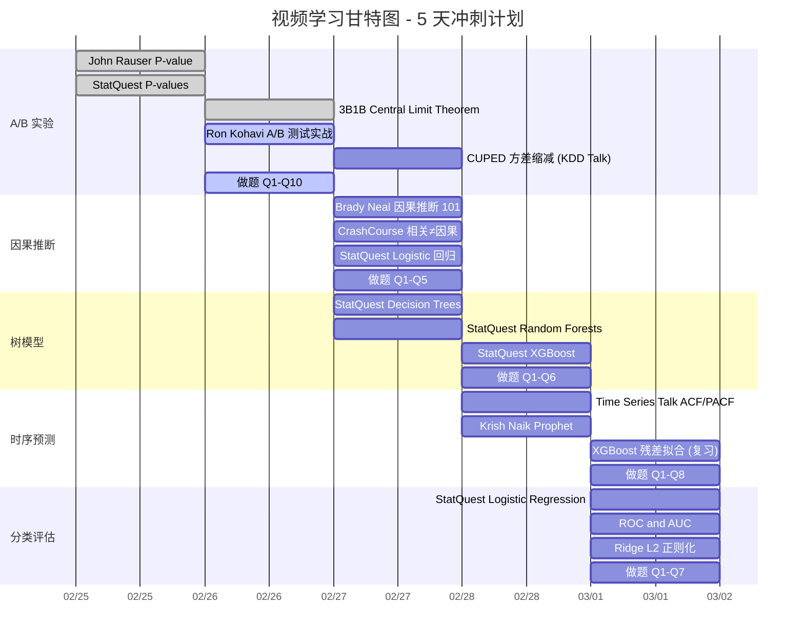
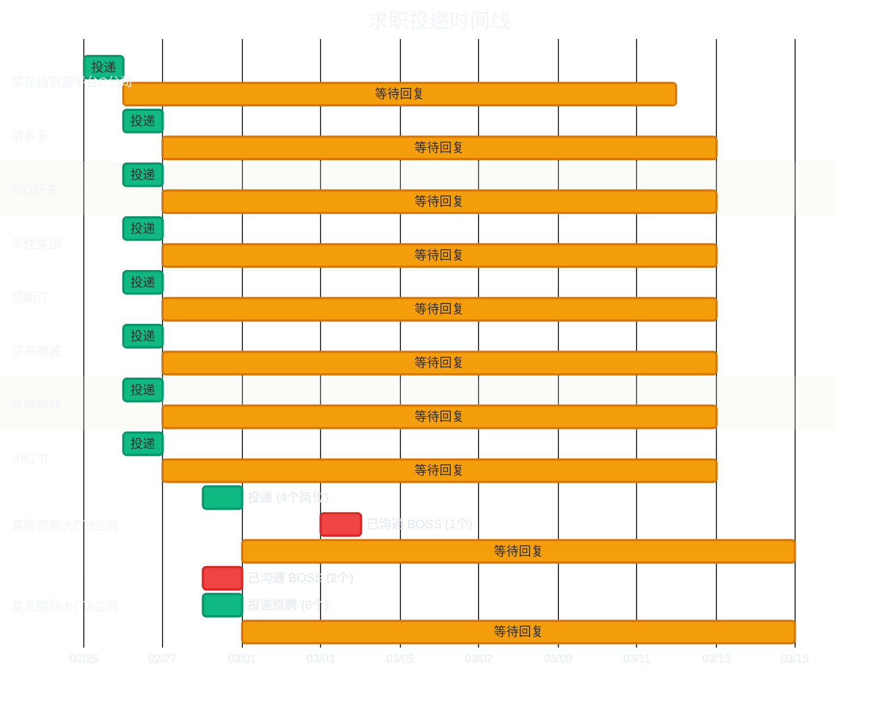

# 🎤 面试准备 (Interview Prep)

> **目标岗位**：阿里国际-客户体验洞察数据分析师 (P7)
> **核心策略**：将 某跨境电商S公司 消费者侧经验**自然迁移**到商家侧，展示方法论的可复用性

---

## 0. 面试备战优先级矩阵

!!! warning "先看这里，确定今天该学什么"

| 优先级 | 模块                                   | 核心内容                             |  准备状态  |
| :----: | :------------------------------------- | :----------------------------------- | :--------: |
|  ⭐⭐⭐   | [STAR Stories](#1-核心-star-stories)   | 3 个核心项目故事 + 1 个隐藏武器      |  🔲 待完善  |
|  ⭐⭐⭐   | [项目深挖题](#21-一项目经历深挖必问)   | 智能客服 / 人力调度 / A/B 平台 10 题 |  🔲 待练习  |
|  ⭐⭐⭐   | [案例分析](#22-二案例分析业务场景模拟) | 指标体系设计、痛点分析框架           |  🔲 待练习  |
|   ⭐⭐   | **理论专项突破** (⬇️ 见下方进度)        | 5 大模块视频学习 + 面试巩固题        | 🔲 看视频中 |
|   ⭐⭐   | [行为面试 (BQ)](#25-五行为面试)        | 跨团队推动、冲突处理                 |  🔲 待练习  |
|   ⭐    | [面试战术](#3-面试战术武器库)          | 反问策略、QC 防御、万能句式          |  ✅ 已沉淀  |

---

## 📺 理论学习进度 (Video-Driven Learning)

> **核心理念**：不死记题库，而是通过视频构建底层心智模型 → 从原理衍生概念理解 → 用面试题巩固检验。
> 每看完一个视频，把对应的 ⬜ 改成 ✅。

| 模块                 | 视频  | 已看  | 面试题 | 链接                                      |
| :------------------- | :---: | :---: | :----: | :---------------------------------------- |
| 🧪 A/B 实验与假设检验 |   5   | ✅✅✅✅✅ | 10 题  | [→ 进入专项](17a_interview_ab.md)         |
| 🔬 因果推断           |   3   |  ⬜⬜⬜  |  5 题  | [→ 进入专项](17b_interview_causal.md)     |
| 🌲 树模型与集成学习   |   3   |  ⬜⬜⬜  |  6 题  | [→ 进入专项](17c_interview_tree.md)       |
| 📈 时序预测           |   3   |  ⬜⬜⬜  |  8 题  | [→ 进入专项](17d_interview_timeseries.md) |
| 🎯 分类与模型评估     |   3   |  ⬜⬜⬜  |  7 题  | [→ 进入专项](17e_interview_classify.md)   |

### 📅 观看规划（建议 5 天完成全部视频）

!!! tip "节奏建议"
    - **每天 3~4 个视频**，约 60~80 分钟。不要贪多，看完立刻做对应模块的面试题巩固。

    - **纯理论视频犯困？** 正常！先 1.5x 快速过一遍抓大意，不需要每个公式都懂。面试不考推导，只考直觉。

    - **穿插原则**：每天混搭"直觉型视频"（StatQuest/3B1B）和"实战型视频"（Emma Ding/面试题），避免连续看纯理论。

---

## 1. 核心 STAR Stories

> 面试中 80% 的问题都可以用下面的故事覆盖。每个故事必须烂熟于心，先看标题自测，再点开对照。

### 📅 项目时间线总览（面试时保持一致）

> **递进逻辑**：打地基（埋点）→ 发现问题（VoC）→ 预测优化（人力）→ 量化评估（实验平台）

| 项目                 | 时间段            |  周期   | 面试策略                               |
| :------------------- | :---------------- | :-----: | :------------------------------------- |
| 🏗️ 埋点治理与数仓建设 | 2022 Q4 - 2023 Q2 | ~6个月  | 提一句即可，面试官追问才展开           |
| 🔍 VoC 体验诊断       | 2023 Q2 - 2024 Q2 | ~12个月 | ⭐ **主讲项目之一**，9pp 归因拆分是亮点 |
| 📊 人力预测           | 2024 Q1 - 2024 Q3 | ~6个月  | 提一句即可，与 VoC 有部分并行          |
| 🧪 A/B 实验平台       | 2024 Q4 - 2025 Q2 | ~6个月  | ⭐ **主讲项目之一**，技术深度最硬       |

!!! warning "数字锁定（所有回答必须统一）"
    - 实验平台：周期缩短 60%（25→10天）、规避 5 次负向上线、智能话术降低 3.2pp
    - VoC 诊断：转人工率 37%→28%（-9pp），诊断体系独立贡献 6.9pp（77%）
    - 人力预测：MAPE ≤ 8%、人力利用率提升 12%

??? example "Story 1: A/B 实验平台体系建设 - 分析周期 7->3 天 :star::star::star:"
    |     STAR     | 内容                                                                                                                                                                                                                                                                                                             |
    | :----------: | :--------------------------------------------------------------------------------------------------------------------------------------------------------------------------------------------------------------------------------------------------------------------------------------------------------------- |
    | **S** (背景) | 客服策略迭代缺乏量化评估，核心指标"转人工率"存在会话 (Session) 和用户 (User) 两个分析粒度。会话级是 Binary 指标 (0/1)，用户级因进线次数不同退化为 Ratio Metric（转人工会话数/总会话数）。实验分析周期长达 7 天+，严重拖慢策略迭代节奏                                                                            |
    | **T** (任务) | 0-1 主导搭建分层重叠实验框架，构建 DTD（Day-To-Day 每日切片）和 LTD（Life-To-Date 累计至今）双轨监控体系，将分析周期从 7 天压缩到 3 天                                                                                                                                                                           |
    | **A** (行动) | (1) Hash 取模实现用户层/会话层/策略层正交分流 + 互斥域隔离 (2) 对用户级 Ratio Metric 采用 **Delta Method** 校正方差 (3) 引入 **CUPED** 利用实验前历史进线频次和转人工频次作为协变量，分别对分子分母做方差缩减（~30%+）(4) 为 LTD 曲线引入 **mSPRT 贯序检验**，基于 $1/\alpha$ 似然比阈值实现安全的中途决策与早停 |
    | **R** (结果) | 分析周期从 **7 天缩短到 3 天**，策略上线周期压缩 60%。"智能安抚话术"实验在 3 天内检测出转人工率降低 **3.2pp** 的显著结论。通过严谨检验框架规避了 5 次负向策略上线                                                                                                                                                |

    **可能的追问 & 应对**：

    - *"DTD 和 LTD 分别怎么用？"* - DTD 是每日独立切片数据，用于监控护栏指标有无单日崩盘，可用硬编码 a=0.05；LTD 是累积数据（Day 3 包含 Day 1~3），每次偷看相当于对同批用户反复检验，必须用 Sequential Testing 动态调整门槛
    - *"为什么不直接 Bonferroni 修正？"* - Bonferroni 假设每次检验独立，但 LTD 数据是层层累加的（高度相关），Bonferroni 会过度保守导致 Power 严重下降。Alpha Spending 专门处理这种累积相关性结构
    - *"转人工率是 Ratio Metric，怎么做 CUPED？"* - 不直接对比值做 CUPED。拆分成子（转人工会话数）和分母（总会话数），分别用历史数据做 CUPED 方差缩减，然后用 Delta Method 融合计算最终显著性
    - *"流量冲突怎么处理？"* - [查看回答策略](#p7-4)
    - *"SRM 常见原因？"* - Bot 流量、触发条件 Bug、分桶逻辑错误

    **🔍 “放弃/取舍”类深挖防御**：

    - *"分层实验中你放弃了哪些分流方案？为什么？"* → "最初考虑过基于 Cookie 的分流，但客服场景祎浏览器晚告都会刷新 Cookie，导致同一用户被重复分流。最终选用 User ID Hash 取模，因为它能确保同一用户在实验期间始终在同一组。"
    - *"CUPED 的协变量选择上，你**筛掉**了哪些候选变量？标准是什么？"* → "最初尝试过用2周前的 DAU 作为协变量，但发现它与“转人工率”的相关性只有 0.15，方差缩减不到 5%。必须用**同指标的历史值**（实验前 7 天的进线频次和转人工频次），相关性超过 0.6，方差缩减才达到 30%+。**标准就是 Cov(X,Y)/Var(X) 中的 θ 足够大。**"
    - *"有没有一个实验结果显著但你建议**不上线**的 case？为什么？"* → "有。有一次我们的“自动分流”策略 P=0.02，转人工率下降了 1.5pp，但护栏指标显示用户“重复进线率”上升 3pp——说明用户并没有真正解决问题，只是被“强制分流”到其他渠道后又跑回来了。所以我建议不上线。**核心沟通：“主指标显著但护栏指标崩了 = 捡了芝麻丢了西瓜”。**"

    ---
    
    🔥 **【P7 实战连招】分层框架与稀释效应 (The Dilution Effect)**
    
    *如果面试官深挖“分层架构的挑战”，直接打出这套 STAR 连招：*
    
    **第一层（基建设计思路 - 为什么做分层重叠）：**
    “随着业务复杂度提升，每天都有几十个模型和 UI 策略要测，产生了极大的分流瓶颈。为了支持并行，我主导设计了**分层重叠分流框架**。我们在逻辑上基于用户的会话链路进行了划分，比如 Layer 1 是最外层页面，Layer 2 是核心算法，Layer 3 是局部卡片。不同层间用独立的哈希种子确保完全正交，这样评估某一层时，其他层的噪音会在两组间完美相减抵消。”
    
    **第二层（自我反思与防守 - 何时不能重叠）：**
    “正交虽好，但我在规范里加了一把锁：**防范交互效应 (Interaction Effects)**。如果实验业务极其耦合（比如都改了同一个推荐位），正交分流会造成页面崩溃或指标暴跌。所以我们会强制把这些实验放在同一层的互斥桶内。”
    
    **第三层（高阶实战痛点 - 如何解决稀释效应）【绝杀核心】：**
    “更深的痛点是，这种架构极易引发**稀释效应（Dilution Effect）**。比如我们在 Layer 3 做了一个仅针对‘物流延误’的极度细分优化。因为工程性能受限，没法做到强实时的『按需触发式分流』，所以我从数据流和指标口径上下手。我要求工程团队在所有分层实验中，不论层级多深，只要命中策略曝光，必须上报一个统一的 **Exposure 打点**。然后在我的评估自动化体系里，不再单纯拿整个 Layer 分配到的 ITT（意向群体）去算 P 值，而是支持基于 Exposure 触发点，去计算 **LATE（局部平均因果效应）**。通过过滤掉没曝光的基线噪音，最终成功找回了多个原本被误判为无效的高价值策略。”

    ---

    🩹 **【模拟面试短板补丁 #1】mSPRT 贯序检验原理与参数设计**

    *来源：豆包模拟面试 Q12/Q13（最大失分点）— 面试官追问"防偷看假阳性是如何控制的？大促期间参数会变吗？"时回答不清楚底层的似然比逻辑。*

    **核心话术（必须张口就来）**：

    "我们在实验平台用的是 **mSPRT (Mixture Sequential Probability Ratio Test)** 来防偷看。它不是预先分配 Alpha，而是基于**似然比 (Likelihood Ratio)** 的动态校验逻辑："

    1. **统一的似然比阈值**：我们将检验的拒绝阈值死死锁定为 $1/\alpha$。如果业务要求的 $\alpha = 0.05$ (5%假阳性预算)，那么阈值就是 20。核心逻辑是：只要实验组的数据让"存在真实策略效应"的概率达到"根本没效果（纯随机噪音）"概率的 **20 倍以上**，系统就随时触发显著判定。
    2. **反向推导的动态门槛（喇叭口）**：因为每天累积的数据量不同，想让似然比达到 20，对实际数据（如均值差异/Z值）的要求是动态变化的。这在直观上就形成了一把逐渐张开的"喇叭口"：前两天样本极少能算出高似然比，所以反向折算的等效 Alpha 门槛极其变态（比如 $< 0.0001$）；而到了第 7 天数据量充足，门槛就会放宽回归到接近 0.05，才允许做出合法的显著性决策。
    3. **大促期间怎么办**：对于统计底层的 $1/\alpha$ 阈值绝不改动。但大促流量具有强烈的"脉冲式变异"（羊毛党涌入破坏同质性），此时我们会触发 **Blackout Period（冻结期）**。这期间大盘照常运转跑数，但系统的 mSPRT 引擎**暂时挂起不做显著性裁决**，等大促余波过去后再恢复判决。
    4. **Futility Boundary（无望早停）**：除了控制假阳性的 Alpha 边界，我们还设置了控制假阴性的 Beta 边界（漏斗口）。如果前期指标极其拉垮，跌破了漏斗下轨，系统会直接判定"这实验注定没救了"，触发**无望早停**，及时释放出极其宝贵的实验并发坑位资源。

    **面试金句**："mSPRT 解决的是**偷看（Peeking）问题**。它的本质是死守 $1/\alpha$ 的似然比绝对阈值。前期样本少，想击穿这个阈值难度极大；后期样本多，难度自然降低。这从数学底层保证了**哪怕业务方每天无限次地偷看大盘看板，整个周期的累计误判率也永远被死死压制在 $\alpha$ 以下。**"

    ---

    📊 **【模拟面试短板补丁 #2】核心量化数据卡片（张口就来）**

    *来源：豆包模拟面试整体评价——"对核心数据无肌肉记忆，P7 需张口就来"*

    | 指标维度                  | 关键数据                   | 背诵口径                                                |
    | :------------------------ | :------------------------- | :------------------------------------------------------ |
    | 分层并发能力              | 30+ 实验                   | "分层架构同时支撑了 30+ 实验并行"                       |
    | 触达率（Dilution 严重度） | ~2%（物流场景）            | "10 万进线中仅约 2000 人触发物流话术，触达率仅 2%"      |
    | CUPED 方差缩减            | 30%+                       | "用实验前 14 天历史进线频次做协变量，方差缩减 30%+"     |
    | 分析周期压缩              | 7 天 → 3 天                | "结合 CUPED + mSPRT，分析周期从 7 天压缩到 3 天"        |
    | 策略上线周期压缩          | 60%                        | "策略上线周期整体压缩了 60%"                            |
    | 智能安抚话术效果          | 转人工率降低 3.2pp         | "3 天内检测出转人工率降低 3.2pp，P < 0.01"              |
    | 负向策略拦截              | 5 次                       | "通过护栏指标+假设检验，拦截了 5 次负向策略上线"        |
    | PSM 匹配方法              | 1:1 卡尺匹配 Caliper=0.2SD | "用 1:1 卡尺匹配（Caliper=0.2SD），匹配后 SMD 均 < 0.1" |
    | 检验效能 Power            | 从 ~40% 提升到 80%+        | "Exposure 过滤后，统计效力从约 40% 飙升到 80%+"         |

    ---

    🚨 **【模拟面试短板补丁 #3】护栏指标告警阈值设计**

    *来源：豆包模拟面试 Q10 评价——"护栏指标无阈值则无法落地为自动化监控，仅停留在概念层面"*

    **核心话术**：

    "护栏指标的阈值不是拍脑袋定的，我们用的是**历史波动区间 + 单侧检验**的组合策略："

    1. **历史基线提取**：拉取过去 90 天的护栏指标（如重复进线率、用户满意度）日级数据，计算均值和标准差
    2. **告警阈值 = 历史均值 + 2 倍标准差**：超过这个阈值就触发黄色预警（人工排查）；超过 3 倍标准差触发红色预警（实验自动暂停）
    3. **统计检验门槛**：同时要求护栏指标的实验组 vs 对照组的**单侧 P 值 < 0.1**（注意：护栏用单侧且用更宽松的 0.1 而非 0.05，因为我们对护栏的态度是"宁可错杀一千不可放过一个"，要极其敏感地捕捉到负向信号）
    4. **自动化落地**：这套逻辑写在 Tableau 实验健康度看板的计算字段里，每天自动刷新。一旦触发红色预警，看板自动 @实验负责人和我，进入人工复核流程

    **面试金句**："实验的决策指标用双侧 Alpha=0.05 做严格判断；但护栏指标必须用**单侧 Alpha=0.1** 做宽松拦截。因为漏放一个负向策略的代价，远大于误停一个好策略的损失。"

??? example "Story 2：用户体验诊断体系 (VoC) → 转人工率 -9pp ⭐⭐⭐"

    > ⚠️ **面试策略：主打"标签→定位→异常诊断→产品化"四步闭环叙事。被追问技术细节时转向"DA 做的是交叉分析和异常检测，不是训练模型"。**

    |     STAR     | 内容                                                                                                                                                                                                                                                              |
    | :----------: | :---------------------------------------------------------------------------------------------------------------------------------------------------------------------------------------------------------------------------------------------------------------- |
    | **S** (背景) | 日均会话 2M+，转人工率 37%，不同市场满意度差异大但问题根因不清晰                                                                                                                                                                                                  |
    | **T** (任务) | 建立用户体验诊断闭环，规模化定位痛点并推动修复                                                                                                                                                                                                                    |
    | **A** (行动) | ① 建标签体系：给会话打"是否转人工/是否差评"标签 → ② **问题定位**：Python 提取差评会话高频词 + 算法团队客询主题标签做交叉聚合 → ③ **YoY 异常诊断**：与去年同期对比，聚焦今年显著恶化或新涌现的问题 → ④ **产品化交付**：Tableau 实时看板 + 企微推送 TOP100 会话明细 |
    | **R** (结果) | 累计识别 Top 30 痛点，推动修复后转人工率下降 **9pp**，方法论沉淀为团队 SOP                                                                                                                                                                                        |

    **可能的追问 & 应对**：

    - *"9pp 如何归因？"* → [查看回答策略](#p7-1)
    - *"既然有算法团队的主题标签了，为什么还要拆高频词？"* → "主题标签是粗粒度的，比如'物流'。但用户到底是因为'物流追踪号没更新'还是'包裹丢失'不满意？高频词提供的是主题下面的**细粒度根因**。而且新涌现的问题主题模型可能还没覆盖到，高频词是一个自下而上的补充信号。"
    - *"高频词里有很多没意义的词（你好/谢谢），怎么过滤？"* → "三层过滤：第一层通用停用词（你好/谢谢/请问）；第二层业务停用词（我们根据客服场景积累的词表，比如'订单号'出现频率高但没有诊断价值）；第三层我只看差评会话的高频词与全量会话高频词的**差异词**——一个词在差评里高频但在整体里不高频，才值得关注。"
    - *"你做的 NLP 是什么级别的？"* → "我做的不是算法侧的 NLP 建模。核心工作是诊断闭环——从满意度指标下钻到会话明细确认根因，再验证普遍性、推动修复。文本分析工具是我**规模化发现问题**的手段。更深的模型能力（意图识别等）是算法团队负责的，我负责定义标注标准、验证模型效果、把产出转化为业务建议。"
    - *"交叉聚合具体怎么做的？"* → "简单来说就是 group by 主题标签，然后在每个主题内部看高频词排名。比如'退换货'主题下，高频词如果是'流程复杂'、'找不到入口'，就说明问题不是政策本身，而是引导不清晰——这直接指向了产品侧的 UI 优化。"

    **🔍 “放弃/取舍”类深挖防御**：

    - *"高频词筛选中你**放弃了哪些**看起来重要但实际没用的词？"* → "比如'订单'这个词，在电商场景它在所有会话里都高频出现，但没有任何诊断价值。还有'物流'粗粒度主题词也被我归入了业务停用词表，因为它不帮你定位'到底哪里痛'。**筛选标准：一个词在差评会话中高频但在全量会话中不高频，才有诊断价值。这就是'差异词'的核心逻辑。**"
    - *"Top 30 痛点中，有没有你**明确不推动修复**的？为什么？"* → "有。比如'尺码偏差'这个痛点排名前 5，但我没有推动客服侧修复，因为根因在供应链和商品侧（工厂生产标准不统一），客服能做的只是告诉用户查看尺码表。我把这个 insight 同步给了商品团队，但短期内客服侧没有影响力。**关键认知：不是所有痛点都在你的能力圈内，要学会分类处理。**"
    - *"你的标注方案**迭代过几版**？初始版本有什么问题被你推翻了？"* → "至少迭代了 3 版。初始版只用'是否点击转人工'按钮作为标签，但发现漏掉了'骂完人直接走了'的用户。第二版加入了情感极性阈值，但引入了一批'只是用词激烈但问题实际已解决'的误报。第三版最终稳定为多维策略：按钮点击 + 情感极性 + 会话异常中断（session drop）三个信号至少命中两个。**标注团队每周对冲突 case 做校准会。**"

??? example "Story 3：客服人力调度优化 → MAPE ≤ 8% ⭐⭐⭐"

    > ⚠️ **面试策略：主打"多层漏斗拆解 + 人机协同"叙事，被追问模型时转向"业务特征设计更重要"。**

    |     STAR     | 内容                                                                                                                                                                                                               |
    | :----------: | :----------------------------------------------------------------------------------------------------------------------------------------------------------------------------------------------------------------- |
    | **S** (背景) | 客服团队排班依赖人工经验，多时区峰值叠加导致人力缺口 40%                                                                                                                                                           |
    | **T** (任务) | 设计端到端预测体系，从订单量到排班方案全链路打通                                                                                                                                                                   |
    | **A** (行动) | ① 基于运营侧订单量预估，按市场历史进线比拆解客询量和转人工量 → ② 结合各团队 TPH 和 HC 数据推算月度人力需求 → ③ 按进线小时分布拆解动态排班 → ④ 市场负责人确认（允许 ±1-2 微调）→ ⑤ A/B 实验验证 AI 排班 vs 人工排班 |
    | **R** (结果) | 预测 MAPE ≤ **8%**，峰值响应控制 30 秒内，人力利用率提升 **12%**                                                                                                                                                   |

    **可能的追问 & 应对**：

    - *"模型用的什么？"* → "这个项目的核心不是某个模型，是整个预测漏斗的设计。Prophet 做趋势分解是其中一步，更关键的是业务逻辑拆解——从订单量到客询量到排班，每一步都有对应的转化率模型。"
    - *"MAPE 8% 怎么做到的？"* → "最大提升不是调参，是拿到运营侧订单量预估作为输入——这一步直接把误差缩了一半，因为客询量本质上就是订单量的函数。"
    - *"人工微调±1-2人不会破坏模型吗？"* → "这恰恰是设计亮点。预测是建议而不是命令，市场负责人有当地经验（比如知道某个节日只影响特定市场），微调让他们有 ownership，落地阻力小很多。"
    - *"为什么用 Prophet 而不是 ARIMA？"* → "Prophet 自动处理趋势变化点和节假日效应，可解释性强——业务团队能直接看到趋势和季节性的分解图，沟通成本低。"

    **🔍 “放弃/取舍”类深挖防御**：

    - *"为什么**不用** ARIMA/XGBoost 做预测？你评估过后放弃的原因？"* → "评估过。**放弃 ARIMA** 因为客服数据是多市场多时区的，ARIMA 每个市场都要单独建模，参数调试成本太高。Prophet 一套 API 全市场通用，建模效率高 10 倍。**放弃纯 XGBoost** 因为它不能自动捕捉趋势和周期性，必须手动构造 lag/rolling 特征，稳定性不如 Prophet。但我保留了它作为残差修正层。"
    - *"市场负责人的微调和你的预测**冲突**时怎么处理？"* → "实际发生过。东南亚某市场 leader 每次加 2 人，因为当地每月底有个 mini 大促节我模型没覆盖到。我的处理：先让步，然后回馈实际数据，下个周期把这个节日加入模型的 holiday 参数。**模型是建议而不是命令，微调让业务有 ownership。**"
    - *"有没有某个市场的预测你**永远做不准**？怎么跟业务交代？"* → "有。新开拓市场（拉美小国），历史数据不到 3 个月，模型没有足够季节性信息。我跟业务说：'这个市场 MAPE 25%+，建议按风险缓冲加 15% buffer，同时用相似市场趋势作为参照。'**承认模型局限性比硬吹精度更专业。**"

??? example "💎 隐藏武器：准时宝 — 体验变现（面试中主动释放）⭐"
    **触发点**：当面试官问"除了降本，数据分析如何直接创造利润？"时抛出。

    | STAR  | 内容                                                                                                                    |
    | :---: | :---------------------------------------------------------------------------------------------------------------------- |
    | **S** | 物流延误咨询节点用户负向反馈集中                                                                                        |
    | **T** | 探索将"投诉成本"转化为"保险增值收入"的可能性                                                                            |
    | **A** | ① K-means 识别时效敏感高价值用户 → ② 协同产品侧灰度测试"服务补偿转保险增值"策略 → ③ Causal Inference (ATE) 计算综合 ROI |
    | **R** | 实现从"解决投诉"到"创造保费"的价值跳转                                                                                  |

??? example "🎓 团队赋能：新人带教 + 向上管理（行为面试必备）⭐⭐"

    > ⚠️ **触发点：面试官问"你有没有带过人"、"你怎么提升团队能力"、"管理经验"时使用。**

    | STAR  | 内容                                                                                                                                       |
    | :---: | :----------------------------------------------------------------------------------------------------------------------------------------- |
    | **S** | 团队快速扩张，新人分析能力参差不齐                                                                                                         |
    | **T** | 带教 4 名新人分析师，确保试用期顺利通过                                                                                                    |
    | **A** | ① 整合培训知识文档和学习路径 → ② 制定阶段性考核 schedule → ③ 1 名未通过试用期后，复盘根因发现是招聘标准问题 → ④ 向上管理，推动优化招聘要求 |
    | **R** | 试用期通过率 **75%**（3/4），招聘标准优化后后续新人适配度显著提升                                                                          |

    **可能的追问 & 应对**：

    - *"那个没通过的人问题出在哪？"* → "技术能力达标但业务理解力不足——他能写出正确的 SQL，但不知道为什么要这么拆指标。这说明我们招聘时只考了技术没考业务 sense，我把这个反馈给了 leader，后来面试加了一道业务 case 题。"
    - *"你怎么做培训规划的？"* → "分三阶段：第一周熟悉数据源和工具；第二到四周跟我做一个完整的分析项目；第五到八周独立承担一个小课题，我做 code review。"

??? tip "💡 扩展叙事：LiuliX — 全栈 DA 护城河（AI 时代差异化）"
    **业务映射**：大厂数仓面临「安全红线不能出域」与「业务需要灵活探索」的矛盾。

    **故事内核**（可在聊到 AI/数据治理时主动提起）：
    > "我独立开发的 LiuliX，用 WebAssembly + DuckDB 实现纯前端秒级处理十万条数据。在实践中，我利用它将特征工程时间从 **3 天缩短到 4 小时**。如果问我在大厂做数据治理的差异化思路？我不只查 SQL 日志，我会推动**'计算下推'**——把轻量级分析节点下放到浏览器端，原生解决数据安全冲突和集群成本控制。"

---

## 2. 面试预测题库 (阿里国际专属)

> 来源：DeepSeek 模拟面试。题目按照 P7 标准设计，已标注考察点和回答策略链接。

### 2.1 一、项目经历深挖（必问）

> 针对 某跨境电商S公司 的智能客服、人力调度、A/B 实验平台三个重点项目，面试官会层层深入。

**智能客服体验优化与流失归因**

??? note "Q1: VoC 的具体流程？用了哪些文本挖掘技术？如何处理多语言？"
    **考察点**：文本挖掘 Pipeline 熟悉度，多语言/非结构化数据挑战。
    
    **回答骨架**：分语种预处理 → 统一 Embedding → 关键词提取 (TF-IDF/TextRank) → 情感分析 → 聚类 → 人工校验 Top Cluster

??? note "Q2: XGBoost 预测转人工意图，做了哪些特征工程？定位了哪些知识库盲区？"
    **考察点**：特征工程思路、模型可解释性、业务落地。
    
    → [查看回答策略：XGBoost 特征重要性解读](#p7-3)

??? note "Q3: 转人工率下降 9pp，如何归因？有没有做因果推断？ ⭐必练"
    **考察点**：因果推断敏感度，科学评估项目效果。
    
    → [查看回答策略：因果归因](#p7-1)

**客服人力资源调度优化**

??? note "Q4: 为什么选择 Prophet 做基线？XGBoost 怎么结合？"
    **考察点**：时序预测方法选择逻辑，模型融合思路。
    
    **回答骨架**：Prophet 优势（可解释、自动检测趋势变化点、节假日内置）→ XGBoost 捕获 Prophet 残差中的非线性模式 → 最终预测 = Prophet 基线 + XGBoost 残差修正

??? note "Q5: MAPE ≤ 8% 如何定义？促销期误差变大怎么办？"
    **考察点**：评估指标深度理解，特殊场景鲁棒性。
    
    **回答骨架**：MAPE = 各时段绝对百分比误差的均值 → 促销期加入营销投入强度/历史同类大促特征 → 人工兜底调整机制

??? note "Q6: 人力排班 A/B 实验怎么设计？如何保证两组可比？"
    **考察点**：非标准场景的实验设计能力。
    
    **回答骨架**：Cluster Randomization（按地区分层随机）→ 检查协变量平衡 → CUPED 降方差 → SRM 验证

**A/B 实验平台体系建设**

??? note "Q7: 分层重叠实验框架如何正交分流？流量冲突怎么处理？ ⭐必练"
    **考察点**：分层实验架构、流量分割、互斥实验。
    
    → [查看回答策略：分层框架避免流量污染](#p7-4)

??? note "Q8: SRM 诊断逻辑怎么实现？发现了哪些常见问题？"
    **考察点**：实验质量监控实战。
    
    **回答骨架**：卡方检验判断实际分桶比 vs 预期比 → 常见原因（Bot 流量、触发条件 Bug、分桶哈希碰撞）→ 自动告警 + 人工排查

??? note "Q9: 分析周期 7->3 天，用了什么加速方法？ :star:必练"
    **考察点**：实验效率优化、方差缩减技术、贯序检验。

    **回答骨架（三层加速方案）**：

    1. **Delta Method 校正方差**：用户级转人工率是 Ratio Metric（分母随机波动），用 Delta Method 一阶泰勒展开精确估算方差
    2. **CUPED 方差缩减**：利用用户实验前两周的历史进线频次和转人工频次作为协变量，分别对分子分母做 CUPED 修正，剥离用户固有行为差异，方差缩减 30%+
    3. **Sequential Testing (mSPRT)**：为 LTD（累计至今）曲线引入 mSPRT 贯序检验机制，以似然比 $1/\alpha$ 为绝对阈值，反向折算每天的动态显著性门槛（前期极苛刻，后期回归 $0.05$），彻底解决业务每天"偷看"导致的假阳性膨胀，支持安全提前止损与中途决策

    **关键区分**：DTD（每日独立数据）可用硬编码 a=0.05（数据互不重叠）；LTD（累积数据）必须用 Sequential Testing（数据层层累加，偷看会导致假阳性膨胀）

    > 🔥 **【防备追问】面试官质疑：“大盘实验至少跑 14 天覆盖周末，你 3 天就能做决策，不觉得离谱吗？”**
    > **P7 级防守话术 (三层连击)**：
    > 1. **业务场景解绑**：“质疑非常专业，大盘确实要跑满 14 天。但我们是**客服对话助手**场景。客服交互是**强即刻反馈**，用户看到新话术后 30 秒内就决定了是解决还是转人工，不存在长周期的延迟转化效应（如大促复购）。因此只要单日进线并发量足够巨大，3 天的累积样本对于捕获这种即刻行为是完全充足的。”
    > 2. **明确 mSPRT 的定位**：“其实这 3 天，更多是利用 mSPRT **对强负向/强正向策略的提前止损**。对于那些一上线就导致客诉飙升的灾难性 Bug 策略，mSPRT 允许我们在第 3 天就击穿早期的苛刻门槛合法下线，而不是硬抗 7 天。这是挽救了容错周期，而非微调那些 0.01% 的长尾实验。”
    > 3. **CUPED 降维打击**：“更深层的底气来源于 **CUPED 方差缩减**。客服指标底噪极大，我用 14 天历史数据作为协变量，硬生生压制了 30% 的方差。方差的锐减导致我们探测相同 MDE 所需的样本量同比例剧减，过去攒 7 天才能抵消的噪音，现在结合 CUPED 攒 3 天就能看清纯增量了。”

    详见 [A/B 高阶: 贯序检验与 Alpha Spending](05a_ab_advanced.md)

**埋点数据治理**

??? note "Q10: 设计埋点规范 SOP 并嵌入技术评审，遇到什么阻力？怎么推动？"
    **考察点**：跨团队推动能力、项目管理。→ 可复用于 **行为面试 Q1**
    
    **回答骨架**：阻力（研发觉得多此一举）→ 策略（用"Bug 黑名单"量化埋点缺陷导致的返工成本）→ 最终将埋点 Review 绑定到 Trunk 合入门禁

---

### 2.2 二、案例分析（业务场景模拟）

> 面试官给具体业务问题，现场分析框架。**核心不是答案正确，而是展示结构化思考过程。**

!!! tip "Case 分析万能 5 步法 (每道题都用这个框架)"
    1. **澄清问题 (Clarify)**：确认分析目标、时间范围、可用数据源
    2. **拆解框架 (Framework)**：用 MECE/漏斗/生命周期等方式拆解问题
    3. **假设排序 (Hypothesis Prioritization)**：列出 Top 3 假设并说明排序理由
    4. **数据需求 (Data Ask)**：明确需要哪些表/字段/粒度
    5. **预期产出 (Expected Output)**：最终交付物是什么（报告/看板/策略建议）

??? note "Case 1: 巴西市场投诉率上升，如何定位核心痛点？"
    考察点：VoC 方法论迁移能力、多源数据融合、根因分析框架。
    
    **5 步法骨架**：
    
    1. **Clarify**：投诉率的定义（占比 vs 绝对量）？上升了多少？是否全品类？
    2. **Framework**：按用户旅程拆（下单→支付→物流→售后），分别看各环节投诉占比
    3. **Hypothesis**：① 物流时效恶化 ② 支付方式不适配当地 ③ 翻译质量
    4. **Data Ask**：客服对话文本 + 订单物流状态 + 用户行为日志
    5. **Output**：痛点优先级矩阵（影响面 × 可解决性），附 Top 3 Action Items

??? note "Case 2: 如何构建商家健康度评分模型？ ⭐必练"
    考察点：指标体系设计能力、商家侧业务理解。
    
    → [查看回答策略：搭建商家服务体验指标体系](#p7-2)

??? note "Case 3: '物流异常自动补偿'上线后，如何评估对复购的影响？"
    考察点：因果推断应用（DID / Causal Impact），实验设计，混淆变量控制。
    
    **5 步法骨架**：
    
    1. **Clarify**：补偿的触发条件？是否随机分配？
    2. **Framework**：如果可 A/B → 随机分组实验；如果不可 → 准实验（DID + 匹配）
    3. **Hypothesis**：补偿提升短期满意度 → 但可能引发道德风险（故意投诉套补偿）
    4. **Data Ask**：用户补偿记录 + 复购行为 + 历史投诉频率
    5. **Pitfall**：选择偏差（只有投诉的人才触发补偿）→ 需用 PSM 构建对照组

??? note "Case 4: 多时区话务量预测与应急调度？"
    考察点：时序预测实战、应急预案设计。
    
    **回答骨架**：分时区建模（每个时区独立 Prophet + 时区间相关性特征）→ 在线监控实际 vs 预测偏差 → 偏差超阈值触发弹性人力池

??? note "Case 5: 设计商家'经营体检报告'数据产品？"
    考察点：数据产品思维，分析到产品化的能力。
    
    **回答骨架**：核心模块（经营概览 / 同行对标 / 诊断建议）→ 交互（红黄绿灯 + 下钻分析）→ 数据源（经营数据 + 行业基准）

---

### 2.3 三、理论专项突破（已拆分为独立模块）

> 技术基础题已按知识领域拆分为 5 个独立的学习模块页面，每个模块遵循 **📺 视频 → 💡 概念 → ❓ 面试题** 的三层递进式学习路径。

| 模块                 | 链接                                  | 题量  |
| :------------------- | :------------------------------------ | :---: |
| 🧪 A/B 实验与假设检验 | [→ 进入](17a_interview_ab.md)         |  10   |
| 🔬 因果推断           | [→ 进入](17b_interview_causal.md)     |   5   |
| 🌲 树模型与集成学习   | [→ 进入](17c_interview_tree.md)       |   6   |
| 📈 时序预测           | [→ 进入](17d_interview_timeseries.md) |   8   |
| 🎯 分类与模型评估     | [→ 进入](17e_interview_classify.md)   |   7   |

---

### 2.4 四、业务理解与行业认知

> 考察跨境电商和阿里国际认知。提前研读 AE 最新新闻和阿里财报。

??? note "Q1: 对 AliExpress 有什么了解？主要市场？与国内电商的体验痛点差异？"
    **回答骨架**：主要市场（欧洲/东南亚/拉美/中东）→ 差异（跨境物流时效长、支付方式碎片化、多语言客服、退换货成本高、合规/关税）

??? note "Q2: 跨境电商商家最关心什么？如何用数据降低经营成本？"
    **回答骨架**：商家三大痛点（物流成本 / 平台佣金 / 营销 ROI）→ 数据手段（物流路径优化 / 价格弹性分析 / 营销归因模型）

??? note "Q3: 加入后如何快速了解 AE 的业务和数据？"
    **回答骨架**：前两周（读数据字典 + 核心看板 + 跟 1-2 个在线会议）→ 第一个月（选一个小项目端到端跑通，建立业务直觉）

??? note "Q4: 从消费者侧转商家侧，最大挑战是什么？"
    → [查看回答策略：搭建商家指标体系](#p7-2)

---

### 2.5 五、行为面试

> 核心：用 STAR 讲故事，每道题标注了可复用的项目故事。

??? note "BQ1: 推动跨团队协作但遇到阻力？ → 复用 Story: 埋点治理 SOP"
    **STAR 骨架**：S（研发抵触埋点规范）→ T（需要嵌入技术评审流程）→ A（用"Bug 黑名单"量化返工成本说服技术 Lead）→ R（埋点规范纳入合入门禁，缺陷率下降 X%）

??? note "BQ2: 数据质量有问题，但业务方要快速上线？"
    **STAR 骨架**：S（发现某核心指标口径有误）→ T（业务方催促上线）→ A（① 量化错误影响面 ② 提出折中方案：先上线 + 加 caveat + 排期修复）→ R（未耽误进度且修复后指标准确）

??? note "BQ3: 分析结论被质疑怎么办？"
    **核心答法**："我会先感谢质疑，然后区分：是数据/方法有问题 → 我回去复核；还是视角/假设不同 → 我把两种假设都跑一遍，用数据说话。"

??? note "BQ4: 同时接到多个紧急需求？"
    **核心答法**：① 先和各方确认真实 deadline ② 按影响面 × 紧急度排序 ③ 主动沟通预期 ④ 并行处理可复用的数据准备工作

---

## 3. 面试战术武器库

### 3.1 P7 难题回答策略 (折叠闪卡) {: #p7-flashcards }

> 针对高难度面试题的**"降维打击"**回答模板。先看题目自测，再点开对照。

??? success "难题 1：转人工率下降 9pp，如何归因到你的项目？（因果推断）"
    **考点**：对因果推断的敏感度，如何在非严格 A/B 实验下科学评估。
    
    **回答策略 (P7 话术)**：
    > "我们在项目上线时**刻意做了 phased rollout**（分阶段上线）。前两周只在部分客服渠道灰度，用**同期对照组**（未灰度渠道）做对比。
    > 虽然这不是严格的随机实验，但我们用 **PSM 匹配**了渠道特征（话务量、时段分布等），再用 **DID** 剔除时间趋势。
    > 结果显示，灰度组的转人工率下降幅度显著高于对照组，且 SRM 验证通过，我们才敢归因。当然，为了更严谨，后来我们在实验平台又复测了一次。"

    **核心要点**：展示**你知道如何在实际业务限制下尽量科学归因**。

??? success "难题 2：如何搭建商家服务体验指标体系？"
    **考点**：指标体系设计能力，跨端（消费者→商家）的方法论迁移能力。

    **回答策略 (P7 话术)**：
    > "虽然我之前主要做消费者侧（某跨境电商S公司），但**方法论是完全相通的**。我会从**商家生命周期的视角**来拆解：
    > - **入驻环节**：入驻审批时长、驳回率、资质审核通过率
    > - **经营环节**：售后纠纷率、平台响应时长、经营成本占比（佣金/物流/营销）
    > - **退出环节**：商家沉睡/流失率、流失原因分布
    > 
    > 接着，参考我们在消费者侧的 VoC 方法，对商家投诉/咨询文本做**关键词聚类**，定位高频痛点。再结合 **RFM 模型**的思路，对商家分层（头部/腰部/长尾），针对性设计体验优化策略。"

    **核心要点**：展示**分析框架的迁移能力**，底层逻辑比表面经验更重要。

??? success "难题 3：XGBoost 特征重要性如何解读？"
    **考点**：特征工程思路、模型可解释性、业务落地闭环。

    **回答策略 (P7 话术)**：
    > "我们不是单一地看某个指标，而是用了**三种重要性综合判断**：
    > - **Gain (增益)**：看哪些特征对区分转人工贡献最大（比如'对话轮次 > 5'）
    > - **Cover (覆盖度)**：看哪些特征覆盖的样本最多（比如'情感极性'几乎每个会话都有）
    > - **Permutation Importance**：随机打乱某个特征，看模型效果下降多少
    >
    > 最终我们定位到一个有趣的反直觉现象：'退货政策'关键词被高频命中，但知识库回答满意度很低。我们**没有停留在重要性排序上，而是结合业务逻辑**——把 Top 特征对应的话术样本拉出来人工复核，确诊是政策描述太拗口导致用户反复追问。"

    **核心要点**：不要只背算法概念，要结合**业务动作落地案例**。

??? success "难题 4：分层实验框架如何避免流量污染？"
    **考点**：A/B 实验平台架构理解，互斥与正交逻辑，对现实复杂性的容错与修正。

    **回答策略 (P7 话术)**：
    > "我们早期的方案是：
    > 1. **分层正交**：用户层、会话层、策略层三层独立，用 **Hash 取模**保证同一用户在不同层的分桶是正交互不干扰的。
    > 2. **互斥实验**：如果两个实验修改同一核心模块（比如都改首单话术），我们会把它们收拢在同一层，用**互斥域 (Mutex Domain)** 物理隔离。
    > 3. **监控冲突**：在看板底座加了一个'实验重叠分布'的图表，如果发现某两个实验的叠加样本偏离理论正交预期，系统会触发预警。
    >
    > 当然，**绝对完美的正交在复杂业务中很难**，我们最终会接受一定可控的流量污染，但在结算时会跑 **CUPED 或引入方差膨胀因子**对显著性判断进行二次修正。"

    **核心要点**：承认现实世界的复杂性，展示你**知道如何进行架构防御和事后修正**。

??? success "难题 5：P-value = 0.08 未达显著，业务方急着上线，怎么处理？ :star:必练"
    **考点**：统计显著性的灵活应对，方差缩减实战，因果推断工具的正确选用。

    **回答策略 (P7 三层排查话术)**：

    **第一层：排查实验基础质量（SRM 与 MDE）**

    > "我会先核对两件事：一是 **SRM**，看分流系统是否正常；二是目前的**实际样本量是否达到了当初设计 MDE 时评估的数量**。很多时候 0.08 不显著仅仅是因为时间没跑够、样本量不足。如果样本量不足，我会挡住业务方的压力，要求延长实验。"

    **第二层：排查选择性偏差与数据挽救（HTE & PSM/IPW）**

    > "如果样本量达标了还是 0.08，或者 SRM 报错了（比如某个 Bug 导致高活跃用户全掉进了实验组）。如果不允许重开实验，我会转向**准实验（Quasi-Experiment）分析**。使用 **PSM (倾向得分匹配) 或 IPW (逆概率加权)**，利用用户实验前的基础特征（活跃天数、历史消费等）训练倾向得分模型，对对照组样本重新加权，强行拉平两组的特征分布，消除选择性偏差后再重新评估实验效应。"

    **第三层：使用 CUPED 终极降噪**

    > "如果两组人群均匀、没有选择性偏差，大盘整体趋势好但就是卡在 0.08，我会引入 **CUPED 方差缩减技术**。
    > 
    > 具体做法：把用户实验前两周的历史指标作为协变量，计算协方差除以**历史数据的方差**，求出最优权重 $\theta$。利用 $\theta$ 帮所有用户统一起跑线——剔除固有的活跃度差异，只测量新策略带来的纯增量。
    > 
    > 执行后我会做**稳健性检验**：确认 CUPED 前后均值不变（只缩方差不改效果量）。通过后用收窄的新方差重新做 T 检验，被噪音掩盖的 0.08 极大概率穿透 0.05 的门槛。一旦显著且置信区间下界高于业务成本线，我就会给业务出具 Go 决策。"

    !!! warning "易犯错误：不要在用户级 A/B 实验里提 SCM（合成控制法）"
        SCM 适用于**无法做用户级随机分流的宏观聚合实体**（如"加州 vs 其余 49 个州"）。在用户级随机实验中发现选择性偏差，正确的武器是 **PSM / IPW**（用户级特征匹配/加权），不是 SCM（聚合实体合成）。面试时混用会暴露"只背模型名字"的问题。

    **核心要点**：展示你能**从质量排查 → 偏差修复 → 降噪增效**三层递进地解决问题，而不是一刀切地说"不显著就不上线"。

??? success "难题 6：分流出现大盘差异（SRM）后的数据挽救策略 (PSM vs IPW) 😈硬核"
    **考点**：SRM 诊断后的止损方案，对 PSM 和 IPW 差异的深刻理解，以及向业务方验证模型可信度的能力。

    **第一层：实验组少 5% 选 PSM，实验组多 5% 选 IPW，为什么？**
    > “这本质上是一个**保留有效样本量**的博弈。
    > 
    > 如果**实验组少 5%**，说明对照组是『丰水池』。我会首选 **PSM (倾向得分匹配)**，在海量的对照组里，严格按照 1:1 为实验组的用户找到‘替身’。多出来的对照组样本可以直接丢弃，这样能得到最纯净的匹配对照样本。
    > 
    > 但如果**实验组多 5%**，说明对照组是『枯水池』。如果还用 PSM 去一对一匹配，就必须扔掉大量珍贵的实验组样本，导致实验的统计功效 (Power) 暴跌。此时我会选择 **IPW (逆概率加权)**，保留所有样本。我会基于用户的历史特征计算倾向得分 $p$，用权重 $\frac{p}{1-p}$ 去放大对照组里长得像实验组的人的权重，强行把对照组的整体分布『拉扯』成跟实验组一模一样的形状。”

    **第二层：业务方质疑 IPW 的权重是‘黑盒造假’，怎么让他们信服？**
    > “业务方的质疑非常合理，因为 IPW 改变了原始数据的客观性。做完 IPW 后，我绝不会直接抛出 A/B 结论，而是会交付两份**稳健性防守证明**：
    > 
    > 1. **事前特征对齐图 (SMD Balance Check)**：画一张加权前 vs 加权后的**标准化均值差异 (SMD) 图表**。如果加权后，所有核心特征（活跃度、留存、历史消费）的 SMD 都被死死压在 **0.1 以下**，业务方就能直观地看到：两边人群的画像现在达到了高度一致。
    > 2. **历史 A/A 安慰剂检验 (Placebo Test 杀手锏)**：如果业务方还是觉得加权不靠谱，我会退回一步。把这套算好的权重，套用到实验上线前两周的历史大盘指标上作差。理应得到一个**极其接近于 0、且毫不显著的 ATE（平均处理效应）**。
    > 
    > 这个安慰剂检验能直接向业务证明这套权重的合法性：『您看，这套权重套在历史数据上，什么增量都造不出来。说明它本身不会凭空制造数据涨幅，我们现在看到的业务正向结果，纯粹来源于这次上线的新策略！』”

    **核心要点**：展示你不仅懂数学公式的取舍，更懂得**如何用商业语言和反证法 (Placebo) 赢得信任**。

---

### 3.2 终面反问策略 (反客为主)

> 针对大厂专家岗，反问要展现**落地感、确定性、商业穿透力**。

??? tip "核心 3 段式话术"
    > "关于 AI 对数分行业的变革，我有一个观察和实践结论想请教您。
    > 随着 25 年初 Cursor 到年底 Antigravity 等工具的普及，'Vibe Coding'（意图驱动开发）已经重塑了我的工作流。我定义的 P7 级全栈数分，应该是从**底层数据确定性**（埋点、治理）到**顶层业务决策**（归因评估、系统设计）的闭环。
    > 
    > **我想请问：**
    > 1. 在阿里内部，目前是如何定义'AI 加持下的数分专家'标准的？
    > 2. 团队目前更倾向于让数分构建通用 AI Agent，还是深入解决特定垂直场景问题？"

??? tip "追击话术：根据面试官回答灵活接招"
    **如果选 [通用 Agent]**（团队缺工具平台型人才）：
    > "我会尝试将沉淀的复杂归因模型（如 PSM-DID）转化为可配置的分析插件，让 AI Agent 帮助一线运营实现数据分析的『普惠化』。"

    **如果选 [垂直场景]**（团队缺业务专家型人才）：
    > "AI 极大缩短了获取和清洗数据的时间，让我能 100% 投入垂直场景。**对业务逻辑的『确定性论证』是 AI 无法取代的航标。**"

    **收尾金句（无论选什么）**：
    > **"Vibe Coding 的生产力解放，让我能同时兼顾『通用方法论的工程沉淀』与『深水区业务问题的精准爆破』。"**

---

### 3.3 AI 质疑防御 (Quality Control)

> 当面试官挑战"你依赖 AI 编程，如何保证严谨性？"

??? warning "P7 级防御话术 (四层验证法)"
    1. **"逻辑指纹"校验 (Logical Checksum)**：抽样 1% 数据手算对齐，建立数据分布直觉
    2. **"边界测试"防线 (Boundary Testing)**：让 AI 针对空值、异常高值设计断言 (Assertion)
    3. **"影子验证"循环 (Shadow Verification Loop)**：核心指标双路验证——AI 写模型，人脑/SQL 写简易逻辑，互为冗余
    4. **"大数平衡"统计直觉**：指标平衡表（如 GMV = 流量 × 转化 × 客单价），确保不违背宏观大数

    **一句话总结**：*"AI 提供效率，我提供 Review 规则和验证框架。"*

---

### 3.4 万能句式 (遇到极难问题时的兜底)

> 把"被拷问"变成"业务探讨"。

!!! quote "降维打击句式"
    "这个问题非常切中痛点，在实际业务中我们当时也遇到过类似的两难挑战。当时我们在有限的资源下，兜底做法是……虽然不完美，但我们通过（加权/人工校验/降维）尽量逼近了业务真相。**如果站在现在的视角重新做，或者贵团队有更完善的基建，我会倾向于……（附加你的进阶思考）**。"

---

## 4. 准备建议 (Action Items)

|   #   | 行动                           | 详情                                                                                | 优先级 |
| :---: | :----------------------------- | :---------------------------------------------------------------------------------- | :----: |
|   1   | **强化商家侧认知**             | 了解 AE 商家类型/经营流程/主要成本项，准备一个商家指标体系框架                      |  ⭐⭐⭐   |
|   2   | **梳理每个项目的因果推断细节** | 智能客服：准备"没做因果推断会怎样误判"案例；人力调度：说明 A/B 实验可比性           |  ⭐⭐⭐   |
|   3   | **SQL/Python 手撕代码**        | 窗口函数、Pandas 多表 merge、简单建模 → 参考 [SQL 速查手册](16_data_engineering.md) |   ⭐⭐   |
|   4   | **了解阿里/AE 最新动态**       | 商家扶持政策、物流合作、财报数据，面试中适当提及                                    |   ⭐⭐   |
|   5   | **准备反问问题**               | "团队核心 KPI？""商家 vs 消费者体验资源平衡？""数据基建和工具链？"                  |   ⭐    |

---

## 5. 投递追踪 (Application Tracker) 📋

!!! info "规则"
    状态为 `✅ 已投递` 的简历**自动封板**，禁止任何后续编辑。详见简历生成 Workflow。

### 5.1 投递总览

### 5.2 投递清单（交互式）

> 💡 **使用方法**：点击表头可排序，右上角搜索框可按公司/岗位/状态等关键词筛选。

<table class="datatables" style="width:100%">
<thead>
<tr>
  <th>#</th>
  <th>公司</th>
  <th>岗位</th>
  <th>Base</th>
  <th>薪资</th>
  <th>状态</th>
  <th>日期</th>
  <th>匹配度</th>
  <th>面试准备重点</th>
  <th>备注</th>
</tr>
</thead>
<tbody>
<tr><td>1</td><td>某在线旅游平台C公司</td><td>国际机票-数据分析</td><td>上海</td><td>25-40K</td><td class="status-submitted">✅ 已投递</td><td>02-25</td><td class="match-mid">75%</td><td>KPI体系搭建、跨部门协作</td><td>某在线旅游平台C公司定制版简历</td></tr>
<tr><td>2</td><td>某互联网大厂A公司</td><td>阿里国际-客户体验洞察分析师</td><td>杭州</td><td>20-40K·16薪</td><td class="status-submitted">✅ 已投递</td><td>02-28</td><td class="match-high">95%</td><td>VoC体系、A/B实验、用户体验指标</td><td>猎聘·最对口</td></tr>
<tr><td>3</td><td>拼多多</td><td>数据分析（出海电商-治理方向）</td><td>上海</td><td>30-60K</td><td class="status-submitted">✅ 已投递</td><td>02-26</td><td class="match-mid">70%</td><td>治理策略、异常检测</td><td>—</td></tr>
<tr><td>4</td><td>NIO 蔚来</td><td>数据分析师</td><td>上海</td><td>25-50K</td><td class="status-submitted">✅ 已投递</td><td>02-26</td><td class="match-mid">68%</td><td>用户行为分析、漏斗</td><td>—</td></tr>
<tr><td>5</td><td>华住集团</td><td>体验研究专家（商业分析方向）</td><td>上海</td><td>25-45K</td><td class="status-submitted">✅ 已投递</td><td>02-26</td><td class="match-high">82%</td><td>体验指标体系、NPS/CSAT</td><td>—</td></tr>
<tr><td>6</td><td>塔斯汀</td><td>高级数据分析专家</td><td>福州</td><td>25-40K</td><td class="status-submitted">✅ 已投递</td><td>02-26</td><td class="match-mid">65%</td><td>经营分析、营销</td><td>—</td></tr>
<tr><td>7</td><td>京东商城</td><td>数据分析-本地生活服务</td><td>北京</td><td>25-50K</td><td class="status-submitted">✅ 已投递</td><td>02-26</td><td class="match-mid">72%</td><td>本地生活业务、GMV分析</td><td>—</td></tr>
<tr><td>8</td><td>哔哩哔哩</td><td>数据科学家-用户产品与社区</td><td>上海</td><td>30-60K</td><td class="status-submitted">✅ 已投递</td><td>02-26</td><td class="match-mid">75%</td><td>用户增长、社区生态</td><td>—</td></tr>
<tr><td>9</td><td>哔哩哔哩</td><td>资深/高级数据分析师</td><td>上海</td><td>30-50K</td><td class="status-submitted">✅ 已投递</td><td>02-26</td><td class="match-mid">73%</td><td>商业化分析、广告归因</td><td>—</td></tr>
<tr><td>10</td><td>小红书</td><td>数据科学家</td><td>上海</td><td>35-60K</td><td class="status-submitted">✅ 已投递</td><td>02-26</td><td class="match-high">80%</td><td>因果推断、实验平台</td><td>—</td></tr>
<tr><td>11</td><td>小红书</td><td>【通用】数据分析</td><td>上海</td><td>30-50K</td><td class="status-submitted">✅ 已投递</td><td>02-26</td><td class="match-mid">72%</td><td>业务分析、增长策略</td><td>—</td></tr>
<tr><td>12</td><td>某短视频大厂B公司</td><td>跨境电商数据分析师（英文精通）</td><td>深圳</td><td>30-60K</td><td class="status-submitted">✅ 已投递</td><td>02-28</td><td class="match-high">85%</td><td>跨境电商、英文+A/B实验</td><td>猎聘</td></tr>
<tr><td>13</td><td>某短视频大厂B公司</td><td>数据分析专家-抖音电商</td><td>上海</td><td>30-60K</td><td class="status-submitted">✅ 已投递</td><td>02-28</td><td class="match-high">80%</td><td>电商运营分析、GMV归因</td><td>猎聘</td></tr>
<tr><td>14</td><td>某短视频大厂B公司</td><td>数据分析师-AI创新业务</td><td>北京</td><td>30-60K</td><td class="status-submitted">✅ 已投递</td><td>02-28</td><td class="match-mid">70%</td><td>AI产品指标、用户反馈分析</td><td>猎聘</td></tr>
<tr><td>15</td><td>某短视频大厂B公司</td><td>国际电商-数据分析师（体验方向）</td><td>深圳</td><td>30-60K</td><td class="status-submitted">✅ 已投递</td><td>02-28</td><td class="match-high">98%</td><td>客户体验、VoC、A/B实验</td><td>猎聘·超对口⭐</td></tr>
<tr><td>16</td><td>某互联网大厂A公司</td><td>数据分析师-业务运营（上海）</td><td>上海</td><td>30-50K</td><td class="status-contacted">💬 已沟通</td><td>02-28</td><td class="match-high">95%</td><td>A/B+因果推断、业务归因</td><td>BOSS·等回复</td></tr>
<tr><td>17</td><td>某互联网大厂A公司</td><td>高级数据分析师-AI产品-淘天</td><td>杭州</td><td>30-50K</td><td class="status-contacted">💬 已沟通</td><td>02-28</td><td class="match-mid">75%</td><td>AI产品迭代、数据驱动决策</td><td>BOSS·等回复</td></tr>
<tr><td>18</td><td>某互联网大厂A公司</td><td>淘天-电商数据分析 P5-7</td><td>杭州</td><td>25-45K·16薪</td><td class="status-submitted">✅ 已投递</td><td>02-28</td><td class="match-mid">78%</td><td>电商运营、人货场分析</td><td>猎聘</td></tr>
<tr><td>19</td><td>某互联网大厂A公司</td><td>数据科学/分析专家-淘宝天猫</td><td>杭州</td><td>30-60K</td><td class="status-submitted">✅ 已投递</td><td>02-28</td><td class="match-mid">78%</td><td>数据科学、推荐策略分析</td><td>猎聘</td></tr>
<tr><td>20</td><td>某互联网大厂A公司</td><td>淘宝平台-商业数据分析</td><td>杭州</td><td>30-50K</td><td class="status-submitted">✅ 已投递</td><td>02-28</td><td class="match-mid">75%</td><td>商业分析、经营指标</td><td>猎聘</td></tr>
<tr><td>21</td><td>某互联网大厂A公司</td><td>商业数据分析专家-阿里资产</td><td>杭州</td><td>55-70K·16薪</td><td class="status-rejected">❌ 已拒</td><td>02-28</td><td class="match-high">92%</td><td>A/B实验、量化归因、DID/PSM</td><td>HR筛选未通过·经验不足</td></tr>
<tr><td>22</td><td>某互联网大厂A公司</td><td>1688-BI数据分析</td><td>杭州</td><td>35-55K·16薪</td><td class="status-submitted">✅ 已投递</td><td>02-28</td><td class="match-low">65%</td><td>BI报表、风控分析</td><td>猎聘</td></tr>
<tr><td>23</td><td>某互联网大厂A公司</td><td>淘天集团-数据分析专家-天猫</td><td>杭州</td><td>30-50K</td><td class="status-submitted">✅ 已投递</td><td>02-28</td><td class="match-mid">78%</td><td>电商运营分析</td><td>猎聘</td></tr>
<tr><td>24</td><td>某互联网大厂A公司</td><td>淘天-数据分析专家-创新业务</td><td>杭州</td><td>30-50K</td><td class="status-submitted">✅ 已投递</td><td>02-28</td><td class="match-high">82%</td><td>A/B实验、因果推断、创新探索</td><td>猎聘</td></tr>
<tr><td>25</td><td>淘宝闪购</td><td>服务运营专家-服务分析</td><td>杭州</td><td>20-35K·16薪</td><td class="status-submitted">✅ 已投递</td><td>03-01</td><td class="match-high">95%</td><td>客服指标体系、VoC、A/B实验</td><td>BOSS直聘·超对口⭐</td></tr>
<tr><td>26</td><td>淘宝闪购</td><td>服务运营专家-资源预测</td><td>杭州</td><td>20-35K·16薪</td><td class="status-submitted">✅ 已投递</td><td>03-01</td><td class="match-high">98%</td><td>时序预测Prophet、人力排班、成本优化</td><td>猎聘·完美匹配⭐⭐</td></tr>
<tr><td>27</td><td>某短视频大厂B公司</td><td>平台策略</td><td>上海</td><td>24-45K·16薪</td><td class="status-contacted">💬 已沟通</td><td>03-03</td><td class="match-high">90%</td><td>电商AB实验体系、复杂评估机制</td><td>BOSS·等回复</td></tr>
</tbody>
</table>

### 5.3 岗位 JD 详情

??? note "🏢 某在线旅游平台C公司 — 国际机票数据分析 (已投递 2026-02-25)"

    **Responsibilities:**

    1. Oversee the daily operations of Trip's overseas markets, ensuring the smooth functioning of various market resources; assist in establishing operational guidelines and promote the implementation and achievement of operational plans.
    2. Monitor and analyze competitor information, ensure effective and visualized data collection.
    3. Coordinate with product, technology, marketing, and customer service departments to address and resolve unexpected issues, ensuring a smooth workflow.
    4. Collaborate closely with the overseas sales team to ensure timely maintenance and implementation of products, and accurately understand product rules and policies.
    5. Maintain effective communication and close collaboration with agency, and promptly collect and update relevant policies.

    **Qualifications:**

    1. Have excellent business data analysis skills, proficient in using Excel for data analysis, mining, and visualization.
    2. Possess strong writing skills, be familiar with internet products, and have a passion for the travel industry.
    3. Have excellent project management abilities, strong execution skills, a sense of responsibility, and problem-solving capabilities.
    4. Demonstrate strong learning ability and initiative, capable of driving project execution and implementation.
    5. Have excellent communication and coordination skills, able to effectively collaborate with team members and other departments.
    6. Be familiar with the local cultures.
    7. Language Requirements: Fluent in speaking, reading, and writing Chinese and English as daily working languages.
    8. If necessary, short-term business trips are required.

    ---

    **JD 适配分析：**

    | JD 要求               | 我的匹配点                           | 匹配度 |
    | :-------------------- | :----------------------------------- | :----: |
    | 海外市场日常运营      | 某跨境电商S公司 10+ 海外市场运营支持 | ⭐⭐⭐⭐⭐  |
    | 竞品监控 & 数据可视化 | Tableau 实时看板 + 异常告警          | ⭐⭐⭐⭐⭐  |
    | 跨部门协调            | 产研数据三方协作推动经验             | ⭐⭐⭐⭐⭐  |
    | Excel 数据分析        | VBA/Pivot/高级函数                   |  ⭐⭐⭐⭐  |
    | 中英文工作语言        | 英文读写流利                         |  ⭐⭐⭐⭐  |
    | 旅游行业热情          | 需在面试中主动表达                   |  ⭐⭐⭐   |

??? note "🏢 拼多多 — 数据分析（出海电商-治理方向）(已投递 2026-02-26)"

    **岗位职责：**

    1. 理解电商平台业务，负责电商平台治理中的数据策略和模型解决方案设计与优化；
    2. 负责与业务产品、算法的对接，提交治理策略方案并落地实施；
    3. 负责电商规则引擎数据挖掘，分析优化规则。

    **任职要求：**

    1. 统计学、数学、计算机等相关专业本科及以上学历；2年+ BI/数据分析相关工作经验；
    2. 具备扎实的数据分析技能，熟练使用Python编程语言，熟练使用Tableau、Hive等相关数据分析工具；
    3. 对数字敏感，熟练运用常见的数据分析框架和方法，具备良好的逻辑分析能力；
    4. 良好的沟通能力、自驱力、结果导向，强烈的责任感和团队合作精神。

    ---

    **薪资范围：** 30-60k · 16薪 | **地点：** 上海-长宁区

??? note "🏢 NIO 蔚来 — 数据分析师 (已投递 2026-02-26)"

    **岗位职责：**

    1. 数据收集与分析：为用户关系各职能业务提供数据分析与挖掘服务，支持业务管理和运营决策
    2. 数据报告与看板：使用数据分析与挖掘软件，完成数据分析报告或者数据可视化看板报搭建
    3. 创新业务：其他创新业务如单用户模型、CBU的数据工程支持

    **任职要求：**

    1. 本科及以上学历，统计学，应用数学或相关专业优先
    2. 5年以上数据分析经验，有大型互联网行业、咨询公司数据分析经验优先
    3. 能熟练使用SQL完成数据提取、清洗、挖掘、建模、评估和分析，对数据和业务有足够的敏感性，熟悉BI相关专业知识，熟练使用sql、python、BI可视化工具等（SQL是硬性要求，tableau/python等是加分项）
    4. 具备良好的沟通和表达能力，有独立开展业务调研、数据分析、报告撰写的能力和经验
    5. 有较强的快速学习能力，能够快速适应快节奏、高压力和不断变化的工作环境

    ---

    **薪资范围：** 25-40k · 13薪 | **地点：** 上海-闵行区

??? note "🏢 华住集团 — 体验研究专家 (商业分析方向) (已投递 2026-02-26)"

    **岗位职责：**

    1. 负责从集团平台视角出发，基于海量用户行为与反馈数据，识别共性的体验问题，并输出系统性解决方案与策略建议，推动体验升级。
    2. 通过数据建模、趋势分析与归因挖掘，持续迭代用户体验监测体系与洞察方法，支持体验管理的数字化与标准化建设。
    3. 推进数据产品与分析工具落地，包括但不限于BI看板、诊断工具、自动预警机制等，提升全链路洞察效率与问题响应速度。
    4. 协同各品牌、运营团队与产品部门，推动数据洞察转化为具体业务动作，形成“分析—策略—落地—复盘”的体验治理闭环。
    5. 构建用户感知与前瞻判断能力，对潜在体验风险与机会进行预警与预判，支持业务前瞻布局与策略调整。

    **任职要求：**

    1. 5年以上用户研究、商业分析、数据科学或相关领域经验，具备平台级数据项目经历，有酒店、文旅或互联网行业背景者优先。
    2. 精通数据分析全流程，具备数据建模与可视化能力。
    3. 具备优秀的结构化表达与报告输出能力，能通过数据报告、解读课件等形式，清晰传递洞察并驱动业务决策。
    4. 擅长跨部门沟通协作，具备较强的项目推动力与结果导向意识，能有效促成洞察落地并“拿结果”。
    5. 本科及以上学历，男女不限。

    ---

    **薪资范围：** 25-30k · 14薪 | **地点：** 上海-嘉定区

??? note "🏢 塔斯汀 — 高级数据分析专家 (已投递 2026-02-26)"

    **岗位职责：**

    1. 负责主要生意渠道如美团、抖音团购、外卖以及自有小程序业务项目分析，使用不同的因果推断方法，提供数据建议、想法洞察，制定业务策略；
    2. 承接业务相关数据相关需求，高质量交付专项数据分析报告；通过专题分析，对用户增长的各类手段提出迭代建议，并推动落地拿到结果，深入参与增长策略制定；
    3. 基于各阶段业务需求，主导创新增长策略的设计和落地，助力业务达成既定的业绩成果；
    4. 统筹业务侧和市场营销等协同方，跑通创新项目各方的协同机制，提高团队合作效率。

    **任职要求：**

    1. 本科学历或以上，数学、统计学、商业分析或商科相关专业背景；
    2. 五年或以上商业分析相关经验。有头部互联网或咨询公司经历者优先；
    3. 用户增长、补贴分析等相关商业分析经验优先，业务敏感度强；
    4. 优秀的数据分析能力及结构化思维，敏锐的数据洞察力；
    5. 熟练掌握常用的数据分析工具；具有扎实的数理统计基本功；
    6. 具备优秀的沟通和协作能力。

    ---

    **薪资范围：** 25-50k · 13薪 | **地点：** 上海-闵行区

??? note "🏢 京东商城 — 数据分析-本地生活服务 (已投递 2026-02-26)"

    **岗位职责：**

    1. 业务分析支持
    - 负责外卖/酒旅/即时零售业务核心指标监控（如GMV、订单量、用户留存、骑手运力效率等），搭建数据看板并输出周期性分析报告。
    - 通过数据分析定位业务增长瓶颈（如用户流失、商户供给不足、配送时效问题等），提出可落地的优化建议。
    - 支持市场活动ROI分析（如补贴策略、会员营销等），评估活动效果并迭代策略。
    2. 专题分析
    - 深入分析用户行为（如下单路径、复购率、客单价），挖掘用户分层运营机会。
    - 研究商户端数据（如动销率、评分、履约质量），辅助商户分级管理和资源分配。
    - 结合地理数据（GIS）分析区域供需匹配度，优化骑手调度和商户入驻策略。
    3. 数据建模
    - 构建预测模型（如订单量预测、需求热力图），支持动态化资源调配。
    - 开发用户LTV（生命周期价值）模型，指导长期用户增长策略。
    4. 跨部门协作
    - 与产品、运营、技术团队协作，推动数据驱动的业务决策（如新功能AB测试、定价策略调整）。
    - 沉淀分析方法论，推动数据工具（如BI、SQL查询模板）的普及和优化。

    **任职要求：**

    1. 数据分析能力
    - 熟练使用SQL（必备）、Python/R（优先），掌握常用统计方法（如回归、聚类）。
    - 精通可视化工具（Tableau/Power BI/QuickBI），能独立设计动态数据看板。
    - 熟悉互联网常用分析模型（漏斗分析、归因分析、RFM等）。
    2. 业务理解
    - 熟悉外卖/O2Q本地生活行业商业模式，了解关键指标（如完单率、补贴率、UE模型）。
    - 具备商户端或用户端运营分析经验者优先（如补贴敏感度、商户活跃度分析）。
    3. 软性素质
    - 逻辑清晰，能从数据中提炼业务洞察，具备强结果导向。
    - 优秀的跨团队沟通能力，能将复杂分析结论转化为可执行建议。

    ---

    **薪资范围：** 20-40k · 20薪 | **地点：** 上海-杨浦区

??? note "🏢 哔哩哔哩 — 数据科学家-用户产品与社区策略 (已投递 2026-02-26)"

    **工作职责：**

    1、通过构建因果模型、数据建模与挖掘，挖掘up主和用户的需求和痛点，提炼出可落地的数据特征，给到优化产品功能和用户体验的策略方案；
    2、构建数据指标体系，跟踪和评估策略的执行效果，指导策略迭代；
    3、与算法、运营等团队紧密合作，确保策略方案的顺利实施和落地。

    **任职要求：**

    1、经济学、商业分析、统计、数学、运筹学、管理学、信息科学或其他专业本科以上学历；
    2、bilibili深度用户，熟悉内容行业及视频产品。
    3、具有较强的统计概率基础和数学逻辑，对数据敏感，熟练掌握excel、SQL、tableau等数据分析工具。
    4、有出色的结构化思维能力，拥有良好的沟通表达能力和团队协作能力。

    ---

    **薪资范围：** 25-45k · 15薪 | **地点：** 上海-杨浦区

??? note "🏢 哔哩哔哩 — 资深/高级数据分析师 (已投递 2026-02-26)"

    **工作职责：**

    团队介绍：
    数据分析中心是B站独立的横向数据分析部门，作为公司统一数据出口，重点参与用户增长、up主&内容生态、社区生态、版权内容分析工作。需要能够灵活运用多种分析模型和框架，结合对于流量、内容的洞察，提供有效的商业决策建议；同时能够深入核心项目，搭建全链路的监控体系，为业务提供结论、观点和优化建议

    1、参与业务目标设定，帮助业务挖掘增长空间；
    2、构建全面的、准确的、能反映业务线特征和发展健康度的关键指标体系，及时发现与定位业务问题；
    3、针对B站的复杂业务场景，联动多方资源进行专题分析，对业务问题进行深入探究，站在公司整体角度提供决策数据支持；
    4、建立数据化用户运营体系，实现用户的获取、留存、变现全流程的数据监控和数据驱动；
    5、沉淀分析思路与框架，可以融合多业务线共性分析需求，与数据产品、数仓 协作推动数据产品的落地；

    **工作要求：**

    1、统计、数学、信息技术、生物统计等相关专业，本科及以上学历，3年及以上相关工作经历；
    2、熟练独立编写数据分析报告，及时发现和分析其中隐含的变化和问题；
    3、良好的数据敏感度,能从海量数据提炼核心结果，有丰富的数据分析、清洗和建模的经验；
    4、熟练运用SQL，能高效的与数据技术团队进行沟通；
    5、对商业机制和业务模式有较为深刻的理解。沟通和团队合作能力突出，能够独立推动项目落地。

    ---

    **薪资范围：** 20-35k | **地点：** 上海-杨浦区

??? note "🏢 小红书 — 数据科学家 (已投递 2026-02-26)"

    **工作职责：**

    1、负责社区广告/电商数据分析工作，搭建业务指标体系，完善数据归因体系；
    2、深入理解业务产品和策略，负责各类A/B实验的设计与分析，抽样调研设计，通过数据分析驱动产品、策略、规则、模型改进，推进优化方案落地执行，助力业务发展；
    3、持续跟踪业务数据，监测业务发展态势，为业务指标异常提供预警、监测和解读，降低业务风险；
    4、结合行业数据、业界观点和市场趋势，为长期业务发展方向提供战略层面的意见和建议。
    5、搭建数据分析指标体系，为业务制定和提升数据应用的价值。
    6、基于数据建模能力，解决业务中的科学量化、归因分析等问题。

    **任职资格：**

    1、本科及以上学历，主修计算机科学、统计学或数学等相关专业优先。
    2、五年以上互联网数据科学/分析经验。
    3、精通SQL和Excel，具有从数据查询、聚合、分析到可视化的整套实战经验。
    4、具备较好的逻辑思维和深入思考能力。
    5、具有出色的业务理解和洞察能力，能和业务紧密贴合，支持业务决策

    ---

    **薪资范围：** 25-40k | **地点：** 上海-黄浦区

??? note "🏢 小红书 — 【通用】数据分析 (已投递 2026-02-26)"

    **工作职责：**

    1、理解商业化信息流&搜索竞价广告/电商广告/KOL合作等业务需求，熟悉产品/运营/客户分析视角，从数据中抓取关键信息，独立支持业务部门做进一步决策分析；
    2、基于对商业化广告/KOL合作相关业务的深度理解，针对关键指标以及各业务线输出专项分析报告；
    3、能跨部门和产品、运营、销售团队合作，一起促成一个项目的完成；
    4、搭建数据分析指标体系，为业务制定和提升数据应用的价值。

    **任职资格：**

    1、硕士以上学历优先，计算机科学/统计学&数学等领域专业；
    2、五年以上互联网数据分析经验，具备成熟的团队管理经验，商业化广告/KOL合作相关业务数据分析经验优先；
    3、精通Sql和Excel，具有从数据查询，聚合，分析到可视化的整套实践经验；
    4、具备较好的逻辑思维，深入思考能力。

    ---

    **薪资范围：** 35-60k · 16薪 | **地点：** 上海-黄浦区

??? note "🏢 某互联网大厂A公司 — P7 客户体验洞察数据分析师 (准备中)"

    **职位描述：**
    1. 具备较高的数据敏感度，负责AE平台客户体验洞察，通过数据和工具分析全链路用户体验（导购、支付、物流、售后等），清晰、快速地识别出消费者体验关键节点以及核心痛点，并定位根本原因，探索用户体验和留存复购转化的关系，助力业务制定相关策略，有效利用产品化和数据化手段提升用户体验。能够结合平台运营现状，设计方案和机制推进解决问题，提升用户体验。
    2. 负责AE业务商家服务体验数据分析及洞察，涉及商家入驻、售后、经营成本、商品质量等经营环节数据指标体系建设、数据监控、体验问题分析，提升商家满意度，降低商家平台经营成本。
    3. 与产品、运营和客服团队紧密合作，提供数据洞察，优化服务流程，提升用户体验。
    4. 定期生成分析报告，跟踪服务体验指标变化，为决策提供数据驱动的建议。

    **任职要求：**
    1. 本科及以上学历，数据、统计学、数据科学或相关专业，有电商行业背景优先。
    2. 3年以上数据分析经验，熟练使用SQL、Python等数据分析工具，具备数据可视化技能。
    3. 具备良好的业务理解能力，能将复杂数据转化为可操作的业务洞察。
    4. 优秀的沟通和团队协作能力，能够与跨职能团队有效合作，推动数据驱动的决策。
    5. 对消费者/商家行为和服务体验有深入理解，善于发现问题并提出解决方案。

    ---

    **JD 适配分析：**

    | JD 要求             | 我的匹配点                          | 匹配度 |
    | :------------------ | :---------------------------------- | :----: |
    | 消费者端全链路诊断  | 某跨境电商S公司 智能客服 & VoC 诊断 | ⭐⭐⭐⭐⭐  |
    | 商家服务指标体系    | 可迁移 VoC + B端健康度模型          |  ⭐⭐⭐⭐  |
    | 跨团队协作推动      | 推动埋点治理、A/B 体系落地          | ⭐⭐⭐⭐⭐  |
    | 3年以上数据分析经验 | 完全吻合                            | ⭐⭐⭐⭐⭐  |
    | SQL、Python、可视化 | 熟悉 Python、Tableau等              | ⭐⭐⭐⭐⭐  |
    | 深刻业务洞察转策略  | '转人工率下降 9pp' 闭环案例         | ⭐⭐⭐⭐⭐  |

    ---

    **薪资范围：** 20-40k · 16薪 | **地点：** 杭州-余杭区

??? success "🏢 某短视频大厂B公司 — 跨境电商数据分析师（英文精通）(已投递 2026-02-28)"

    **岗位职责：**

    1. 负责中心内业务数据体系建设，数据集搭建及维护，提升数据使用效率；
    2. 与业务紧密合作，承接数据需求，有效沟通并解决对接业务的问题和诉求；
    3. 持续监控业务指标，对业务进展出解读，及时发现问题并定位原因，给出策略建议；
    4. 负责跨部门、跨职能数据口径对齐，指标体系整合与完善；
    5. 关注行业及业务发展动态，从数据视角输出分析报告，协助推进策略落地。

    **职位要求：**

    1. 3年及以上工作经验，具有复杂业务数据处理经验优先；有海外背景优先；
    2. 数据高度敏感，逻辑清晰，业务理解力强，能从数据中获得业务洞察；
    3. 精通SQL，熟悉Hadoop/Hive，有数据可视化产品的使用经验，了解常见的量化归因方法，熟练掌握Python或R。

    ---

    **薪资范围：** 25-45k · 15薪 | **地点：** 上海-徐汇区 | **匹配度：⭐⭐⭐⭐ 85%**

??? success "🏢 某短视频大厂B公司 — 数据分析专家-抖音电商 (已投递 2026-02-28)"

    **岗位职责：**

    1. 面向中国电商行业运营，负责商家、商品、内容、广告、货架等行业策略方向的DA工作；
    2. BP运营中台精细化程序管理，基于多场景统一数据口径，通过科学的指标体系搭建精细的业务投入建议；
    3. 针对实际问题/趋势的专题分析，根据趋势和长期变化，输出落地方向有效建议；
    4. 协同运营中心其它团队，参与策略设计并联合推进精细化落地，做好监控和效果评估。

    **职位要求：**

    1. 电商相关专业，计算机、统计学、数学、经济学等；
    2. 熟练使用SQL/Hive等数据处理语言，熟悉Python或R等数据统计和分析方法；
    3. 逻辑思维能力、业务解题能力和快速学习能力，能独立完整数据分析项目。

    ---

    **薪资范围：** 20-40k · 15薪 | **地点：** 上海-杨浦区 | **匹配度：⭐⭐⭐ 75%**

??? success "🏢 某短视频大厂B公司 — 数据分析师-AI创新业务 (已投递 2026-02-28)"

    **岗位职责：**

    1. 负责AI业务相关的数据分析工作，具体内容不限于用户侧分析、策略效果验证、增长驱动、辅助决策、编译测试；
    2. 对业务有深度思考，进行转变为数据指标的提炼追踪，对短期趋势进行跟进，对长期趋势进行预测及回顾；
    3. 基于业务迭代和分析需要，完善数据建设，通过合理的AB策略方案及分析方法，清晰客观的反映产品体验的变化；
    4. **通过反转实验、长期交替、因果推断等科学的方法**，推动业务持续迭代；
    5. 主动发现业务不满的需求和商机，找到可改进/提效的机会，给出具体可行的优化建议。

    **职位要求：**

    1. 3年以上数据分析经验，内容生态/搜索/社交产品经验优先；
    2. 熟练使用SQL & Python，具备基本的机器学习与数据投资理论和技术基础；
    3. 对AI创新业务感兴趣，好奇心强，高度自驱。

    ---

    **薪资范围：** 20-40k · 15薪 | **地点：** 上海-黄浦区 | **匹配度：⭐⭐⭐⭐ 80%** — JD 明确要求因果推断！

??? success "🏢 某短视频大厂B公司 — 国际电商-数据分析师（体验分析方向）(已投递 2026-02-28)"

    **岗位职责：**

    1. 基于全渠道用户/商家反馈审计及体验相关数据构建体验体系优化的洞察能力；
    2. 定期系统全量国际电商用户/商家中遇到的负面问题，针对体验的变化趋势聚焦 RCA；
    3. 负责国际电商商业体验业务的数据监控，梳理并构建体验指标体系；
    4. 通过体验问题的深入调查分析，牵引电商所有相关方共同提升体验；
    5. 对国际电商核心体验指标NPS、CPO、NBR等负责。

    **职位要求：**

    1. 本科及以上学历，3年以上数据科学/数据分析工作经验，**跨境电商分析经验优先**；
    2. 具备构建数据指标体系知识和经验；
    3. 精通SQL、Hive，至少可以熟练使用一种数据可视化分析工具，懂R和Python者优先；
    4. 逻辑性强，有敏锐的用户体验、商家体验的感知能力；
    5. **能使用英语作为工作语言者优先**。

    ---

    **薪资范围：** 25-50k · 15薪 | **地点：** 上海-杨浦区 | **匹配度：⭐⭐⭐⭐⭐ 98%** — 与VoC经验完美匹配！

??? warning "🏢 某互联网大厂A公司 — 数据分析师-业务运营（上海）(BOSS 已沟通 2026-02-28)"

    **岗位职责：**

    1. 搭建数据指标体系，并基于日常指标监控，及时发现并定位业务问题；
    2. 通过专题分析，对业务问题进行深入分析，为公司运营决策、用户增长方向提供数据支持；
    3. 沉淀分析思路与框架，提炼数据产品需求，与相关团队协作并推动数据产品的落地；
    4. 与相关团队协作进行数据建模和快速迭代，推动业务部门的数据化运营。

    **职位要求：**

    1. 统计、数学、信息技术等专业，5年以上相关工作经历；
    2. 熟练运用SQL、EXCEL等工具，有丰富的数据分析、挖掘、清洗和建模的经验；
    3. 熟练独立编写商业数据分析报告；
    4. 有数据模型建立和运营经验、数据化运营经验，尤其互联网运营分析相关经验优先；
    5. **A/B Test设计，因果推断优先**。

    ---

    **薪资范围：** 30-40k · 16薪 | **地点：** 上海-普陀区 | **匹配度：⭐⭐⭐⭐⭐ 95%** — JD 直接写了A/B+因果推断！

??? warning "🏢 某互联网大厂A公司 — 高级数据分析师-AI产品-淘天 (BOSS 已沟通 2026-02-28)"

    **岗位职责：**

    1. 负责电商用户AI产品的商业分析，包括全链路数据指标体系梳理和搭建、数据产品建设和策略支持；
    2. 负责AI产品的数据体系建设，包括数据指标设计，数据清洗和埋点方案设计；
    3. 负责AI产品的实验方案设计和优化，结合AB实验、归因分析方法量化产品及大模型效果；
    4. 基于业务理解，熟练运用多种分析手段和方法（如海量数据分析、行业研究、竞争分析等）；
    5. 通过业务数据的挖掘，对专项问题进行重点研究与分析，能书写并输出专项商业分析报告。

    **职位要求：**

    1. 清晰的分析逻辑以及良好的业务洞察能力；
    2. 数据处理能力强，熟练掌握hive、SQL、excel等相关数据提取工具；
    3. 具备数据运营与产品运营能力，针对业务问题，可以通过实验设计，并制定有效解决方案及衡量方法；
    4. 有AI产品分析相关经验，了解C端AI产品、AIGC内容生成、大模型评估相关的优先。

    ---

    **薪资范围：** 25-50k · 16薪 | **地点：** 杭州-余杭区 | **匹配度：⭐⭐⭐⭐ 75%** — A/B+归因匹配，但AI产品方向有偏差

??? success "🏢 淘宝闪购 — 服务运营专家-服务分析 (已投递 2026-03-01) ⭐"

    **岗位职责：**

    1. 搭建客服服务数据、成本指标体系，监控与分析全渠道服务数据，定位服务瓶颈与体验短板，成本动因，拆解为可执行可监控的过程指标，撰写分析报告，提出改进建议。
    2. 高效使用数据技术和AI工具，提升业务支撑效率；利用数据产品工具，建设面向管理的报表体系，提升业务的数据使用效率；有效协同数据开发等相关团队，进行数据基础建设和数据埋点质量治理。
    3. 通过A/B测试等方式，科学评估服务策略效果和成本，推动策略迭代，与业务团队紧密协作，将分析结论转化为实际行动，并通过数据看板与报告，高效传递数据洞察。

    **职位要求：**

    1. 本科及以上学历，3年以上数据分析相关经验，有客服/用户运营分析经验者优先。
    2. 精通SQL和Excel，能独立完成复杂数据提取与处理，熟悉统计学方法（如假设检验）或A/B测试策略评估经验者优先。
    3. 具备优秀的逻辑分析能力和业务理解能力，能独立解决复杂问题，优秀的沟通表达能力、结构化分析写作能力，强大的自驱力和抗压力。

    ---

    **薪资范围：** 20-35k · 16薪 | **地点：** 杭州-余杭区 | **匹配度：⭐⭐⭐⭐⭐ 95%** — 与某跨境电商S公司客服分析经验完美对口！

    **JD 适配分析：**

    | JD 要求                | 我的匹配点                                  | 匹配度 |
    | :--------------------- | :------------------------------------------ | :----: |
    | 搭建客服服务指标体系   | 某跨境电商S公司 埋点治理 + 客服指标体系搭建 | ⭐⭐⭐⭐⭐  |
    | 定位服务瓶颈与体验短板 | VoC 诊断体系，6大痛点识别与推动修复         | ⭐⭐⭐⭐⭐  |
    | A/B测试评估服务策略    | A/B 实验平台从0到1搭建                      | ⭐⭐⭐⭐⭐  |
    | 数据埋点质量治理       | 埋点治理项目，数据质量 SOP                  | ⭐⭐⭐⭐⭐  |
    | 客服/运营分析经验      | 3年+ 某跨境电商S公司 客服数据分析           | ⭐⭐⭐⭐⭐  |
    | 统计学/假设检验        | Delta Method + CUPED + mSPRT                |  ⭐⭐⭐⭐  |

??? success "🏢 淘宝闪购 — 服务运营专家-资源预测 (已投递 2026-03-01) ⭐⭐"

    **岗位职责：**

    1. 基于历史数据（如咨询量、投诉量、订单量动势），建立并优化客服业务量预测模型（时间序列、机器学习等），覆盖日常、促销、节假日等场景；结合业务策略（如大促、新功能上线）和外部因素（如天气、市场活动）调整预测逻辑。
    2. 根据预测结果制定客服资源分配方案（如人力排班、坐席数量、技能组配置），确保服务效率与成本平衡；在业务波动时（如突发咨询高峰），快速调整资源调度策略，避免服务超载或人力闲置。
    3. 建立客服资源管理方法论，包括预测模型迭代、排班规划、异常预警机制等；推动标准化流程落地。
    4. 定期分析预测偏差、资源使用效率（如坐席利用率、平均处理时长），优化模型与策略；定期输出资源管理报告，总结问题并优化迭代。

    **职位要求：**

    1. 本科及以上学历，2年以上客服资源管理或业务预测经验；熟悉客服运营全流程（如咨询、投诉、工单处理），深刻理解业务量波动驱动因素（如促销、季节性、用户行为等）。
    2. 精通时间序列分析，熟练使用SQL提取数据，Excel进行数据可视化。
    3. 优秀的跨部门沟通能力，熟练撰写结构化报告（如预测偏差分析、资源优化方案）。
    4. 熟悉客服行业KPI（如ASA、SLA）及成本核算逻辑。

    ---

    **薪资范围：** 20-35k · 16薪 | **地点：** 杭州-余杭区 | **匹配度：⭐⭐⭐⭐⭐ 98%** — 这就是你在某跨境电商S公司做的人力预测项目！

    **JD 适配分析：**

    | JD 要求                    | 我的匹配点                                       | 匹配度 |
    | :------------------------- | :----------------------------------------------- | :----: |
    | 客服业务量预测模型         | Prophet + XGBoost 多模型预测客询量               | ⭐⭐⭐⭐⭐  |
    | 覆盖日常/促销/节假日场景   | 多时区峰值叠加 + DST处理 + 大促特殊模式          | ⭐⭐⭐⭐⭐  |
    | 制定人力排班/资源分配方案  | 小时级 HC 需求预测 + 渠道比例折算                | ⭐⭐⭐⭐⭐  |
    | 预测模型迭代/异常预警      | MAPE ≤ 8% + 偏差监控 + 自动告警                  | ⭐⭐⭐⭐⭐  |
    | 客服资源管理或业务预测经验 | 3年+ 某跨境电商S公司 客服数据分析 + 人力预测项目 | ⭐⭐⭐⭐⭐  |
    | 时间序列分析               | Prophet 趋势分解 + 季节性建模                    |  ⭐⭐⭐⭐  |
    | 客服行业KPI（ASA、SLA）    | 转人工率/响应时长/差评率 日常监控                | ⭐⭐⭐⭐⭐  |

??? warning "🏢 某短视频大厂B公司 — 平台策略 (BOSS 已沟通 2026-03-03)"

    **职位描述：**

    1. 搭建电商AB实验体系，推进电商全域科学决策水平；
    2. 协同横向部门，盘点能开AB实验的场景清单，并在不断推进AB实验覆盖率提升；
    3. 建设AB实验委员会，建立复杂实验评审机制，通过实验设计/指标/分析模板规范化输出，沉淀最佳实践，提高实验科学性、敏捷性；
    4. 搭建AB实验决策体系，明确实验结果与后续动作之间的关联规则。

    **职位要求：**

    1. 有互联网相关的较多的AB实验经验，对AB实验的原理、复杂实验设计、实验流程熟悉；
    2. 较强的结构化和逻辑思考能力、严谨缜密；
    3. 较强的推动能力，能推动横向团队一起工作；
    4. 好奇心强，主动性强，能快速学习，能独立思考，沟通能力强。
    内推直达，各职级都需要，风控，用户，策略等都有招聘

    ---

    **薪资范围：** 24-45k · 16薪 | **地点：** 上海 | **匹配度：⭐⭐⭐⭐ 90%** — 完美匹配 A/B 实验平台建设经验
