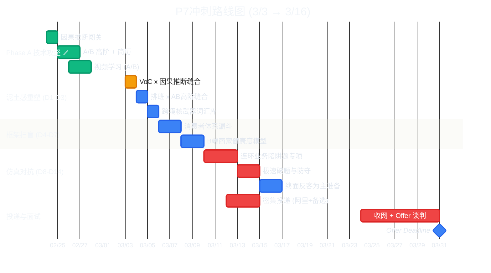

# 📅 日程安排与冲刺看板

> **最后更新**：2026-02-27
> **目标 Offer Deadline**：3/31（房租延期后的硬底线）
> **核心策略**：滚动模块复习 ♻️ — 每个模块走完"理论→STAR→模拟→沉淀"闭环后切换下一个

---

## ⚡ 总览甘特图

---

## ♻️ 滚动复习方法论

每个模块按照以下闭环循环推进，**每天额外搭配 1-2 道笔试编码题**（从 `07_笔试模拟` 目录取题）：

| 阶段                  | 时长       | 具体动作                                                                     | 产出               |
| :-------------------- | :--------- | :--------------------------------------------------------------------------- | :----------------- |
| **🛡️ 护城河加固**      | Day 1 - 3  | 把高阶分析方法(因果推断/A/B)死死焊在简历项目上，形成终极防御话术             | 高密度 STAR 话术   |
| **🌐 全链路框架扫盲**  | Day 4 - 7  | 搭建消费者漏斗图与 B 端商家生命周期模型，建立上帝视角                        | 万能拆解框架矩阵   |
| **🎤 全仿真抗压测试**  | Day 8 - 14 | 用带有大促干扰、部门墙甩锅的跨界连环陷阱题压测，强制融入跨境词库进行反击防守 | 坚不可摧的业务体感 |
| **💻 每日笔试 (底线)** | 贯穿全程   | 每天睡前手写回顾 SQL 窗口函数/进阶参数                                       | 代码底线肌肉记忆   |

---

## ✅ 已完成模块

??? success "Module 1: A/B 实验与假设检验 ✅ (2/25 - 2/27)"

    **理论**：Delta Method / CUPED / mSPRT 全部通关
    **视频**：Ron Kohavi 实战 + KDD CUPED + StatQuest A/B + 3B1B CLT = 5/5 ✅
    **模拟面试**：豆包 Round 1 (13题) + Round 2 (14题) = 27 题深挖完成
    **沉淀产出**：

    - [⚠️ 错题本](17_interview_mistakes.md)：7 个致命失分点已记录
    - [🧪 A/B 面试题库](17a_interview_ab.md)：14 题 + 概念深挖题
    - [A/B 高阶速查](05a_ab_advanced.md)：CUPED 五步稳健性 + Delta Method 公式

    **状态**：暂时放下，等 Module 2/3 循环完毕后回来二刷错题本加深记忆

---

## 🔄 P7 冲刺核心：护城河加固与“泥土感”重塑

### Stage 1: 护城河加固 (3/3 - 3/5)

#### 📅 3/3 周二 — 🛡️ VoC 业务线与因果推断 (PSM/DID) 缝合

|  时段  | 任务                                                                | 配合资料                              |
| :----: | :------------------------------------------------------------------ | :------------------------------------ |
| 🌅 上午 | 撰写 500 字终极防御话术：证明转人工率下降 9pp 是 VoC 的真实独立贡献 | [因果面试题](17b_interview_causal.md) |
| 🌤 下午 | 提炼混淆变量（如：季节大促、同期 UI 变动），并准备语音口述模拟      | [因果面试题](17b_interview_causal.md) |
| 🌙 晚上 | 💻 每天 30min SQL/Pandas 编码复健                                    | `07_笔试模拟/`                        |

#### 📅 3/4 周三 — 🛡️ 排班调度实验与 A/B 高阶缝合

|  时段  | 任务                                                           | 配合资料                           |
| :----: | :------------------------------------------------------------- | :--------------------------------- |
| 🌅 上午 | 将排班准确率提升的故事，包裹进双粒度指标方差校正与贯序检验架构 | [A/B 高阶速查](05a_ab_advanced.md) |
| 🌤 下午 | 准备贯序检验 (mSPRT) 似然比动态门槛与无望早停的业务防守逻辑    | [A/B 高阶速查](05a_ab_advanced.md) |
| 🌙 晚上 | 💻 每天 30min SQL/Pandas 编码复健                               | `07_笔试模拟/`                     |

#### 📅 3/5 周四 — 🌐 建立跨境“核武器”词汇库

|  时段  | 任务                                                                 | 配合资料                             |
| :----: | :------------------------------------------------------------------- | :----------------------------------- |
| 🌅 上午 | 梳理 10 个高频变数（支付熔断、关税博弈、大促爆仓、多语言情感极性等） | [业务分析](13_business_analytics.md) |
| 🌤 下午 | 将词汇库强制串联进至少 2 个相关的 STAR 项目经历中                    | [业务分析](13_business_analytics.md) |
| 🌙 晚上 | 💻 每天 30min SQL/Pandas 编码复健                                     | `07_笔试模拟/`                       |

---

### Stage 2: 全链路电商框架扫盲 (3/6 - 3/9)

#### 📅 3/6-3/7 — 🌐 消费者旅程与商家健康度模型

|  时段  | 任务                                                         | 配合资料                             |
| :----: | :----------------------------------------------------------- | :----------------------------------- |
| 🌅 上午 | 整理“导购展示 -> 加购 -> 支付路由 -> 履约配送 -> 售后”漏斗图 | [业务分析](13_business_analytics.md) |
| 🌤 下午 | 构建“入驻 -> 流量变现 -> 履约 -> 纠纷 -> 流失”商家生命周期   | [业务分析](13_business_analytics.md) |
| 🌙 晚上 | 掌握商家经营成本（佣金/营销费/物流费）和降本破局点的数据拆解 | [业务分析](13_business_analytics.md) |

---

### Stage 3: 全仿真对抗与抗压测试 (3/10起)

> 进入“以战养战”阶段。放弃局部细节，聚焦综合业务场景下的数据统筹。强制将每一把“杀手锏工具”（因果推断、AB高阶算法）嵌入业务剧本。

#### 📅 3/10 之后 — 🎤 连环业务陷阱题专项

| 任务场景                                                       | 考核侧重点               |
| :------------------------------------------------------------- | :----------------------- |
| 大盘转化率跌了，如何光速排查原因并定责业务方？                 | 维度下钻与漏斗体系应用   |
| 算法策略上线后核心指标大涨，但护栏指标崩溃，怎么做数据干预？   | 实验系统把控与多目标权衡 |
| 跨部门利益冲突（如拉新活动导致客诉激增），如何用数据定分止争？ | 数据归因的严谨度         |

---

### 📞 面试实战期 (3/8 - 3/31)

> 三模块滚动复习闭环已走完，进入"以战养战"阶段。每次真实面试后的复盘 → 追加错题 → 针对性补缺。

| 周期            | 重点                    | 每日节奏                                      |
| :-------------- | :---------------------- | :-------------------------------------------- |
| **3/8 - 3/14**  | 第一批面试窗口          | 上午面试/准备 → 下午复盘写错题 → 晚上笔试练习 |
| **3/15 - 3/21** | 面试迭代 + 薄弱模块回炉 | 哪个模块被面试官打穿就立刻回炉滚动复习        |
| **3/22 - 3/31** | 收网 + Offer 谈判       | 底线 25w / 目标 30w / 冲刺 35w                |

---

## 📺 视频清单总览

### A/B 实验模块 ✅ (已完成 5/5)

| 视频                            | 时长   | 状态 |
| :------------------------------ | :----- | :--- |
| StatQuest: P-values             | ~15min | ✅    |
| 3Blue1Brown: CLT 中心极限定理   | ~20min | ✅    |
| Ron Kohavi: A/B Testing 实战    | ~50min | ✅    |
| KDD: CUPED 方差缩减             | ~20min | ✅    |
| Evan Miller: A/B 实验的 20 个坑 | ~30min | ✅    |

> [!TIP]
> **关于剩余理论视频的处理**：学术性的冗长推导视频已被移出主流程。接下来的备考核心是“懂业务，会应用，能讲故事”，避免陷入脱离业务的应试死记硬背。

---

## 📝 历史学习报告 (Daily Progress)

- 📅 [2026-02-18 学习报告](../reports/daily_2026-02-18.md)
- 📅 [2026-02-17 学习报告](../reports/daily_2026-02-17.md)
- 📅 [2026-02-15 学习报告](../reports/daily_2026-02-15.md)
- 📅 [2026-02-14 学习报告](../reports/daily_2026-02-14.md)
- 📅 [2026-02-13 学习报告](../reports/daily_2026-02-13.md)
- 📅 [2026-02-12 学习报告](../reports/daily_2026-02-12.md)
